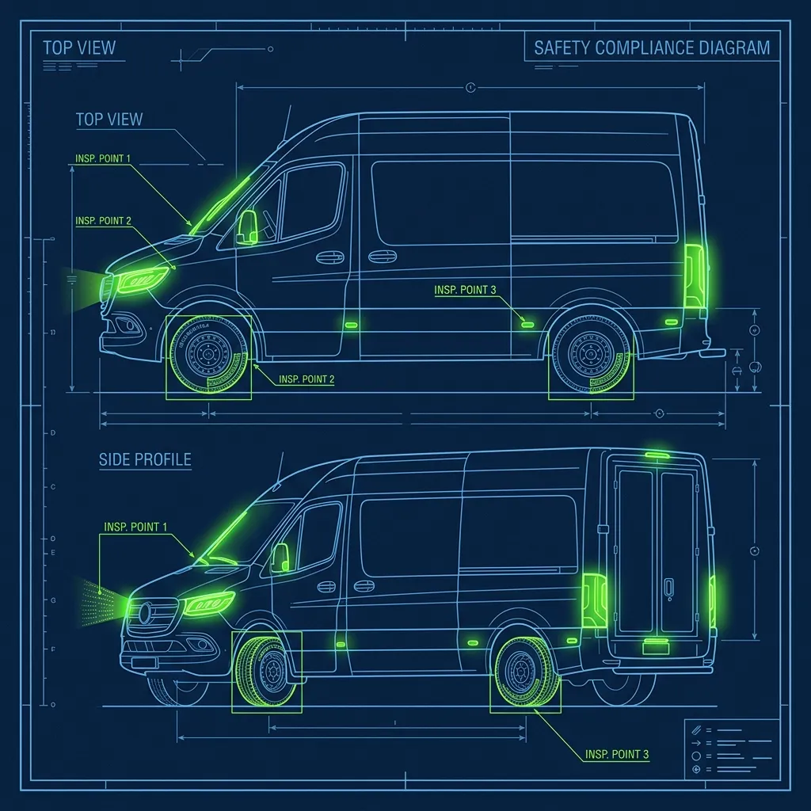
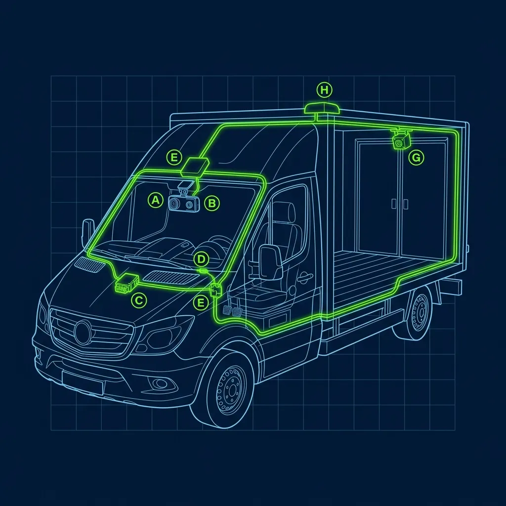

I've managed stores where we had to deal with driver accidents more times than I'd like to count. Fender benders in apartment complex parking lots. A driver who slid into a ditch during an ice storm. One guy rear-ended someone at a red light because he was looking at his phone trying to find the customer's apartment number. Every single time, the same ugly reality comes crashing down: nobody — not the driver, not the franchise, not the insurance company — wants to be the one holding the bag. 

Delivering pizzas for [Domino's](/articles/chain/dominos), [Pizza Hut](/articles/chain/pizza-hut), or [Papa John's](/articles/chain/papa-johns) is one of the most dangerous jobs in food service. You're spending 6 to 8 hours a night weaving through busy intersections, navigating dark neighborhoods, and driving in weather that sensible people stay home in. The operational reality: 

## The Insurance Gap Nobody Warns You About

This is the single most important thing every new delivery driver needs to understand, and I can almost guarantee your manager won't tell you during orientation: **your standard personal auto insurance does not cover you while you're delivering.** 

> **Russell's Note:** You don't know true panic until a 15-item catering order drops right in the middle of a Sunday brunch shift. It instantly backs you up to the window.

> **Russell's Note:** Time to lean, time to clean. It's an annoying cliché, but when the health inspector (the ultimate clipboard warrior) shows up unannounced, you'll be glad you wiped down the low-boys.

Read that again. Let it sink in.

If you get into a wreck and tell your insurance company "I was delivering a pizza," they will almost certainly deny your claim. Standard policies specifically exclude "commercial driving" or "using your vehicle for hire." It doesn't matter that you were only five minutes from the store. It doesn't matter that the accident wasn't your fault. The moment you admit you were on the clock, your personal coverage evaporates.

To fix this, you need to call your insurance agent — before your first delivery shift, not after your first accident — and add a Business Use Endorsement or a delivery rider to your policy. It takes about 10 minutes over the phone. Most drivers report paying an additional $20 to $50 per month for the endorsement. That sounds steep when you're making $12 an hour plus tips, but consider the alternative: if you total your car on a delivery run without it, you're personally responsible for thousands in repairs, the other driver's damages, and any medical bills. I watched drivers lose their cars and end up buried in debt because they skipped this step.

## What the Pizza Company's Insurance Actually Covers

Here's where it gets complicated, and where a lot of drivers get a false sense of security. Most major pizza franchises carry something called Non-Owned Auto Liability Insurance. Sounds comprehensive, right? It's not.

**What it covers:** If you cause an accident — run a red light, hit a pedestrian — the company's policy typically pays for the *other person's* medical bills and vehicle damage. It protects the franchise from third-party liability lawsuits.

**What it absolutely does not cover:** Your car. Your medical bills. Your rental car while yours is in the shop. That's entirely on you. The company's insurance protects the company, not you personally. If the other driver's attorney decides to sue, they'll go after both the franchise and you as an individual. The franchise's coverage handles the franchise's exposure. Your personal liability — including any judgments against you specifically — falls on your own insurance, or your own pocket if you don't have the right coverage.

I cannot stress this enough: the company is not your safety net. You are your safety net.

## Exactly What to Do if You Crash on the Clock

When the worst happens, adrenaline takes over and your brain stops working logically. Burn this list into your memory so you don't have to think about it:

1. **Ensure safety first.** Check yourself, check the other driver, call 911 if anyone is hurt. Get an official police report — always, even for minor fender benders. That report is your legal protection.

2. **Call your store immediately.** Your GM needs to know you're okay, but they also need to void the customer's order and [dispatch a fresh pizza with another driver](/articles/pizza-hut-dispatch). The customer is still waiting.

3. **Remove your uniform before exchanging information.** This is the unwritten rule among veteran drivers, and every experienced manager I've worked with quietly encourages it. Take off your company hat, your branded shirt, anything with a corporate logo. If the other driver sees "Domino's" or "Pizza Hut," their first thought is deep pockets and a lawsuit. You're just a regular driver who happened to be in an accident.

4. **Document everything obsessively.** Photos of both vehicles, road conditions, damage, license plates, the intersection. Get the other driver's name, phone, insurance info. Write down the exact time and location. This documentation will be critical for both your personal insurance claim and the franchise's incident report.

5. **File a Workers' Compensation claim if you're injured.** You are a W-2 employee, which means you're eligible for workers' comp regardless of who was at fault. Report your injury to your manager immediately and ask for the paperwork yourself. Don't assume the store will initiate this — many franchise managers are not well-trained on workers' comp procedures. Be proactive.

## Vehicle Requirements You Should Actually Follow

Before you start delivering, most franchises require your car to pass a basic inspection. Working headlights, taillights, brake lights, and turn signals are non-negotiable. Valid registration, state-minimum insurance, and a current inspection sticker where applicable. Management is supposed to do periodic vehicle checks throughout your employment — not just at hiring.

Here's the reality though: In my time behind the counter, managers who inspect every driver's car monthly like clockwork, and I've seen managers who look the other way because they're desperate for warm bodies during the dinner rush. If your car develops a safety issue — a burned-out headlight, bald tires, a cracked windshield — and you get into an accident, that negligence becomes a legal liability for both you and the franchise. Don't cut corners on your vehicle just because your manager does.

Keep a basic [bank of cash for making change](/articles/dominos-20-bank-rule), a working dashcam (they cost as little as $30), and a phone charger in your car at all times. A dashcam provides indisputable evidence of what happened in an accident. If the other driver claims you ran a red light and your footage says otherwise, that camera just saved your livelihood.

## The One Rule That Matters More Than Anything

Never speed to meet a delivery time guarantee. No tip and no delivery bonus is worth a car accident. If you're running behind, call the customer and let them know. A late pizza is an inconvenience. A car wreck can change your entire life. I witnessed it happen, and it's never worth the three-dollar tip you were chasing.

## Frequently Asked Questions

### Can the pizza company fire me for getting in an accident?

It depends on the circumstances. If the accident was clearly your fault — running a red light, texting while driving — the franchise can and often will terminate your employment. If it was genuinely not your fault, most stores won't fire you, but they may reassign you to inside duties until the insurance situation is resolved. Every franchise handles it differently.

### Do I have to use my own car for delivery?

At most major chains, yes. Delivery drivers provide their own vehicles. A tiny number of franchises provide company-owned cars, but it's extremely rare. You typically receive a per-delivery mileage reimbursement — usually $1 to $2 per delivery — to help offset [gas and wear-and-tear costs](/articles/dominos-gas). It never fully covers your actual expenses.

### What if the accident happens while I'm driving back to the store without food in the car?

You're still on the clock and still driving for commercial purposes. The same insurance exclusions apply. It doesn't matter whether you currently have a pizza in the car. If you're clocked in and driving as part of your job duties, your personal insurance may deny the claim without the proper business use endorsement.

---
