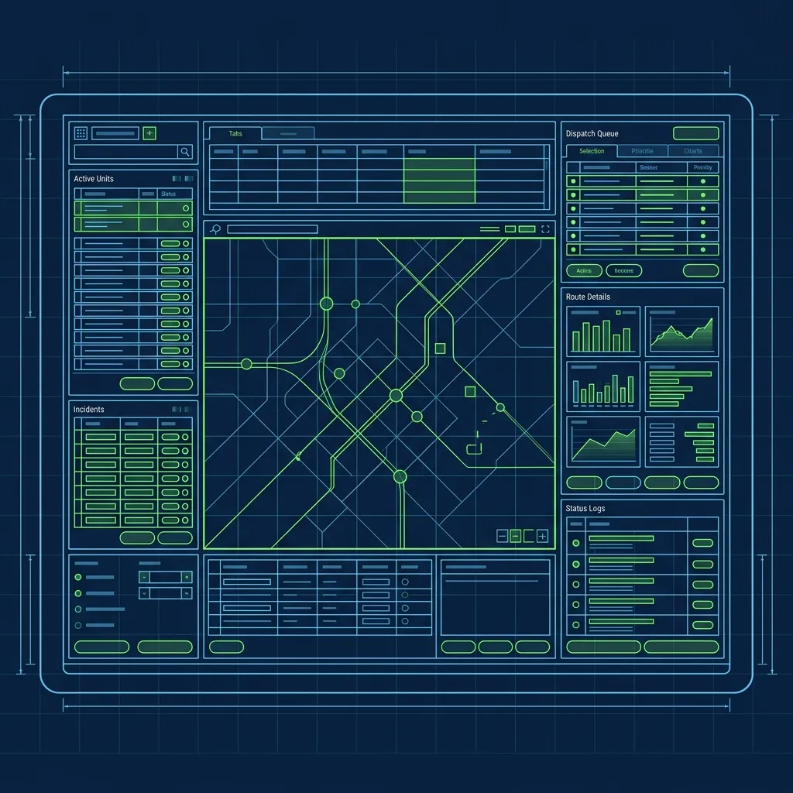
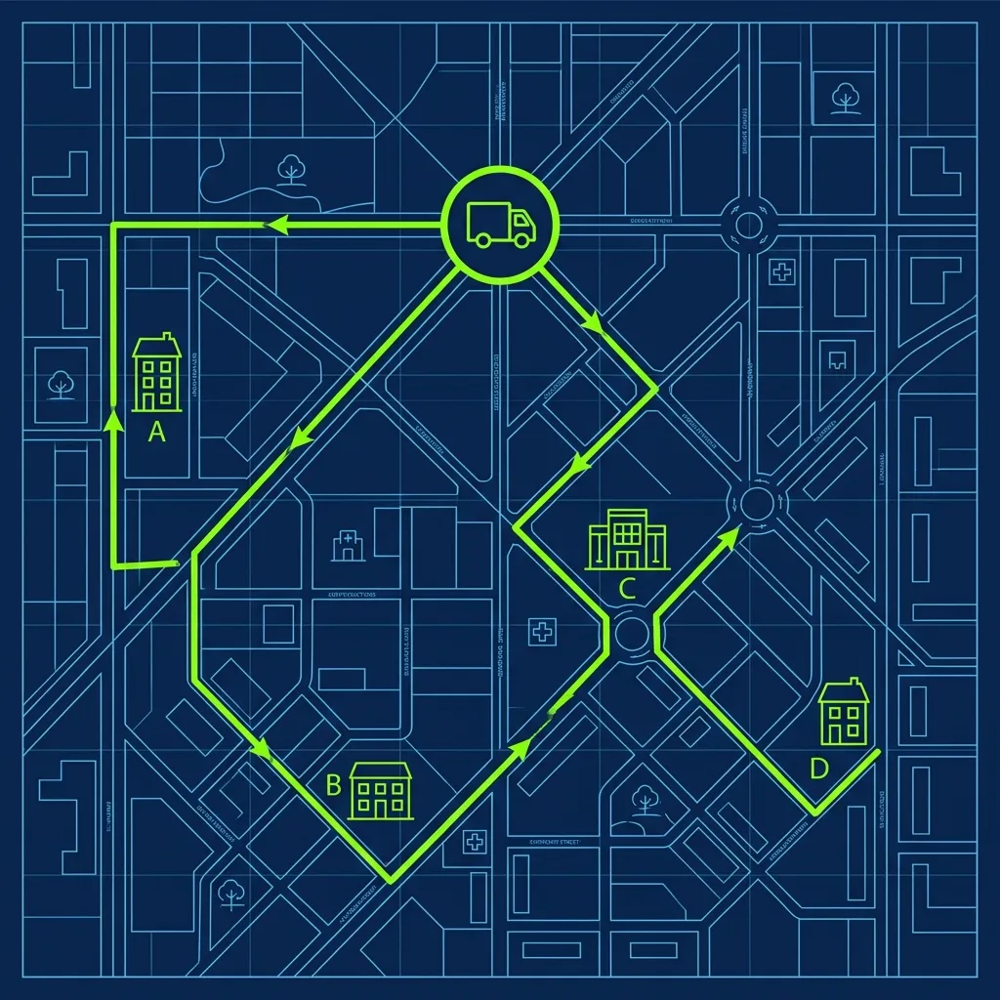

If you get hired as a delivery driver at Pizza Hut, your entire night revolves around one screen in the back of the store. Not the oven. Not the cut table. The Dispatch Terminal. That glowing touchscreen monitor next to the heat racks is the brain of the operation, and understanding how it works is the difference between a $60 night and a $150 night. 

The old days of writing addresses on a whiteboard and fighting with other drivers over the best tippers are long gone. Modern pizza delivery is automated, GPS-tracked, and timed down to the second. The reality is more nuanced than you'd think. 

## The Drag-and-Drop System

The dispatch screen is a massive touchscreen mounted right next to the heat racks where boxed pizzas sit waiting for drivers. When an order comes out of the oven, the cut-table worker boxes it, slaps the receipt on top, and scans it. The order instantly pops up on the dispatch screen as "Ready," showing the address, the order contents, and a timer that starts counting upward the moment the pizza hit the rack. 

When you return to the store from your previous run, your name appears at the top of the "Available Drivers" list. You physically touch your name on the screen, drag it over to the waiting order, and hit "Dispatch." That's it. The system clocks you out of the store, your GPS tracker engages through the Pizza Hut Delivery App on your phone, and the customer gets an automatic text saying their food is on the way.

Here's the thing nobody tells you during training: **that dispatch timer is one of the most heavily scrutinized metrics in the entire store.** From the moment the order shows "Ready" to the moment you mark it "Delivered" on your app, every second is logged. Store managers get weekly reports showing average dispatch-to-delivery times broken down by driver. If you're consistently slow, the manager will pull you aside. If your numbers are terrible, it can affect the store's overall performance rating with corporate. That timer isn't just tracking the pizza — it's tracking you.

## Doubles, Triples, and the Routing Algorithm

Taking one pizza at a time is a rookie move. Experienced drivers make their real money on "Doubles" — taking two orders at once — or even "Triples" on busy nights. But you can't just grab three random boxes and run.

The dispatch system has a built-in routing algorithm that groups orders by geographic proximity. If two orders are going to the same neighborhood, the system will pair them on the screen. If one order is heading north and another south, the system blocks you from taking both — the second pizza would be cold by arrival and the customer would complain.

The algorithm is smarter than most new drivers realize. It factors in estimated drive time based on real-time traffic, how long the order has been sitting in the heat rack, and whether the order includes time-sensitive items like wings or breadsticks that degrade faster than pizza. If the math shows that a double would result in the second delivery arriving too late, it prevents the pairing entirely.

On a killer Friday night, a well-timed double can mean two deliveries, two tips, and two mileage reimbursements in the time it would take to do one run. That's where the money is.

## The FIFO Queue and Why You Can't Cherry-Pick

In the old days, senior drivers used to cherry-pick the good deliveries — the neighborhoods with the big houses and the generous tippers — and leave the apartment complexes and known stiffers for the new guys. Modern dispatch killed that.

The system enforces a strict First In, First Out (FIFO) rule. If you're the first driver back in the store, you take the oldest order on the screen. Period. Even if you know that address has never tipped a single cent in the three years you've been delivering there. If you try to bypass the queue and assign yourself a newer, better order, the system locks you out. The Shift Manager has to override it manually, and that override gets logged. Do it more than once and you'll be having a very uncomfortable conversation.

That said, experienced drivers learn to play within the system. You can't skip orders, but you can influence timing. During a Friday night rush, drivers who know the board has a bad order up next take an extra 30 seconds "organizing their hot bag" in the parking lot so the next driver in line grabs the stiff and a better double forms up for their return. Managers are absolutely aware of this trick, and if they catch you stalling, you'll hear about it. But the fact that every veteran driver knows it tells you something about how the game actually works.

## In-Store Duties Between Runs

What a lot of people don't realize about being a Pizza Hut driver is that you're not just a driver. When you return from a run and the dispatch screen is empty, you don't get to sit in your car scrolling your phone. You're expected to work the store.

That means folding boxes — endless, endless boxes. Helping the cut-table worker box and label orders. Sweeping the lobby. Answering phones. Restocking the drink cooler. The dispatch system tracks your in-store time versus your on-the-road time, and managers use those numbers to figure out if they've got too many or too few drivers scheduled.

The Golden Rule of Dispatch — and I've drilled this into every driver I've ever trained — is this: **never hit "Dispatch" until the pizza is inside your hot bag and any sides or drinks are in your hand.** If you dispatch the order but then spend five minutes hunting for ranch cups and a 2-liter of Pepsi, the system flags your delivery time as suspiciously slow. You look bad, the store looks bad, and the customer's food is getting colder every second.

## Maximizing Your Income

The drivers who consistently make the most money aren't the fastest drivers on the road. They're the ones who know their delivery zone cold. Every shortcut. Every gated community's access code. Every apartment complex where the building numbers make no sense. Spend your first week studying the zone map like it's a final exam, because faster runs mean more deliveries per shift, which means more tips.

Keep your hot bag clean and in good condition — a stained bag with a broken zipper makes a terrible impression at the door and leads to colder food. Some veteran drivers buy their own high-quality insulated bags for $15 to $20 and report noticeably better tips. And always start your shift with at least $20 in small bills for making change. Nothing murders a potential tip faster than telling a customer "I don't have change for a twenty." If you're prepared for a [smooth cash transaction](/articles/dominos-20-bank-rule), customers round up. If you fumble, they ask for exact change back.

## Frequently Asked Questions

### How many deliveries can a driver make in a typical shift?

During a busy Friday or Saturday night, an experienced driver can hit 15 to 25 deliveries in a 6- to 8-hour shift, especially when doubles and triples are flowing. On a slow weeknight, expect 8 to 12. Your income fluctuates wildly with volume, which is why most veteran drivers fight for the weekend shifts.

### Can drivers see customer tip amounts before accepting a delivery?

No. Unlike gig platforms like DoorDash or Uber Eats, Pizza Hut drivers can't see tip amounts before taking a run. You find out what the customer tipped on the credit card only after the delivery is complete. Cash tips are discovered at the door. This is part of why the FIFO system works — there's no way to cherry-pick based on expected tips, so every [driver takes their turn](/articles/pizza-delivery-driver-accident) fairly.

### What happens if a customer claims they never received their order?

The GPS tracking in the dispatch system proves you were physically at the delivery address. If a customer calls claiming non-delivery, the manager pulls up the GPS logs to verify your location and timestamps. In most cases, the store sends a replacement order to keep the customer happy, but habitual false claims from the same address get flagged and eventually denied. The system protects honest drivers.

---
