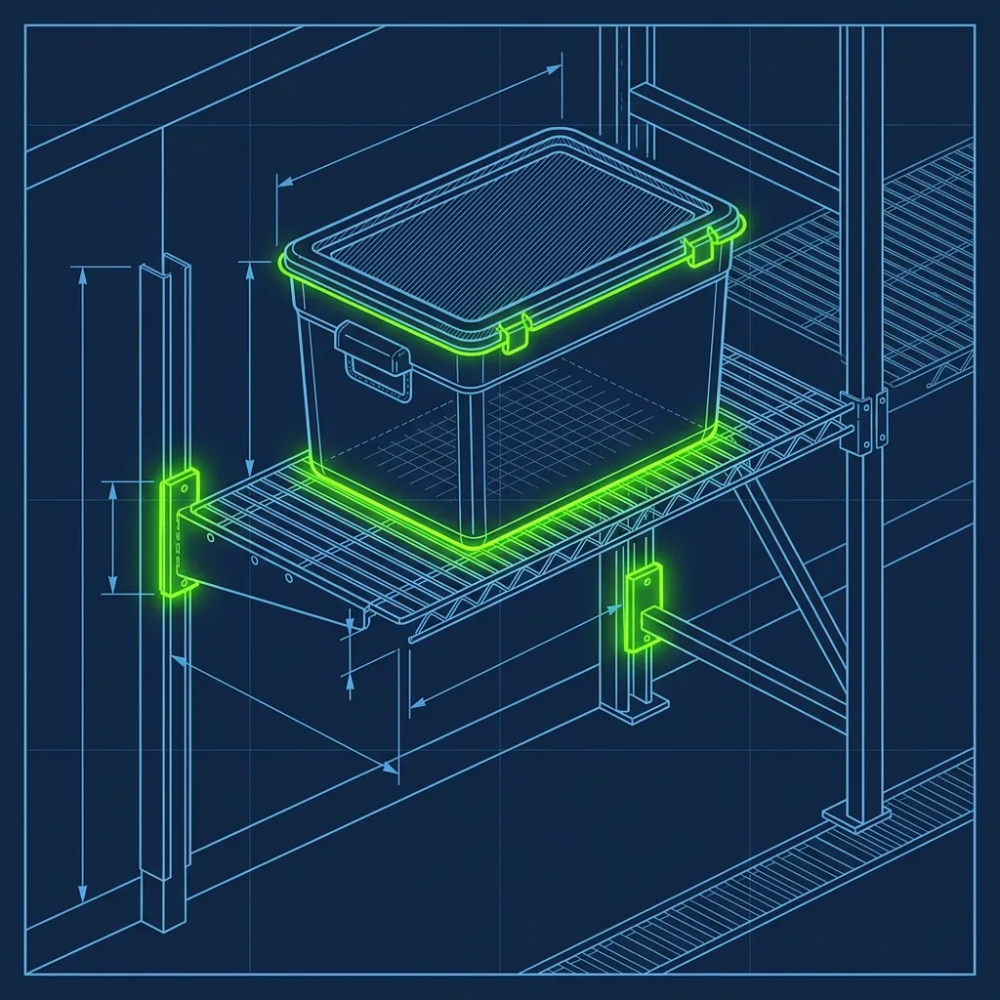
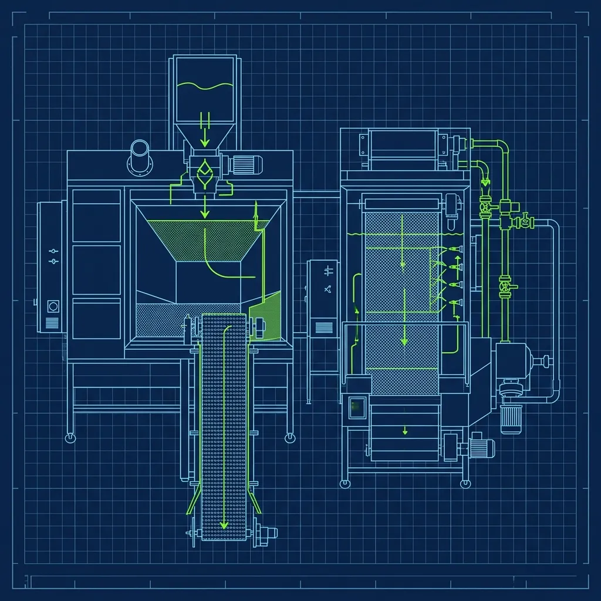

There's a reason Popeyes chicken hits different than every other piece of fried chicken in fast food, and it's not some magical secret ingredient that nobody's figured out. It's labor. It's time. It's a Batter Fry Cook standing over a massive stainless steel bin of seasoned flour, physically mashing and folding batter into raw chicken until their hands are raw and their back aches. While most fast-food restaurants receive their chicken pre-breaded and frozen in plastic bags, Popeyes does it the old-fashioned way — by hand, from scratch, every single day. 

If you're hired as a Batter Fry Cook at Popeyes, you're signing up for one of the most physically demanding positions in the entire QSR industry. Here's exactly what happens behind that counter. 

## The 12-Hour Marinade: Where the Flavor Actually Comes From

> **Russell's Note:** People always ask why this tastes different at home. Simple. We aren't afraid of butter, salt, and keeping the clamshell grill screaming hot.

> **Russell's Note:** People always ask why this tastes different at home. Simple. We aren't afraid of butter, salt, and keeping the flat top screaming hot.

The secret to Popeyes' flavor doesn't start on the makeline. It starts 12 hours earlier, in the walk-in cooler, in massive tubs of Louisiana seasonings and spices. 

Raw chicken pieces are submerged in this marinade for a minimum of 12 hours before they can be used. Not 8 hours. Not 10. Twelve. A strict General Manager will refuse to serve chicken that hasn't hit the full 12-hour mark, and honestly, the good ones should. The marinade penetrates deep into the meat during that time, which is why Popeyes chicken tastes seasoned all the way through — not just on the surface like most competitors. That deep flavor is what keeps customers coming back, and it cannot be faked or shortcut.

Here's the operational nightmare that creates: the morning manager has to calculate how much chicken the entire store will need for the day and make sure enough tubs were set to marinate by the night crew. If the morning team opens the cooler and discovers that last night's closer didn't prep enough, the store will run out during the lunch rush with zero way to speed up the process. You can't microwave your way through 12 hours of marination. I've seen stores have to 86 fried chicken during peak hours because of a night shift that didn't do their prep. The fallout is brutal.

## The Wet Batter and the Flour: A Two-Step System

When it's time to cook, the Batter Fry Cook pulls the marinated chicken from the cooler and initiates a two-step dredging process:

- **The Dip:** Each piece is submerged in a wet, seasoned egg-and-buttermilk-style batter. This wet layer is what the flour clings to.
- **The Flour:** The wet chicken goes straight into a massive stainless steel bin filled with seasoned flour.

Both the wet batter and the seasoned flour are made in-store using proprietary spice blend packets from the corporate supply chain. You mix these packets with the liquid or flour base according to exact specifications. Getting the batter consistency right is everything — too thick and the coating comes out gummy and heavy, too thin and it slides right off the chicken in the fryer. Veteran cooks learn to judge consistency by sight and feel, adjusting with small amounts of water or flour throughout the day as the batch gets used.

The batter station gets messy fast. Your hands are constantly moving between wet and dry, and within an hour, you've got flour caked up to your elbows and batter splattered across your apron. It's not glamorous work. But it's the most important station in the building.

## The Toss and Fold: Where the Magic Happens

This is the technique that separates Popeyes from everyone else. You cannot simply roll the chicken in the flour and call it done. To get those massive, shatteringly crispy flakes — what cooks call the "crag" — Popeyes Batter Fry Cooks use a specific folding technique that is closer to masonry work than cooking.

You push the flour over the chicken, then use both hands to aggressively press the flour down into the meat. Toss it. Fold the flour over again. Press hard. What you're doing is physically mashing the wet batter and dry flour together on the surface of the chicken, creating thick, shaggy layers of dough. Every time you press, the wet batter seeps through slightly, creating another layer that can be covered with more flour on the next fold. This layering is what produces those dramatic, crunchy ridges and peaks on the finished product.

New Batter Fry Cooks almost always under-press during their first few shifts. They're afraid of tearing the meat or damaging the piece. It takes a few days to learn how much pressure the chicken can handle. The reality is, you have to be aggressive. Gentle doesn't create crag. If your finished pieces look smooth and thin, you're not pressing hard enough. The [KFC approach with pressure fryers](/articles/kfc-pressure-fryers) is a completely different technique — Popeyes relies on this physical labor to build texture before the chicken ever touches oil.

## The Fry: Beef Tallow and Temperature Control

The final secret is the oil itself. While most fast-food chains use 100% vegetable or canola oil, Popeyes traditionally uses a blend that includes beef tallow — rendered beef fat. Frying the heavily floured chicken in beef tallow at high temperatures is what locks the moisture inside while creating that intensely savory, shatter-crisp exterior.

Temperature control is critical and something new cooks underestimate constantly. Drop too many pieces at once, the oil temperature crashes, and the batter absorbs oil instead of crisping — giving you greasy, soggy chicken. Run the oil too hot, the exterior burns before the interior reaches safe temp, which is a food safety violation waiting to happen.

Experienced Batter Fry Cooks develop an intuitive sense for fryer capacity. They learn to listen for the right sizzle — that aggressive, consistent crackle that tells you the oil is at the right temperature. A quiet, bubbling fryer means the oil has dropped too low. Adjust accordingly or the next batch goes in the trash.

## Holding Times and Waste Management

After frying, chicken goes into heated holding cabinets with a strict hold time of around 30 to 45 minutes. Once that timer expires, it's supposed to be discarded. During slow periods, this creates significant waste, which is why smart cooks learn to fry smaller batches during off-peak hours rather than cooking a full load and watching it expire. Keep the flour bin sifted and fresh throughout the day — as wet batter drips in, the flour clumps up and creates inconsistent coating. Sift with a mesh strainer every 30 to 45 minutes and top off with fresh seasoned flour.

Develop a consistent rhythm: dip, drop, press, fold, press, fold, into the fryer. The fastest Batter Fry Cooks don't think about individual pieces — they establish a mechanical cadence that keeps speed consistent and ensures every piece gets the same [level of crag as their competitors demand](/articles/kfc-original-vs-extra-crispy).

## Frequently Asked Questions

### How long does it take to learn the battering process?

Most new Batter Fry Cooks feel comfortable with the basics after one to two weeks. Truly mastering the Toss and Fold to produce consistently perfect crag takes a month or more of daily practice. Speed comes with muscle memory — new cooks are significantly slower than veterans for the first several weeks, and that's expected.

### Is the chicken at Popeyes ever frozen?

The chicken arrives at the store fresh and raw, not frozen. It's marinated in-store and cooked fresh daily. This is a key differentiator between Popeyes and competitors who use pre-breaded frozen products. Some stores may occasionally freeze excess marinated chicken to prevent waste, but that's not standard practice.

### Why does Popeyes chicken taste different at different locations?

The most common reasons are variations in frying oil freshness, differences in how well individual cooks perform the Toss and Fold technique, and how strictly each store follows marination and holding times. A store with a disciplined, experienced [Batter Fry Cook](/articles/raising-canes-bird-specialist) and fresh oil will produce noticeably better chicken than a store that cuts corners. The recipe is the same — the execution is everything.

---
