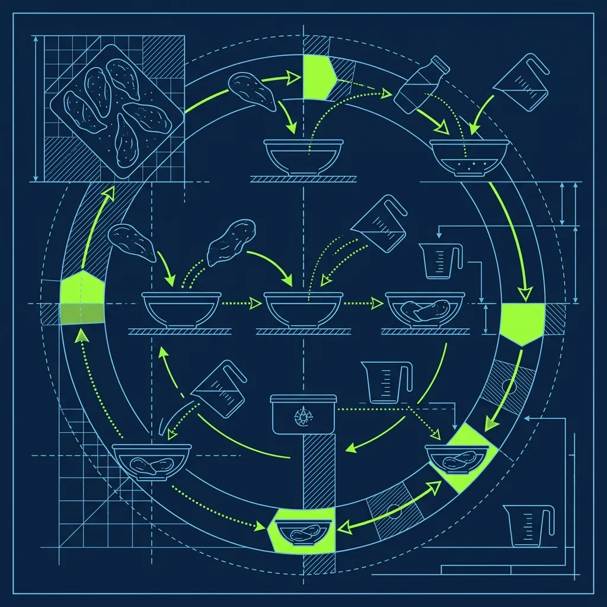
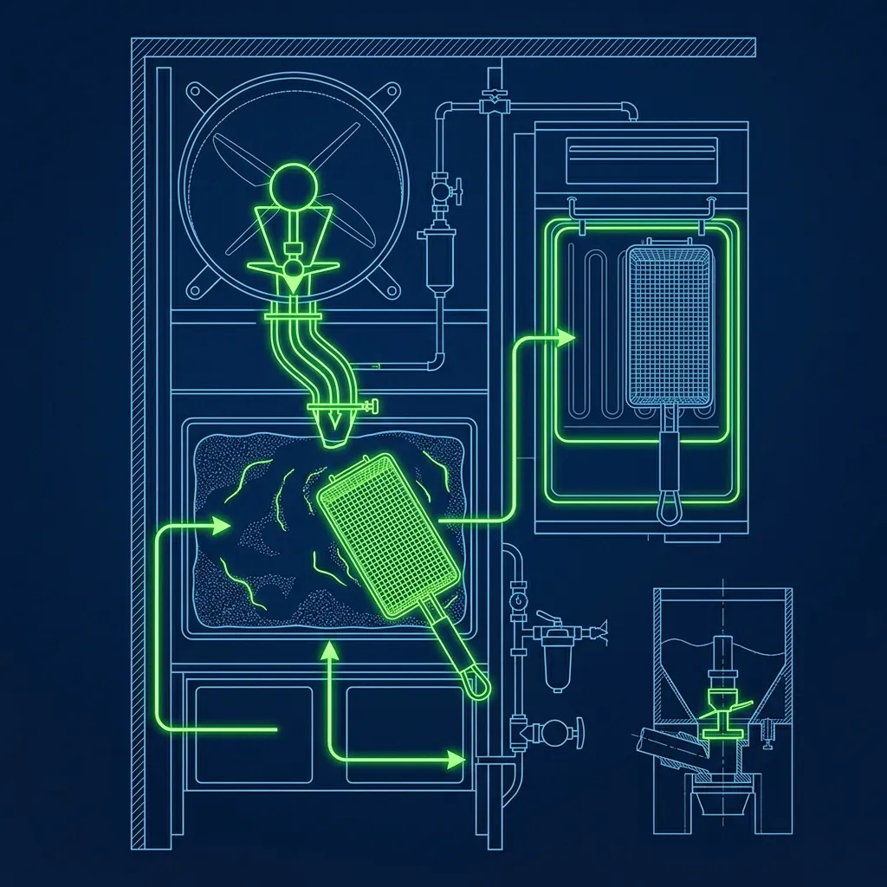

Raising Cane's has the most absurdly focused menu in the entire fast-food industry. They sell chicken fingers. That's it. No burgers, no salads, no seasonal limited-time-offers. Chicken fingers, Texas toast, coleslaw, crinkle-cut fries, and Cane's Sauce. Because the menu is this narrow, every single item has to be perfect every single time. There's nowhere to hide. *(Related guide: [The Popeyes Chicken Battering Process: Why It's So Crispy](/articles/popeyes-chicken-battering-process/))*

That's why they don't have generic "grill cooks" or "prep cooks." They have the Bird Specialist. And if you're hired for this position, you are the most important person in the building. You are the heartbeat of the operation. If you fail, the entire restaurant grinds to a halt. *(Related guide: [How Dangerous Are the KFC Pressure Fryers?](/articles/kfc-pressure-fryers/))*

## The 24-Hour Marinade and Why It Can't Be Rushed

Before a single chicken tender touches flour, it has spent exactly 24 hours marinating in the walk-in cooler. Not 12 hours like some competitors. Twenty-four. The tenders arrive at the store fresh — never frozen — and go straight into marinade tubs that were prepped the night before. *(Related guide: [Does Five Guys Really Not Have Any Freezers?](/articles/five-guys-no-freezers/))*

This 24-hour window is non-negotiable. A strict manager won't serve chicken that's been marinating for 20 hours, let alone 16. The extended soak time is what gives Cane's chicken that deep, consistent seasoning all the way through the meat, not just on the surface.

Here's the operational stress this creates: if the night shift doesn't prep enough marinade tubs, the store runs out of usable chicken during the next day's rush. And unlike a burger joint where you can just throw more patties on the grill, you can't fast-track 24 hours of marination. I've heard stories of locations temporarily closing because they simply had no marinated chicken to cook. That's how important the overnight prep is, and that's why the best managers treat marinade forecasting like a science, not a guess.

## The Art of the Drop

At a generic fast-food place, chicken nuggets arrive frozen in a bag and you dump them into a fryer basket. Raising Cane's is a completely different animal. Your job as the Bird Specialist is an endless, highly choreographed dance of breading and frying:

1. **The Batter:** Take the raw, marinated tenders and drop them into the wet batter. Each piece needs to be fully submerged and evenly coated.
2. **The Flour:** Transfer them to a massive bin of seasoned flour. This is where skill matters — you use a "scoop and press" motion, cupping flour around the tender and pressing firmly enough to build thick crag without crushing the delicate meat.
3. **The Drop:** Carefully place them into the fryer basket, spacing them evenly, and set the timer for exactly 6 minutes.

Every step has to be precise because the entire restaurant depends on your output. Batter inconsistently, and some pieces come out pale and under-coated while others are thick and heavy. Overcrowd the fryer basket, and the oil temperature drops, turning crispy tenders into greasy, sad excuses for chicken fingers. A good Bird Specialist spaces tenders evenly and never drops more than the fryer can handle at once.

The breading technique is subtly different from [Popeyes' aggressive Toss and Fold method](/articles/popeyes-chicken-battering-process). Chicken fingers are smaller and more delicate than bone-in pieces, so you can't press as aggressively. It's a gentler motion — firm but controlled. Experienced Bird Specialists can bread an entire basket in about 90 seconds. New hires take two to three minutes and produce less consistent results. Speed comes from muscle memory, and after a week or two, your hands know the exact pressure by feel.

## The 6-Minute Rule and the "Never Hold" Policy

The reason Raising Cane's chicken is always hot, always juicy, and always crunchy is one of the most aggressive freshness policies in the industry.

A cooked chicken finger is allowed to sit under the heat lamps for approximately 6 minutes. Six. That's it. If it sits longer, it goes in the trash. Not the warmer. Not the "almost ready" bin. The trash.

This sounds insane from a cost perspective, and honestly, it kind of is. But it's the cornerstone of the brand. Customers expect chicken that is fresh out of the fryer, with a crispy exterior and a juicy interior that pulls apart perfectly. A tender that's been languishing under a heat lamp for 10 minutes starts drying out. The batter loses its crunch. The quality drops in a way that even casual customers notice. Cane's would rather eat the cost of wasted chicken than risk a subpar experience.

As the Bird Specialist, this means you're under constant pressure to predict customer flow. Drop too much chicken, you waste the store's money and your manager has words with you. Don't drop enough, and the drive-thru backs up because customers have to wait the full 6 minutes for a fresh batch. It's a high-wire act with no safety net, performed over and over for your entire shift.

## Reading the Rush: The Bird Specialist's Crystal Ball

The best Bird Specialists develop an almost supernatural sense for customer flow. They don't wait for orders to appear on the screen — by then it's already too late, because the customer is going to wait the full 6-minute cook time.

Instead, they watch the parking lot. They watch the drive-thru camera monitor — which most Cane's locations have visible from the kitchen. If five cars suddenly pull in, drop two baskets immediately. If the lot is empty and the counter is quiet, hold off and cook in smaller batches to minimize waste.

During a predictable lunch rush — usually 11:30 AM to 1:30 PM — an experienced Bird Specialist starts building a small buffer of cooked tenders about five minutes before the wave hits. During slow mid-afternoon periods, they scale way back, dropping just one or two baskets at a time. This constant forecasting is what separates a good Bird Specialist from an exceptional one, and it's a skill no amount of training videos can teach. It comes from watching patterns, counting cars, and talking to the front counter.

Communication is your most important tool. Ask the cashier: "How many combos deep are we?" Ask the drive-thru operator: "Is the line filling up?" The Bird Specialist who talks to the front counter team is always, always better than the one who works in silence. You can't predict what you can't see, and the people working the register see things you don't.

## Keeping Your Station Clean

Your flour bin is your lifeline, and it degrades throughout the shift. As wet batter drips into the flour from each batch, the flour starts clumping. Clumpy flour creates uneven coating. Sift the bin with a mesh strainer every 30 to 45 minutes and add fresh seasoned flour as needed. A clean flour bin is the difference between consistent crag and a patchy, thin coating that nobody wants to eat. Some stores do a full flour change at the midday shift swap, and the [freshness-first approach mirrors brands like Five Guys](/articles/five-guys-no-freezers) in its intensity.

## Frequently Asked Questions

### How long does it take to become a proficient Bird Specialist?

Most new hires need about two to three weeks of training before they can run the station solo during a rush. Basic competency comes within the first week, but the ability to anticipate demand, manage multiple fryer baskets, and maintain consistent quality under pressure takes several weeks of daily practice to develop.

### Is the Bird Specialist position paid more than other roles?

In many locations, the Bird Specialist earns the same base hourly rate as other crew members. However, because it's the most demanding and high-responsibility position in the kitchen, it's often one of the first roles considered for pay raises and promotions to Shift Lead. If you can run the bird station during a Friday night rush without breaking a sweat, management notices.

### What happens if the store runs out of marinated chicken?

It's one of the worst things that can happen. Since the chicken requires a full 24-hour marinade, there's no way to fast-track the process. If the store runs out, they literally cannot serve their main product. In extreme cases, a location may have to temporarily close until a new batch is ready. This is why accurate forecasting and proper marinade prep by the overnight crew is mission-critical — and why the best [fried chicken operations](/articles/kfc-pressure-fryers) obsess over production planning.

---
