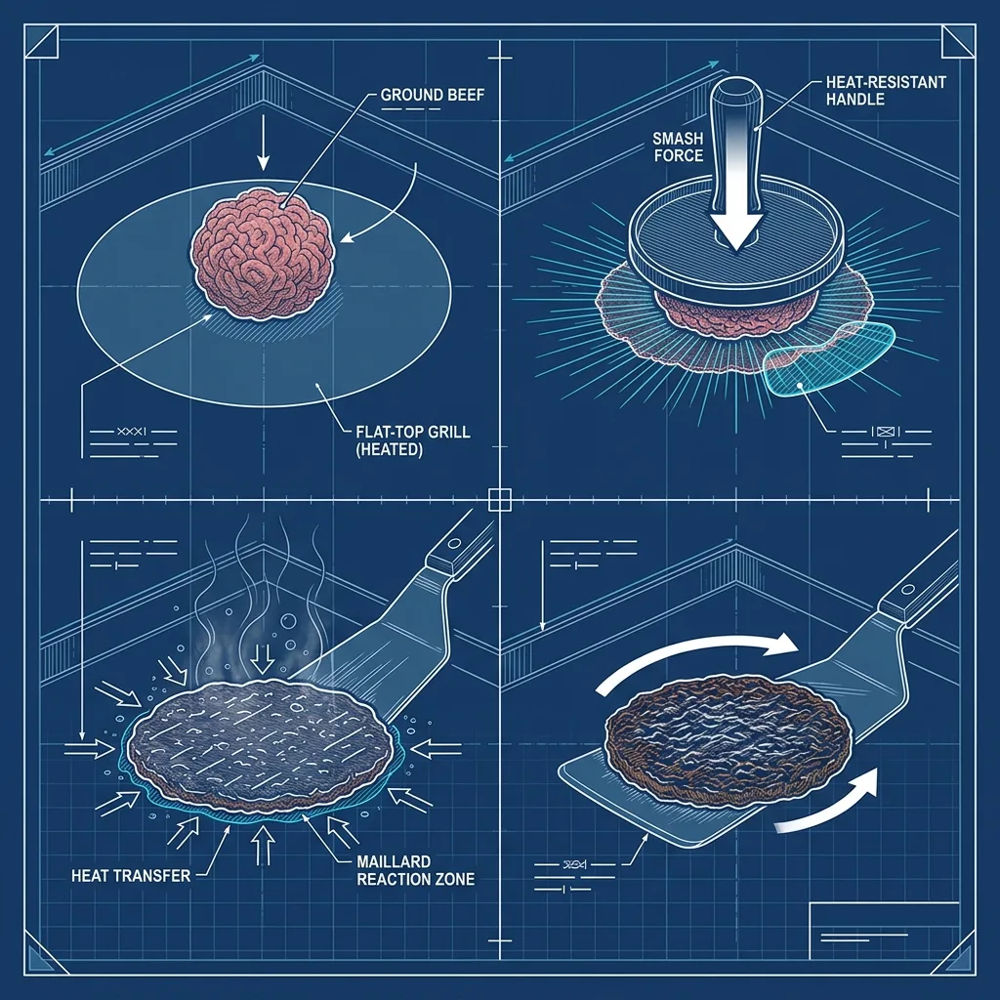
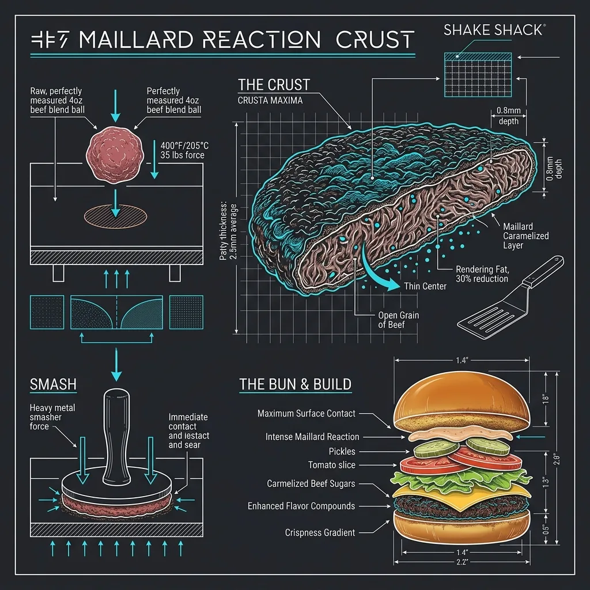

7.  What is the Shake Shack Smash Burger Technique?

If you’ve eaten a Shake Shack burger and thought, “Why does this taste so different from every other fast-food burger I’ve had?”—the answer isn’t a secret sauce recipe or some proprietary beef blend nobody else can get. The answer is physics. Specifically, it’s what happens when you take a ball of fresh ground beef and crush it flat against a screaming hot griddle with a heavy metal press. That moment—the smash—is the entire philosophy of the restaurant distilled into a single, aggressive cooking motion. 

I’ve watched this technique executed thousands of times across different burger concepts, and Shake Shack has refined it into something that’s almost surgical in its precision. Here’s exactly how it works, why it works, and what makes it fundamentally different from how most other chains cook their burgers. 

## The Smash: What Actually Happens on the Flat-Top

> **Russell's Note:** Any BOH veteran will tell you: the walk-in cooler is the only soundproof place to take a 30-second mental break when you're getting slammed and holding on drops.

> **Russell's Note:** The Sysco truck being late will ruin a prep shift faster than anything else. You learn to pivot immediately or the lunch rush will crush you.

The process starts with a ball of fresh, never frozen ground beef—typically a proprietary blend that includes a mix of cuts like chuck, brisket, and short rib. The exact blend has been developed in partnership with Pat LaFrieda Meat Purveyors, and it’s designed to have a specific fat ratio (usually around 25-30% fat) that gives the finished burger its richness without turning into a grease puddle. 

A cook grabs a portioned ball of beef—roughly 4 ounces for a single ShackBurger patty—and places it directly onto the flat-top griddle. The griddle surface is running hot. We’re talking 400°F to 450°F on the cooking surface, which is significantly hotter than the typical fast-food grill. At this point, the beef ball is just sitting there, round and tall, making almost no contact with the cooking surface.

Then comes the press.

The cook takes a heavy stainless steel press—a flat-bottomed, weighted tool that’s essentially a thick metal disc with a handle—and drives it straight down onto the beef ball with firm, controlled force. The ball flattens out into a thin, wide patty in about one to two seconds. The cook holds the press down for a beat, maybe two, then lifts and moves on.

That single motion is the entire technique. And everything that makes the burger taste the way it does flows from that one moment of contact.

## Why the Crust Is the Whole Point

Here’s the science that Shake Shack is weaponizing: the Maillard reaction. When proteins and sugars in the beef hit a dry, hot surface above roughly 300°F, they undergo a complex chemical transformation that produces hundreds of new flavor compounds. These are the deep, savory, almost nutty flavors that you associate with a perfectly seared steak or a well-browned piece of meat.

The key variable in the Maillard reaction is surface area contact with heat. A round ball of beef sitting on a flat griddle has maybe one square inch of contact. A smashed patty has the entire bottom surface—potentially 15 to 20 square inches—pressed directly against that 400°F+ metal. More contact area means more browning. More browning means more flavor compounds. More flavor compounds means a burger that tastes fundamentally richer than one that was gently laid down and cooked through.

The result is that dark, almost lacey crust along the edges and bottom of the patty. If you’ve ever picked up a ShackBurger and noticed that the patty edges are thin, crinkled, and deeply browned—almost crispy—that’s the Maillard reaction running at full capacity. Those crispy edges aren’t a mistake or a sign of overcooking. They’re the entire point of the technique.

When I first saw a Shake Shack patty come off the griddle, I remember thinking it looked almost burned around the edges. It wasn’t. It was perfectly executed. The center was still juicy and medium—the thin profile means it cooks fast—but the exterior had developed a crust that you simply cannot achieve with a thicker, hand-formed patty cooked on a lower-temperature grill.

## The Press Tool Itself

The press used at Shake Shack isn’t some generic kitchen weight. It’s a purpose-built smash tool—a thick, flat stainless steel disc, often around 6 inches in diameter, with a sturdy vertical handle welded to the top. The weight of the press itself does a lot of the work. You’re not muscling the beef flat with arm strength alone; the mass of the tool helps you apply even, consistent pressure across the entire surface of the beef ball.

Some locations use a heavy-duty offset spatula or a custom press that resembles a large, flat-bottomed trowel. The exact tool can vary slightly between locations, but the principle is always the same: heavy, flat, and rigid. You need even pressure distribution so the patty comes out uniformly thin across its entire surface. If you press unevenly—harder on one side than the other—you get a patty that’s thick in one spot and paper-thin in another, which means uneven cooking and inconsistent crust development.

The press is also used only once per patty. You smash, hold briefly, release, and that’s it. You don’t press the patty a second time during cooking. Pressing again would squeeze out the rendered fat and juices that have started pooling on the top surface of the patty, and you’d lose moisture. One press, maximum contact, then hands off until the flip.

## Fresh, Never Frozen: Why It Matters for the Smash

The fresh beef component isn’t just a marketing tagline—it directly affects the smash technique. Frozen beef that’s been thawed has a different texture and moisture profile than beef that was never frozen. Ice crystals that form during freezing puncture the muscle fibers, which means when the beef thaws, it releases more moisture. That extra moisture creates steam when it hits the griddle, which fights against the Maillard reaction. Steam is the enemy of browning. You want dry surface contact with hot metal, not a layer of water vapor between the beef and the cooking surface.

Fresh beef also balls up and holds together differently. When you portion a ball of fresh ground beef, it has a loose, cohesive texture that responds to the press in a specific way—it spreads out evenly and maintains its structure without crumbling apart. Previously frozen beef can be mushier and less predictable under the press, leading to patties that tear or develop holes.

Shake Shack’s supply chain is built around maintaining this fresh-never-frozen protocol. The beef arrives at each location refrigerated, not frozen, and has to be used within a tight window. This creates the same kind of inventory pressure that [Five Guys](/articles/chain/five-guys) deals with—if you want the full breakdown of what running a no-freezer kitchen actually looks like, [the Five Guys no-freezer deep dive](/articles/five-guys-no-freezers) covers it in detail.

## How It Differs from Five Guys

This is the comparison that comes up constantly, and it’s worth addressing head-on because the two chains are often mentioned in the same breath as “premium fast-casual burgers.” But the cooking techniques are fundamentally different.

Five Guys does not smash their burgers. Full stop. At Five Guys, the beef is hand-portioned and loosely formed into patties, then placed on a flat-top grill and cooked without pressing. The patties are thicker, cooked at a somewhat lower temperature, and the goal is a juicy, beefy patty with moderate browning—not the aggressive, edge-to-edge crust that defines a smash burger.

The Five Guys patty is about the beef itself. The Shake Shack patty is about what happens to the beef when it contacts the griddle. Both approaches produce good burgers, but they’re aiming at completely different targets. A Five Guys burger is thick, juicy, and beefy. A Shake Shack burger is thin, crusty, and savory in a way that leans more toward seared steak than traditional hamburger.

The other major difference is assembly philosophy. Five Guys is all about customization—you pick from a list of 15+ free toppings, and they pile them on. Shake Shack has a curated menu with specific builds that are designed as complete flavor profiles. You’re not customizing a ShackBurger the way you’d customize a Five Guys burger. You’re ordering a composition.

## The ShackBurger Build

The ShackBurger is the flagship, and understanding how it’s assembled shows how the smash patty fits into a larger design:

1.  **The bun** — a Martin’s potato roll, which has a soft, slightly sweet interior and a surface that toasts well. It’s placed cut-side down on the griddle to develop a light golden crust. This matters because a toasted bun interior resists moisture, preventing the juices and sauce from turning the bread into a soggy mess.
    
2.  **ShackSauce** — applied to both the top and bottom bun. The exact recipe is proprietary, but it reads as a Thousand Island-adjacent spread with a tangy, slightly sweet profile. It acts as both a flavor component and a moisture barrier.
    
3.  **The smashed patty** — placed directly on the sauced bottom bun. The crust side faces up so that the textured, browned surface is what your teeth hit first when you bite down.
    
4.  **American cheese** — melted directly on the patty during the final moments of cooking. The cheese is added while the patty is still on the griddle, and the residual heat melts it into a smooth, clingy layer. American cheese is chosen specifically because of its melting properties—it goes from solid to perfectly smooth and gooey without breaking or turning greasy.
    
5.  **Lettuce and tomato** — green leaf lettuce and a thick tomato slice. These go on the top bun, providing a cool, fresh contrast to the hot, fatty patty below.
    

The whole thing is compact. A single ShackBurger isn’t a towering, two-fisted burger. It’s designed to be eaten in four or five bites, with every bite delivering the same ratio of crust, cheese, sauce, and bun. The thin patty is critical to this—if the patty were thicker, the proportions would be off, and the crust-to-interior ratio would shift away from crust dominance.

## The SmokeShack: The Same Technique, Different Build

The SmokeShack uses the same smashed patty but takes the flavor profile in a completely different direction:

*   **Applewood-smoked bacon** — thick-cut strips that add a smoky, salty, crunchy element that plays off the beef crust.
*   **Chopped cherry peppers** — these are the wildcard. They’re sweet, tangy, and mildly spicy, and they cut through the richness of the beef and bacon with a sharpness that wakes up your palate.
*   **ShackSauce** — same sauce as the ShackBurger, tying the build together.

The SmokeShack is where you really see the smash technique earn its keep. The thin, crusty patty holds its own against the bold flavors of bacon and cherry peppers. A thicker, softer patty would get lost—the bacon would dominate, and the beef would become a bland supporting player. But because the smashed patty has so much developed crust and concentrated flavor, it stands up to everything else on the sandwich.

## The Griddle Station in Practice

Working the griddle station at a Shake Shack during a lunch rush is one of the more intense positions in fast-casual. The cook is managing multiple patties on a flat-top simultaneously—smashing, timing flips, adding cheese, pulling finished patties off and placing them on prepped buns. The timing windows are tight because the thin patties cook fast. We’re talking maybe 60 to 90 seconds per side, depending on the griddle temperature and the exact thickness of the smash.

If you leave a smashed patty on the griddle 30 seconds too long, it goes from “perfect crust” to “dried out and overdone.” There’s very little margin for error with a patty this thin. The cook has to develop a rhythm—smash, wait, flip, cheese, pull—and maintain that rhythm through 200 to 300 burgers per shift without losing focus.

The griddle itself requires constant maintenance during service. Beef fat and fond (the browned bits that stick to the surface) build up continuously. The cook scrapes the griddle surface between batches to prevent carbonized buildup from transferring bitter, burnt flavors to the next round of patties. A clean griddle surface is essential for proper crust development—if the surface is gunked up with old fond, the new patty can’t make direct metal contact, and the sear suffers.

## Why You Can’t Perfectly Replicate It at Home

People try to replicate smash burgers at home all the time, and the results are usually good but not quite the same as what comes off a Shake Shack griddle. The main reason: heat mass. A commercial flat-top griddle has an enormous thermal mass—a thick steel plate backed by powerful burners that can maintain surface temperature even when cold beef is placed on it. When you smash a beef ball on a commercial griddle, the surface temperature might dip 10 or 15 degrees momentarily, then recover almost instantly.

A home skillet, even a heavy cast iron one, loses much more heat when the cold beef hits it. The temperature drops, the recovery is slower, and you get more steaming and less searing during those critical first few seconds of contact. You can get close with a well-preheated cast iron pan and small batches (one or two patties at a time, not four), but the commercial griddle advantage is real and measurable.

## Frequently Asked Questions

### Can you ask for your ShackBurger patty to be cooked to a specific doneness?

Shake Shack cooks their patties to a standard doneness that aims for medium to medium-well. Because the patties are so thin after smashing, there isn’t a huge range to work with—you can’t really get a medium-rare smash burger because the thinness means the interior cooks through very quickly. The standard cook produces a patty that’s juicy in the center with the deep crust on the exterior, and that’s what the menu is designed around.

### What’s the difference between a single and a double ShackBurger?

A single has one smashed patty. A double stacks two smashed patties with cheese between them. The double is where the smash technique really shines, because you’re getting four surfaces of Maillard crust (the top and bottom of each patty) plus melted cheese acting as glue between the layers. Many regulars consider the double to be the definitive Shake Shack experience because the crust-to-beef ratio is even more pronounced.

### Is the beef blend really from Pat LaFrieda?

For most Shake Shack locations, especially in the Northeast, the beef is supplied by Pat LaFrieda Meat Purveyors. As Shake Shack has expanded nationally and internationally, they’ve diversified their supply chain to include other high-quality meat purveyors who produce beef to the same specifications. The blend recipe—the specific ratio of cuts and the fat percentage—is consistent regardless of supplier, so the end product tastes the same whether you’re eating in Manhattan or Houston.

* * *

**Have you tried doing the smash technique at home? What’s your setup — cast iron, griddle, something else? Drop your experience below, and if you’ve got a side-by-side comparison of Shake Shack versus your home smash, I’d genuinely like to hear how close you got.**

RR

Russell Roseberry

10-Year QSR Veteran & Former Kitchen Manager

Russell Roseberry spent over a decade managing kitchens at major fast food chains across the Southeast. From [Chick-fil-A](/articles/chain/chick-fil-a) to [Wendy's](/articles/chain/wendys) to [Taco Bell](/articles/chain/taco-bell), he's worked every station, trained hundreds of new hires, and learned the operational secrets that most customers never see. He created Fast Food Guides to share real insider knowledge with the people who actually want to know how the food gets made.
