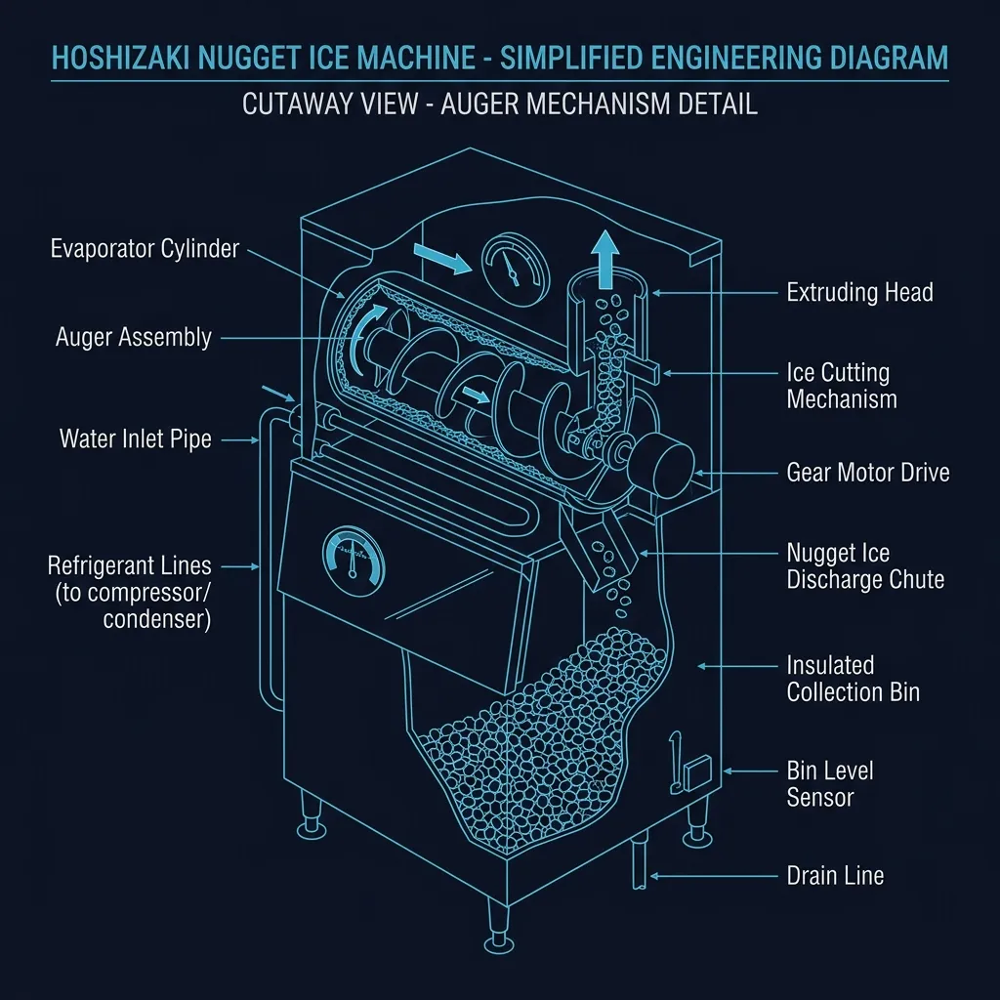
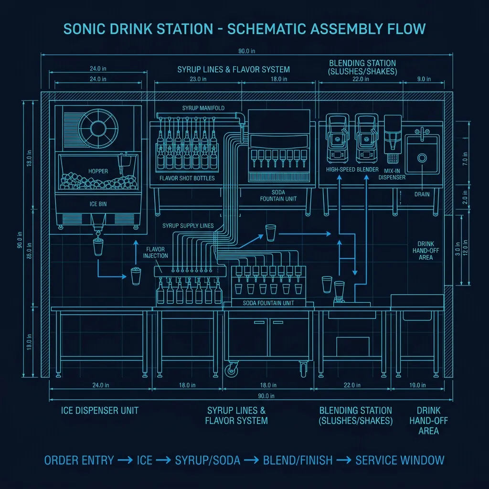

## It's Not Regular Ice. It Never Was.

If you've ever ordered a drink from Sonic and thought the ice tasted different — softer, chewable, almost addictive — you weren't imagining things. **Sonic uses nugget ice**, also called pellet ice or "Sonic ice," and it is fundamentally different from the cube ice that every other major fast food chain uses. 

Regular ice is made by freezing water in molds. The result is a dense, hard cube that melts slowly and doesn't absorb flavors. Nugget ice is made by a completely different process — one that produces a porous, layered, chewable pellet that absorbs the drink it's sitting in. That's why a Sonic Cherry Limeade tastes different from the first sip to the last. The ice itself is carrying flavor. 

This isn't a marketing gimmick. It's an engineering decision that costs Sonic significantly more money per location than standard cube ice, and it creates a whole set of operational headaches that most customers never think about. 

## How Nugget Ice Machines Actually Work

Sonic's nugget ice is produced by **Hoshizaki or Scotsman nugget ice machines** — commercial units that cost $3,000–$6,000 each and operate on a fundamentally different principle than standard ice makers.

### The Auger Process

Here's what happens inside:

1. **Water flows** into a cylindrical freezing chamber surrounded by refrigerant coils
2. The water freezes against the inner wall of the cylinder, forming a thin sheet of ice
3. A rotating **auger** (a large screw-shaped mechanism) scrapes the ice off the wall as it forms
4. The scraped ice flakes are pushed upward through the cylinder by the auger's rotation
5. As the flakes compress against each other at the top, they fuse into **soft, porous nuggets**
6. The nuggets break off and fall into a storage bin below

The result is ice that is approximately **80% ice and 20% air**, compared to cube ice which is nearly 100% solid. That air is what makes nugget ice soft enough to chew without cracking a tooth, and the porous structure is what allows it to absorb liquid.

## Why Sonic Chose Nugget Ice (And Why Most Chains Don't)

The decision to use nugget ice is directly tied to Sonic's business model. Unlike [McDonald's](/articles/chain/mcdonalds) or [Burger King](/articles/chain/burger-king), where food is the primary revenue driver, **Sonic generates a disproportionate amount of its revenue from drinks**. Their menu has over 1.3 million drink combinations when you factor in flavor add-ins, and their Happy Hour promotion (half-price drinks) is one of the most successful recurring promotions in fast food.

When drinks are your core product, the ice matters. Nugget ice makes drinks taste better because:

- **It chills faster** — more surface area means the drink reaches optimal temperature quicker
- **It absorbs flavor** — the porous structure soaks up the drink, so even chewing the ice gives you flavor
- **It doesn't dilute as quickly as crushed ice** — despite being soft, nugget ice holds its structure longer than shaved or crushed ice
- **Customers associate the ice with the Sonic experience** — it's become part of the brand identity

### Why Other Chains Don't Use It

The reason is simple: **cost and maintenance**. Nugget ice machines:

- Cost 2–3x more than standard cube ice machines
- Produce ice more slowly (a typical unit makes 800–1,000 lbs/day vs. 1,500+ for a cube machine)
- Require more frequent cleaning (the auger mechanism and water system need regular descaling)
- Break down more often (the auger is a mechanical component with moving parts, unlike the passive freezing of cube trays)

For a chain like [McDonald's](/articles/chain/mcdonalds), where drinks are secondary to burgers and fries, the ROI doesn't justify it. For Sonic, where drinks are the main attraction, it absolutely does.

## The Operational Reality: Ice Machine Maintenance

Ask any Sonic crew member what the worst part of their job is, and a surprising number will mention the ice machine. These units are **maintenance-intensive** in a way that standard ice makers aren't.

### The Weekly Deep Clean

Sonic's operational standards require the ice machines to be deep-cleaned on a regular schedule. This involves:

1. **Turning off the machine** and allowing the remaining ice to melt
2. **Running a descaling solution** through the water system to remove mineral buildup
3. **Disassembling the auger** (on some models) to clean the barrel and screw
4. **Sanitizing the storage bin** where the ice collects
5. **Reassembling and restarting** — which takes 30–45 minutes before the machine is producing ice at full capacity again

During this downtime, the location has to rely on its backup ice supply. Most Sonic locations have multiple ice machines specifically because one is frequently down for maintenance or repair.

### The Water Quality Problem

Nugget ice machines are extremely sensitive to water quality. Hard water — water with high mineral content — causes scale buildup inside the freezing cylinder and on the auger. This scale reduces ice production, makes the ice taste off, and eventually damages the machine.

Many Sonic locations use **water filtration systems** specifically for their ice machines, which adds another layer of cost and maintenance. In areas with particularly hard water, the filters need to be replaced monthly.

## The Drink Station: Where It All Comes Together

Sonic's drink preparation area is designed around the ice machine as the centerpiece. The typical workflow for a drink order:

1. **The order comes in** via the drive-in stall speaker or drive-thru
2. The drink maker grabs the correct cup size and fills it with **nugget ice from the bin** — typically to the very top
3. The base drink is dispensed from the **fountain system** (Coca-Cola products at most locations)
4. **Flavor add-ins** (cherry, vanilla, grape, strawberry, etc.) are added via syrup pumps — each pump delivers a measured shot
5. For specialty drinks like Slushes, the frozen base comes from a separate **slush machine** and is combined with flavors
6. A lid and straw go on, and the drink is routed to the carhop or drive-thru window

### The Speed Challenge

During peak hours — especially during Happy Hour (typically 2–4 PM) — a single Sonic location might make **200–400 drinks per hour**. The ice machine's production rate becomes the limiting factor. If the machine can't keep up with demand, the crew runs out of ice, and everything stops.

This is why experienced Sonic managers obsess over ice levels. They'll check the bin multiple times per hour during rushes, and some locations have managers who can estimate remaining ice capacity by the sound the bin makes when the lid opens.

## Why People Buy Bags of Sonic Ice

Here's something that surprises most people: **Sonic will sell you a bag of just their ice**. It's typically $2–3 for a 10-pound bag, and people actually buy them regularly. Some locations sell dozens of bags per day, especially in summer.

This isn't an accident. Sonic recognized that their ice had become a product in its own right and leaned into it. Some locations even have dedicated signage advertising bagged ice for sale.

The demand for nugget ice has also spawned a cottage industry of home nugget ice makers (brands like GE Opal and Frigidaire), which retail for $400–$600. These consumer machines use the same basic auger principle as Sonic's commercial units, just at a much smaller scale.

## What You're Actually Experiencing

When you take a sip of a Sonic drink and it hits different from the same soda at any other chain, you're experiencing the combined effect of three things:

1. **Nugget ice that chills the drink faster** and more evenly than cube ice
2. **Porous ice that has absorbed the drink's flavor**, making every piece of ice a tiny flavor bomb
3. **A cup packed to the brim with ice**, which means a higher ice-to-liquid ratio that keeps the drink colder longer

It's a $5,000 machine making a product that most customers can't articulate why they prefer — they just know they do. And that's exactly the kind of competitive advantage that keeps Sonic's drink business thriving in a market where every other chain is selling the exact same Coca-Cola products through the exact same fountain machines.
