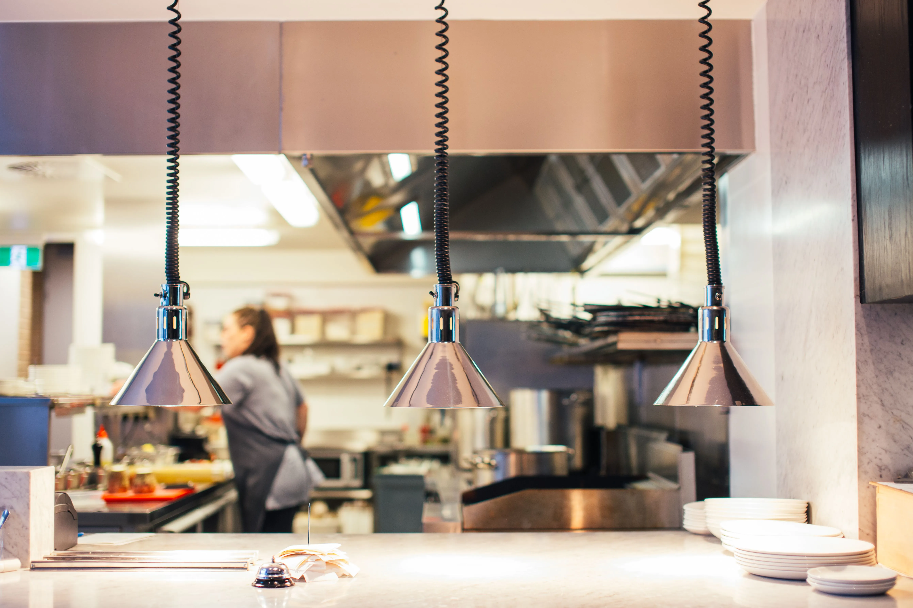

If you have ever stood inside a high-volume Starbucks during the 8:00 AM morning peak, you have witnessed a level of operational density that feels like organized chaos. Blenders are roaring on the Cold Bar, milk pitchers are steaming on the [Mastrena espresso machines](/articles/starbucks-mastrena-espresso-calibration), and dozens of customized mobile order cups line the handoff plane.

To the untrained eye, it looks like an uncoordinated scramble. Behind the counter, every single beverage movement is governed by a piece of corporate software known as the **Digital Production Manager (DPM)**.

The DPM is the tablet interface (typically running on iPad hardware mounted at eye level above the espresso bars and handoff plane) that acts as the air traffic control tower for modern Starbucks operations. It has completely replaced the legacy system of hand-writing cups with Sharpies, turning drink execution into a routed digital pipeline. The operational mechanics for routing and managing orders are as follows:

## 1. Multi-Channel Ingestion and Queue Routing

<strong>Manager's Tool:</strong> Spending hours building schedules in Excel? We use <a href="https://www.7shifts.com/?a_aid=fastfoodguides" target="_blank" rel="noopener sponsored">7shifts</a> to automate our labor matrix and handle shift-swaps instantly. It is a lifesaver for cutting labor costs.

In a modern Starbucks store, orders arrive simultaneously from four distinct ingestion channels: **Drive-Thru (DT), Cafe Point of Sale (POS), Mobile Order & Pay (MOP), and Third-Party Delivery (UberEats/DoorDash)**. 

If all four channels printed labels to a single printer consecutively, the store would collapse within 15 minutes. The DPM software solves this by dynamically routing tickets across specialized physical work stations based on product type and channel:
*   **The Channel Split:** In high-volume stores equipped with three Mastrena espresso machines, the DPM algorithm assigns Bar 1 exclusively to Drive-Thru orders, Bar 2 exclusively to Mobile/Delivery orders, and Bar 3 (or shared capacity) to walk-in Cafe orders.
*   **The Component Split:** If a customer orders a hot Caramel Macchiato and an iced Strawberry Açaí Refresher in the same mobile transaction, the DPM splits the ticket. The hot drink label routes to the Hot Bar printer, while the Refresher label routes to the Cold Bar (CBS) printer. Both tickets share a unified order GUID (Globally Unique Identifier) so the handoff partner knows to consolidate them before calling the customer's name.

## 2. Dynamic Throttling and The 3-Screen View

The DPM interface is divided into three functional operational views that partners swipe through during their shift: **Prep, In Progress, and Ready**.

### The "Prep" Queue and Label Pacing
The "Prep" screen shows every unprinted order waiting in the cloud server queue. Unlike older systems where label printers spat out adhesive stickers endlessly until they trailed across the floor, modern DPM setups utilize **Label Pacing**.
*   The system only prints a label when the barista pulls the preceding sticker off the machine's lip sensor.
*   By viewing the digital "Prep" screen on the DPM tablet, baristas can look 10 orders ahead into the cloud queue. If a barista sees three consecutive iced chai lattes scheduled five tickets back, they can batch-prep the milk cans ahead of time without waiting for the physical labels to print.

**ProTip:** Do not "pre-pull" stickers from the printer in long chains. The DPM algorithm calculates mobile app wait times based on unprinted tickets. Pulling them all prematurely tells the system the queue is shorter than it is, causing customers to arrive before their drinks are ready.

### Dynamic Throttling During Peak
When incoming MOP ticket volume exceeds the physical thermodynamic capacity of the espresso machines (e.g., receiving 80 drink orders in a 5-minute window), the DPM communicates with corporate cloud servers to execute **Dynamic Throttling**. The Starbucks mobile app automatically dynamically inflates estimated pickup times for customers (changing a 5-minute estimate to a 15-to-20-minute estimate) to prevent lobby overcrowding and manage customer expectations.

  <strong>Manager's Insight: The "Force Print" Feature</strong>
  One of the most critical supervisory tools within the DPM is the **Force Print** button. 
    
  If a customer arrives in the cafe asking for their mobile order, and the barista sees on the DPM "Prep" screen that the ticket is buried 25 orders deep in the digital queue, the barista can tap the customer's name on the iPad and select **"Force Print."** 
    
  This immediately bypasses the cloud queue and forces the physical label printer to spit out that specific drink sticker instantly. While general managers instruct shift supervisors to use this feature sparingly—because force-printing pushes every other waiting customer one drink further back in line—it is an essential relief valve for de-escalating tense lobby situations and handling remakes for spilled beverages.

## 3. The Dedicated Handoff Role (The Consolidation Bottleneck)

In stores doing over 800 transactions per morning peak, corporate labor deployment models assign a dedicated partner to the **Handoff Plane (or "Consolidator")** role, armed with their own DPM tablet.

### Closing the Loop: The "Ready" Swipe
In a kitchen without a Consolidator, baristas place finished drinks onto the pickup counter blindly. With a DPM Consolidator in place, the workflow becomes closed-loop:

**ProTip:** During peak, swiping items as "Complete" on the DPM tablet can feel like a chore, but skipping this step forces the shift supervisor to constantly manually track down missing components, causing severe bottlenecks at the handoff plane.

1.  The Hot Bar barista finishes a Venti Latte and sets it on the staging rail.
2.  The Consolidator grabs the cup, matches it with the customer's warmed cheese danish from the pastry station, and groups them together.
3.  The Consolidator taps the customer's order on their DPM tablet and swipes it into the **"Ready"** status.
4.  **The Automated Notification:** Swiping an order to "Ready" triggers an instant automated push notification to the customer's smartphone app (*"Your order is ready at the counter!"*) and changes the status on the lobby digital display board from "In Progress" to "Ready."

## 4. Hardware Reliability and Network Failures

Because the DPM system relies on continuous cloud connectivity and local network handshakes between iPads, KDS controllers, and thermal label printers, network latency can paralyze a store.

When local internet connectivity flickers, stores enter **Offline Mode**. The DPM tablets lose their real-time sync with the mobile app servers, forcing the POS registers to print long-form paper receipts directly to backup kitchen impact printers. Baristas must revert to verbal line-calling and manual cup marking—a jarring operational regression that proves just how completely modern Starbucks throughput relies on the digital architecture of the DPM.
