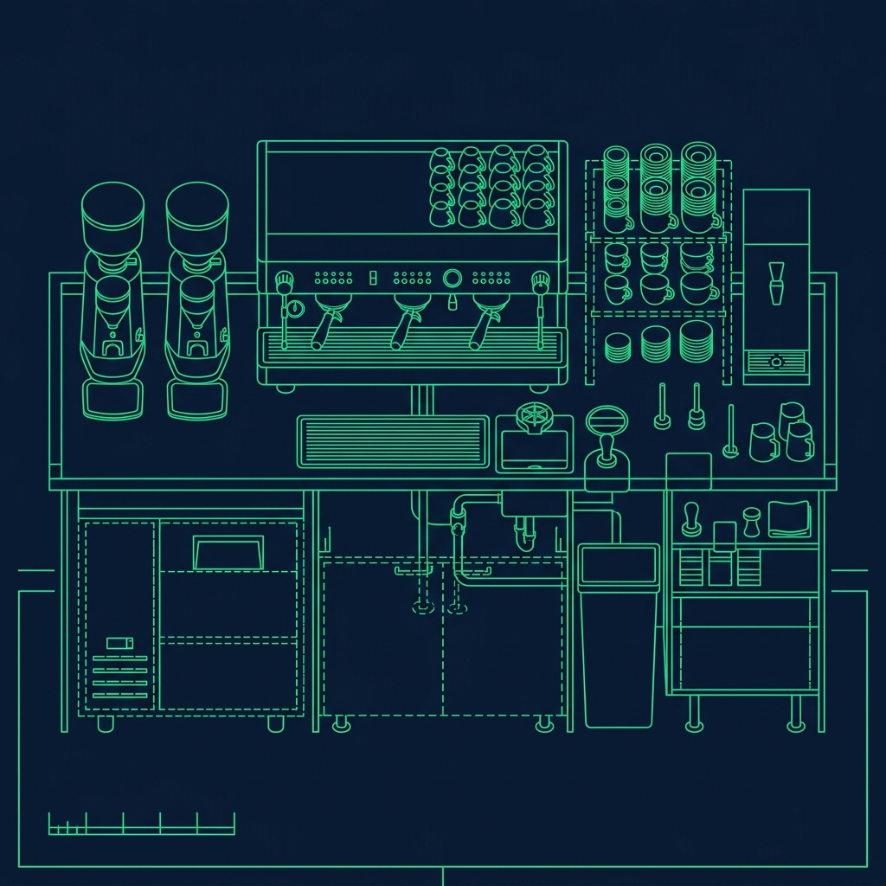
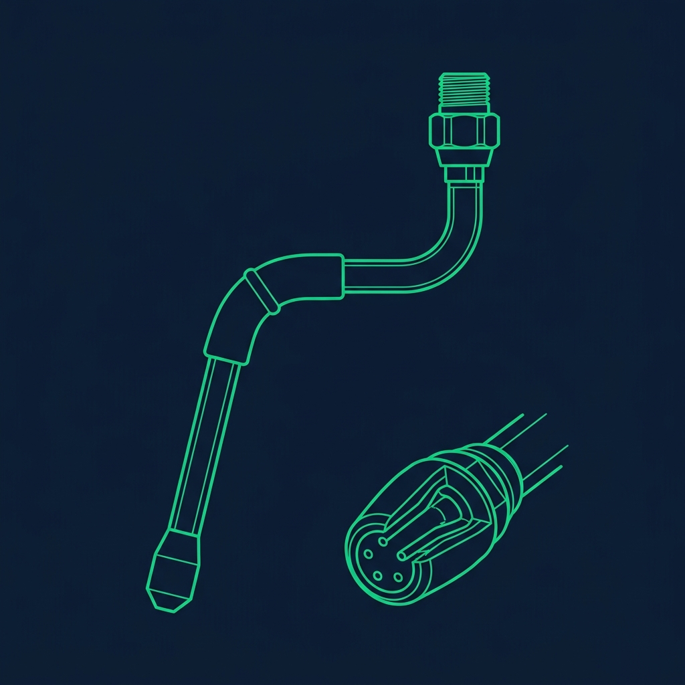

The Starbucks morning rush—internally called "Peak"—is one of the most intense experiences in the entire QSR industry. Between 7:00 AM and 9:00 AM, hundreds of customers, a relentless stream of mobile orders, and a packed drive-thru line converge on the store simultaneously. If your Shift Supervisor puts you on the Hot Espresso Bar during Peak, it means two things: they trust your skills, and you're about to endure two hours of the most focused, high-speed beverage crafting you've ever done. I've trained dozens of baristas through their first Peak shifts, and the difference between drowning and thriving comes down to a handful of specific habits. Here's every one of them. *(Related guide: [How to Master the Starbucks Cold Bar and Frappuccino Sequence](/articles/starbucks-cold-bar-frappuccino/))*

## Respect the Beverage Routine

Starbucks drills a highly specific routine into every barista during training called the Beverage Routine. When the rush hits and tickets are printing faster than you can read them, do not abandon it. The routine is specifically engineered to keep you moving efficiently without having to think about what comes next. *(Related guide: [What is the Starbucks Customer Support (CS) Cycle?](/articles/starbucks-customer-support-cycle/))*

The sequence works like this:

- **Steam the Milk First.** The Mastrena espresso machine takes time to steam milk to the proper temperature (around 150°F to 160°F for standard drinks, 180°F for extra-hot requests). Start this step first because it's the longest wait in the entire build. *(Related guide: [How the Starbucks \](/articles/starbucks-pull-to-thaw/))*
- **Queue the Shots.** While the milk steams, pull the espresso shots into the cup. The shots take about 18 to 23 seconds to pull, and that window overlaps perfectly with the steaming time.
- **Add the Syrup.** While the shots are pouring, pump the required syrup—vanilla, caramel, classic, hazelnut, whatever the sticker says—directly into the cup. The shots fall on top of the syrup, which helps them dissolve and integrate.
- **Finish and Connect.** Pour the steamed milk, add whipped cream if applicable, cap it, sleeve it, and place it on the handoff plane. Call out the drink and move to the next sticker.

The secret to speed is sequencing across multiple drinks. While the milk is steaming for Drink #1, you should already be queuing shots and pumping syrup for Drink #2. You should never be standing still waiting for a machine to finish a cycle. Dead time is where you fall behind, and once you're behind during Peak, you almost never catch up.

## Don't Look at the Line

I tell every new barista the same thing before their first Peak shift: do not look out into the cafe. If you glance up and see 30 people staring at you with their arms crossed and their phone timers running, your anxiety will spike and you'll start making mistakes. You'll pump 3 instead of 4, you'll forget the extra shot, you'll steam the wrong milk.

Focus entirely on your stickers. Pull two stickers at a time—no more. Make Drink #1, sequence Drink #2, and ignore the crowd. Your job is not to manage the lobby; your job is to pull perfect shots and steam beautiful milk. Let the Shift Supervisor manage the angry customers. That's literally what they're paid to do.

The stickers come from multiple channels—cafe orders, mobile orders, drive-thru orders—and they all print on the same machine. Starbucks standard is to work them in the order they print, regardless of channel. However, your SSV may ask you to alternate—one mobile, one cafe—to keep both groups of customers moving. Follow whatever deployment plan they set for that specific rush.

## Keep Your Station Immaculate

A messy bar slows you down in ways you don't notice until it's too late. If you spill milk, wipe it immediately. If the espresso grounds bin is getting full, empty it the second you have a 10-second gap. If you let milk crust onto your steam wand or syrup pool on the counter, you will eventually drop a cup, knock over a bottle, or slip on a wet floor and completely derail the flow.

Here's the detail that even some experienced baristas overlook: a clean steam wand produces better microfoam. When milk residue builds up on the tip, it clogs the tiny holes and creates large, bubbly foam instead of the silky-smooth microfoam that flat whites and lattes require. Purge and wipe the wand after every single steam. No exceptions. Two seconds of prevention saves you a 45-second remake.

Keep at least two rinsed pitchers ready at all times—one for dairy and one for whatever alternative milk you're using most (usually oat). Switching between milks without rinsing is a cross-contamination risk and a potential allergen issue that no amount of speed justifies.

## Communicate with Your Support

During Peak, you should never have to leave your one-square-foot of space behind the bar. The [Customer Support barista](/articles/starbucks-customer-support-cycle) exists specifically to keep you stocked. Their entire job is restocking your milk, bringing fresh cups, replenishing ice, and making sure you have everything you need to keep building drinks.

But they can't read your mind. If you're down to your last carton of oat milk, don't wait until it's empty. Call out immediately: "I need oat milk on Hot Bar, on the fly." That gives the CS partner time to grab it from the back before you actually run dry.

Communication goes beyond restocking. If you notice mobile order stickers are piling up faster than cafe stickers, tell your Shift Supervisor so they can adjust the deployment—maybe pulling a third barista onto the floor or temporarily redirecting simple drinks to another station. Staying silent while you drown in tickets helps nobody.

## Know Your Modifiers Cold

During Peak, you absolutely do not have time to look up how many pumps of vanilla go in a Grande versus a Venti. Before your first Peak shift, drill these standard pump counts into your memory:

- **Tall:** 3 pumps of syrup, 1 shot of espresso (hot), 1 shot (iced)
- **Grande:** 4 pumps of syrup, 2 shots of espresso
- **Venti Hot:** 5 pumps of syrup, 2 shots of espresso
- **Venti Iced:** 6 pumps of syrup, 3 shots of espresso

Knowing these by heart means you can read a sticker, grab the cup, and start pumping syrup in one fluid motion without pausing to count or check a recipe card. Over the course of a two-hour Peak, those saved seconds add up to dozens of drinks.

The sticker also tells you every modification—extra shot, light ice, no whip, extra hot—but the base numbers above cover the standard build for probably 80% of what you'll make during a morning rush. Lattes, flavored lattes, Americanos, and Cappuccinos all follow the same syrup and shot grid.

## Pro Tips for Your First Peak Shift

- **Pre-batch your syrups mentally.** When you pull two stickers at once, glance at both before you start. If both drinks use vanilla, pump both cups back-to-back while you're already holding the bottle. Saves you from putting it down and picking it up again.
- **Practice on [Cold Bar](/articles/starbucks-cold-bar-frappuccino) first.** If your store allows it, ask to train on Cold Bar during a slow mid-afternoon shift before you attempt Hot Bar during Peak. Cold Bar teaches the same sequencing discipline with slightly lower pressure because blenders are more forgiving than espresso machines.
- **Keep your towel in the same spot.** Sounds trivial, but if your bar towel is always on your left hip or tucked into the same corner, you never waste time looking for it when you need to wipe the steam wand. Muscle memory extends to your entire station setup, not just the drink builds.

## Frequently Asked Questions

### How many drinks should I be making per 10-minute window during Peak?

A strong Hot Bar barista typically produces 8 to 12 drinks every 10 minutes during a heavy Peak. When you're just starting, aim for 6 to 8 and focus on accuracy over speed. Remakes cost more time than going slightly slower on the first build. Speed comes naturally once the Beverage Routine is locked into muscle memory.

### What do I do if the espresso machine goes down during Peak?

Immediately call it out to your Shift Supervisor. They'll either swap you to the backup Mastrena (if your store has a second machine) or redeploy you to Cold Bar while they troubleshoot. Never try to fix the machine yourself during Peak—it wastes precious time and you likely aren't trained on machine diagnostics anyway.

### How do I handle a remake request in the middle of Peak?

If a customer says their drink is wrong, apologize sincerely, write a remake sticker, and slot it into your queue. Do not stop everything to remake it immediately unless your Shift Supervisor specifically tells you to. Disrupting your flow for one remake can cascade into delays on ten other drinks. The customer will get their corrected drink within a couple of minutes, which is faster than it feels.

