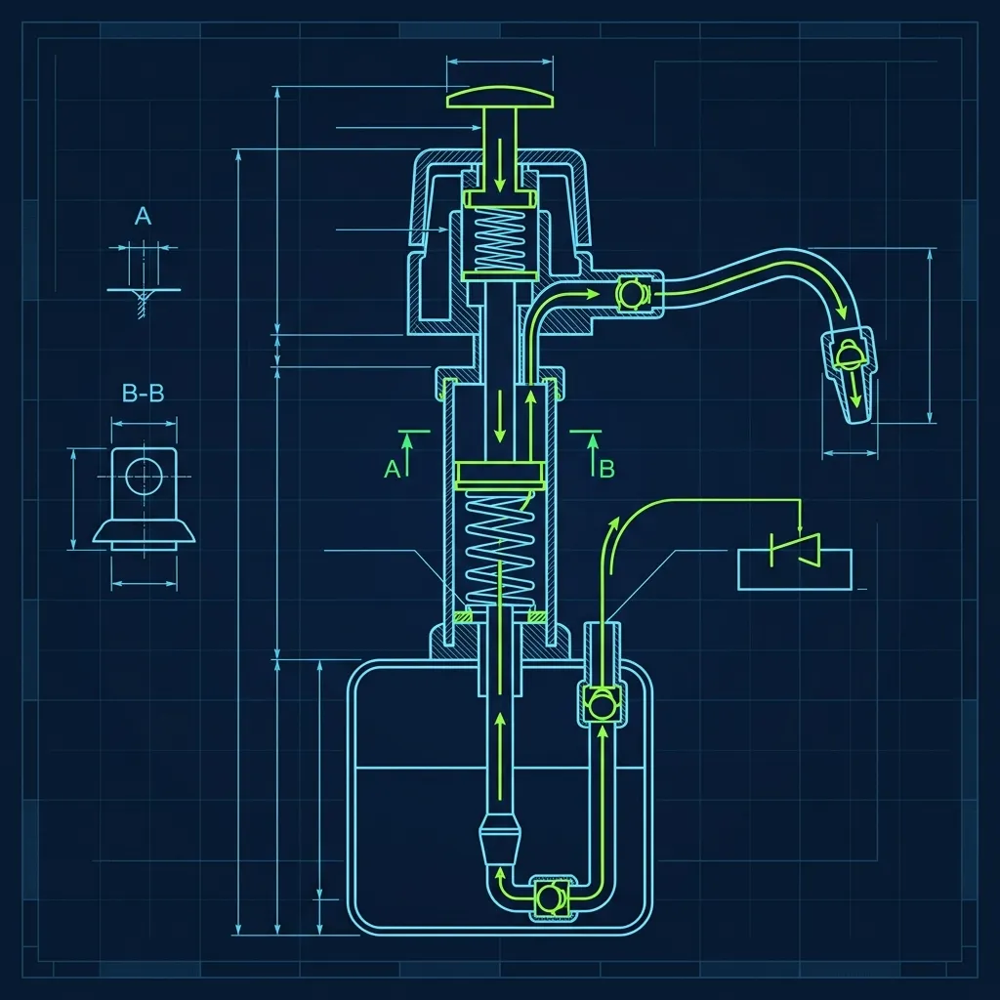

If you’ve just been hired at Starbucks, congratulations—you are about to consume more caffeine in a single week than most people do in a month. But before you can get comfortable, you have to survive "Bar Training." 

The most common reason new green bean baristas panic during the morning rush is forgetting how many pumps of syrup go into a drink. Staring blankly at a Venti Iced Caramel Macchiato ticket while the line stretches to the door is a rite of passage.

Instead of trying to memorize flashcards, you need to understand the structural logic behind the menu. Here is how you can memorize the Starbucks pump ratios fast.

## The Hot Bar Baseline (The 2-3-4-5 Rule)

Everything at Starbucks is built on a mathematical baseline. Once you understand the baseline, you don't need to memorize 50 different drinks; you just need to know the exceptions.

For standard Hot Bar drinks (Lattes, Mochas, White Mochas), the syrup pumps follow the **2-3-4-5 Rule** based on the cup size:

*   **Short (8 oz):** 2 pumps
*   **Tall (12 oz):** 3 pumps
*   **Grande (16 oz):** 4 pumps
*   **Venti Hot (20 oz):** 5 pumps

If a customer orders a Grande Vanilla Latte, it gets 4 pumps of Vanilla. If they order a Tall Mocha, it gets 3 pumps of Mocha. It is that simple.

<strong>Pro Tip:</strong> Always pump the syrup into the cup *before* pulling the espresso shots. The heat and pressure of the espresso hitting the syrup is what mixes the drink. If you pump syrup on top of the milk, the customer will get a mouthful of unflavored milk and a thick layer of pure sugar at the bottom.

## The Iced Venti Exception

You will notice that the 2-3-4-5 rule covers Venti *Hot* drinks (20 oz). But a Venti *Iced* cup is 24 oz to account for the ice. 

Because the cup is larger and holds more liquid, a **Venti Iced drink gets 6 pumps** of syrup. 

So the full standard progression (Tall, Grande, Venti Hot, Venti Iced) is **3-4-5-6**.

## The Macchiato Exception (One Less Pump)

Here is where many new baristas get tripped up: the Caramel Macchiato.

A Caramel Macchiato gets **one less pump** of syrup (Vanilla) than a standard latte of the same size. Why? Because the drink gets a heavy drizzle of caramel sauce on top. If you put the standard amount of vanilla syrup *plus* the caramel drizzle, the drink becomes overwhelmingly sweet.

So, the Macchiato pump rule is **1-2-3-4 (Hot) and 5 (Iced)**:
*   Short: 1 pump
*   Tall: 2 pumps
*   Grande: 3 pumps
*   Venti Hot: 4 pumps
*   Venti Iced: 5 pumps

## Cold Bar and Frappuccinos (The 2-3-4 Rule)

Frappuccinos are built on the Cold Bar Station (CBS), which uses a completely different set of pumps. CBS pumps are physically shorter and dispense exactly half the volume of a standard hot bar pump.

For Frappuccinos, the rule is the **2-3-4 Rule** (Tall, Grande, Venti).

*   **Tall:** 2 pumps (Frap Roast) + 2 pumps (Syrup)
*   **Grande:** 3 pumps (Frap Roast) + 3 pumps (Syrup)
*   **Venti:** 4 pumps (Frap Roast) + 4 pumps (Syrup)

<strong>Insider Secret:</strong> If you run out of a CBS syrup pump during a rush and have to use a Hot Bar pump for a Frappuccino, you must cut the recipe in half. A Grande Frappuccino needs 3 CBS pumps. If you only have a Hot Bar pump, use 1.5 pumps. If you use 3 full Hot Bar pumps, the Frappuccino will be pure liquid sugar and won't blend correctly.

## The Americano Exception

Americanos get an extra shot of espresso compared to lattes. Because they have an extra, highly bitter shot, they also get an **extra pump of syrup** to balance the flavor profile if requested.

The Americano progression (Tall, Grande, Venti Hot, Venti Iced) is **4-5-6-7**.

## Memorization Strategy

When you are on bar, don't look at a ticket and try to remember the entire recipe. Look at the ticket and identify the **modifications from the baseline**. 

If you see a "Venti Iced Caramel Macchiato," your brain should immediately process: 
1. Baseline Iced Venti = 6 pumps. 
2. Macchiato Exception = -1 pump. 
3. Total = 5 pumps of Vanilla.

Once you stop memorizing individual drinks and start applying the rules, the bar will slow down, the anxiety will drop, and you'll be knocking out drinks like a seasoned veteran.
