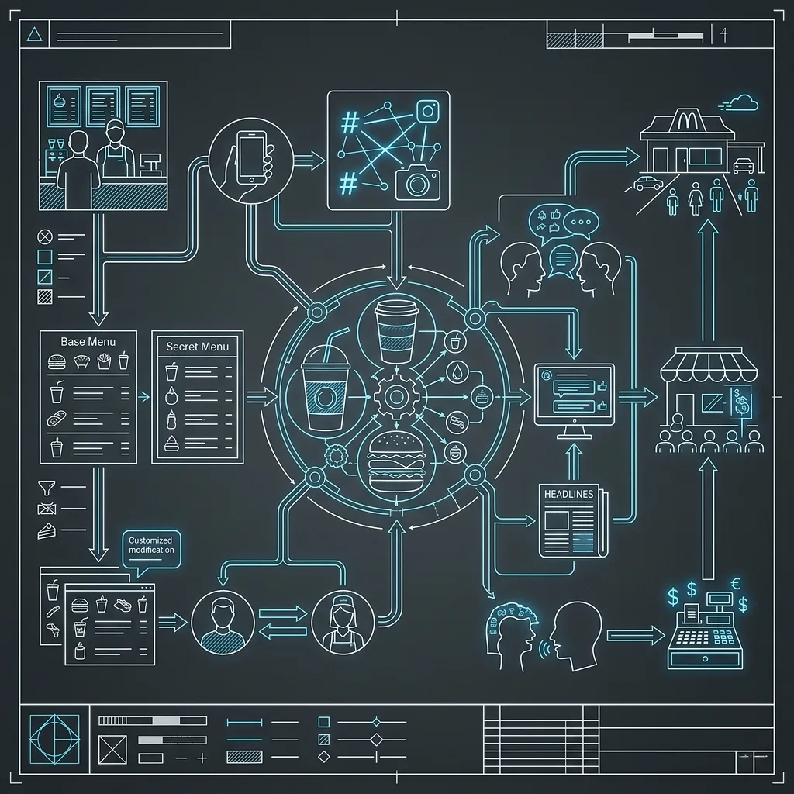
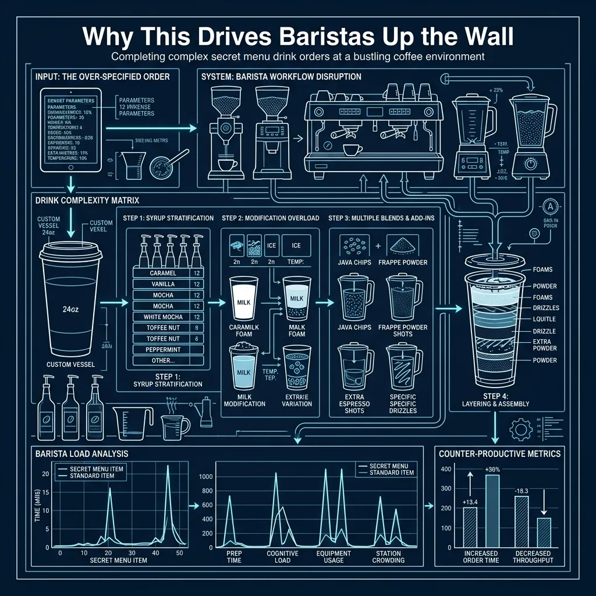

7.  Does Starbucks Actually Have a 'Secret Menu'? (What Baristas Think)

Let me settle this right now: Starbucks does not have a secret menu. There is no laminated card hidden under the register. There is no special screen on the POS system that unlocks when you say the right password. There is no training module where baristas learn to make the “Cotton Candy Frappuccino” or the “Butterbeer Latte.” None of that exists. It has never existed. 

What people call the Starbucks “secret menu” is actually just a collection of custom drink recipes that customers have invented, named, and shared on social media. Some of these recipes are genuinely good. Some of them are disgusting sugar bombs that no reasonable person should consume. But none of them were created by Starbucks, none of them are in any Starbucks training material, and your barista almost certainly has no idea what you’re talking about when you walk up to the register and say, “Can I get a Cinderella Latte?” 

I’ve spent enough time in and around QSR kitchens to appreciate what this phenomenon does to the people behind the counter. Let me walk you through the reality. 

## How the “Secret Menu” Myth Got Started

The concept took off around 2012-2013, when Tumblr and early Instagram food accounts started posting elaborate custom Starbucks drinks with catchy names. A user would figure out that if you ordered a Vanilla Bean Frappuccino with raspberry syrup and java chips, it tasted vaguely like a raspberry cheesecake. They’d name it the “Raspberry Cheesecake Frappuccino,” photograph it with good lighting, and post it online. Other people would see it, want to try it, and show up at Starbucks asking for a drink that doesn’t exist on any menu.

The trend exploded with TikTok. Starting around 2019-2020, TikTok creators began posting “secret menu” videos that racked up millions of views. Some of these videos show the actual modifications needed to build the drink. Many of them just show the finished product with a name and no recipe, leaving the customer to walk into a Starbucks, say the name, and expect the barista to know what they’re talking about.

Starbucks corporate has never endorsed the concept. They’ve never published a secret menu. They’ve never trained baristas to make any of these drinks by name. Their official position, repeated in numerous press statements over the years, is essentially: “We’re happy to make any custom drink using our available ingredients, but we don’t have a secret menu. If you want a specific custom drink, please provide the recipe.”

That’s a perfectly reasonable position. The problem is that most customers don’t hear it — or don’t care.

## Why This Drives Baristas Up the Wall

Imagine you’re working the bar during the [morning rush](/articles/starbucks-morning-rush), which at most Starbucks locations means a steady stream of 30 to 50 drinks per half hour. The store is loud. The espresso machine is pulling shots. The blender is running. The mobile order printer is spitting out tickets faster than you can read them. You are in survival mode.

A customer walks up and says: “Hi, I’d like a Sunset Drink.”

You have no idea what that is. You’ve never heard of it. It’s not on any menu. It’s not in the POS system. It’s not in your training.

So you ask: “I’m not familiar with that one — do you have the recipe?”

Now the customer looks at you like you’ve just confessed to a crime. They pull out their phone, scroll through TikTok for 30 seconds while you and the eight people behind them wait, and then show you a video of someone making a drink with no measurements listed. Just a visual of someone pouring various colored syrups into a cup.

This interaction plays out hundreds of thousands of times per day across Starbucks locations worldwide. It is, by consensus among baristas, one of the most frustrating parts of the job.

The frustration isn’t about making complicated drinks. Baristas make complicated drinks all day long. A Venti Caramel Ribbon Crunch Frappuccino with extra caramel drizzle and an affogato shot is a pain to make, but it’s a real menu item with a real recipe card and a real button on the POS. The barista knows exactly what goes in it and how to ring it up.

The frustration is about being expected to know recipes that don’t exist in any Starbucks system, while simultaneously being judged on speed and accuracy. A barista who takes two minutes to decode a TikTok video is a barista who falls behind on the bar, which backs up the line, which slows down the entire store, which affects [the customer support cycle](/articles/starbucks-customer-support-cycle) and triggers complaints from every other customer waiting.

## [How the Starbucks](/articles/starbucks-pull-to-thaw) Customization System Actually Works

Here’s what most customers don’t understand: Starbucks already has one of the most flexible customization systems in the entire food and beverage industry. You don’t need a “secret menu” because you can build virtually anything from the components that are already available. Every drink is assembled from a set of modular building blocks:

### Base Drink

This is your starting point — espresso, brewed coffee, tea, Frappuccino base, refresher base, steamed milk (for steamers/hot chocolates), or lemonade. Every drink begins with one of these foundations.

### Size

Tall (12 oz), Grande (16 oz), Venti (20 oz hot / 24 oz cold), or Trenta (30 oz, cold drinks only). The size determines default quantities for everything else — more pumps of syrup, more shots of espresso, more milk.

### Milk

Whole milk, 2% milk, nonfat milk, heavy cream, half-and-half, oat milk, almond milk, coconut milk, or soy milk. Each one changes the flavor, texture, and calorie count. Most drinks default to 2%, but you can swap to anything.

### Syrup Pumps

This is where the customization gets deep. Starbucks carries a rotating selection of syrups including vanilla, classic (plain sweetener), caramel, hazelnut, toffee nut, peppermint (seasonal), cinnamon dolce, brown sugar, raspberry, and several others. Each size has a default number of pumps — a Tall gets 3, a Grande gets 4, a Venti gets 5 or 6. You can increase, decrease, or combine syrups however you want.

### Espresso Shots

Most espresso drinks come with a default number of shots — a Tall gets 1, Grande gets 2, Venti gets 2 (hot) or 3 (iced). You can add extra shots, reduce shots, or request different roast profiles (blonde or signature).

### Add-ons

Whipped cream, caramel drizzle, mocha drizzle, cookie crumbles, java chips, vanilla sweet cream cold foam, salted caramel cold foam, chocolate malt powder, cinnamon powder, and more. These are the garnishes and extras that let you personalize the drink.

### Temperature and Preparation

Hot, iced, or blended. Extra hot. Light ice or no ice. Upside down (espresso poured last instead of first). Dry (more foam, less milk) or wet (less foam, more milk) for lattes and cappuccinos.

When you understand this system, you realize that any “secret menu” drink is just a combination of these standard components with a cute name attached. A “Medicine Ball” is just a Jade Citrus Mint tea bag plus a Peach Tranquility tea bag in steamed water with honey and lemonade — Starbucks eventually put it on the actual menu as the “Honey Citrus Mint Tea” because so many people ordered it. A “Pink Drink” started as a secret menu hack — Strawberry Acai Refresher with coconut milk instead of water — and became so popular that Starbucks added it to the official menu.

## The POS System and Why Complex Orders Slow Everything Down

The Starbucks point-of-sale system is designed to handle customization. Every modifier has a button. Every syrup, every milk, every add-on can be rung up individually. But here’s what customers don’t see: each modification adds time at two points in the process.

First, it adds time at the register. The cashier has to navigate through multiple screens to input each modification. A simple latte takes about 5 seconds to ring up. A heavily customized drink with four syrup modifications, a milk swap, extra shots, cold foam, and drizzle can take 30 to 45 seconds. That doesn’t sound like much, but when there are 15 people in line, those extra seconds compound rapidly.

Second — and this is the bigger bottleneck — each modification adds time at the bar. The barista has to read a ticket that might have 8 or 10 lines of modifications, interpret them all correctly, execute them in the right sequence, and maintain quality. Miss one modification and the customer sends it back, which creates a remake that further backs up the queue. During peak, a barista is working on two to three drinks simultaneously, reading tickets while pulling shots while steaming milk. A drink with 10 modifications requires more cognitive load than three simple drinks combined.

This is why experienced Starbucks partners sometimes get frustrated with the “secret menu” trend. It’s not about the difficulty of any individual drink. It’s about the cumulative effect on throughput when five out of every ten customers are ordering highly customized drinks that take three times as long to ring up and make.

## The Most Common “Secret Menu” Orders and How to Actually Order Them

If you want to order a drink you saw on social media, here’s the correct approach: know the recipe before you get to the counter and give the barista the actual modifications. Don’t use the made-up name. That name means nothing to them.

Here are a few popular ones broken down into their actual components:

**“Cotton Candy Frappuccino”** — Order a Vanilla Bean Frappuccino, add raspberry syrup (2 pumps for a Grande). That’s it. The vanilla base plus raspberry creates a flavor that some people think resembles cotton candy.

**“Butterbeer Frappuccino”** — Order a Caramel Frappuccino with toffee nut syrup (3 pumps for a Grande) and caramel drizzle on top. The caramel and toffee nut combination creates a buttery, butterscotch-type flavor.

**“Cookies and Cream Frappuccino”** — Order a Vanilla Bean Frappuccino with mocha syrup (2 pumps) and java chips blended in. The cookies-and-cream name is a stretch, but the chocolate chips in a vanilla base do create something in that general territory.

**“Iced White Mocha with Sweet Cream Foam”** — This one is almost a real menu item. Order an Iced White Chocolate Mocha, substitute vanilla sweet cream cold foam on top, and optionally add extra caramel drizzle. It’s been a TikTok staple for years.

The pattern is always the same: start with a real base drink, add specific modifiers, and describe exactly what you want. If you do this, the barista can make it quickly and accurately. If you just say the name and expect them to know, you’re going to waste your time and theirs.

## What Baristas Wish You Knew

I’ve talked to enough current and former Starbucks partners to compile a general consensus on this topic:

**They don’t mind making custom drinks.** Customization is literally part of the job. What they mind is being expected to know recipes that aren’t theirs to know.

**Bring the recipe, not just the name.** If you’ve got a TikTok saved on your phone with the full recipe visible, show it to the barista. Better yet, read the modifications out loud. “Can I get a Grande Iced Chai with two pumps of vanilla, oat milk, and vanilla sweet cream cold foam?” That’s clear, specific, and fast to ring up.

**Expect to pay for every modification.** Custom drinks are often more expensive than standard menu items because each added syrup, each milk substitute, and each topping has a price. A “secret menu” drink with four modifications might cost $8 to $9 by the time you’re done. Don’t be surprised by the total.

**Don’t order them during peak.** If you want to experiment with a complicated custom order, do it at 2 PM on a Wednesday when the store is quiet and the barista has time to work with you. Ordering a 12-modification drink at 7:45 AM when there are 20 people in line behind you is a bad time for everyone involved.

**Be patient if it doesn’t taste right the first time.** Since these aren’t standardized recipes, there’s no quality control benchmark. The barista is building it on the fly based on your instructions. If it needs adjustment, politely ask for a tweak rather than demanding a full remake. Most baristas are happy to add a pump of syrup or more foam if you ask nicely.

## The Drinks That Made It Off the “Secret Menu”

A handful of formerly “secret” drinks have been so popular that Starbucks eventually added them to the official menu. This is the best evidence that the “secret menu” is really just an informal R&D pipeline powered by customers:

*   **Pink Drink** — Strawberry Acai Refresher with coconut milk. Originally a hack, now a permanent menu item and one of Starbucks’ best sellers.
*   **Honey Citrus Mint Tea (Medicine Ball)** — Originally a customer creation that baristas started making so frequently they memorized it. Now it’s on the menu with its own button in the POS.
*   **Iced Chocolate Almond Milk Shaken Espresso** — Partially inspired by customer customization trends around shaken espresso drinks with non-dairy milk.

The lesson here is that Starbucks listens. When a custom combination becomes popular enough, they’ll formalize it. But until they do, it’s on you to know the recipe.

## Frequently Asked Questions

### Will a barista refuse to make a “secret menu” drink?

No, as long as you can provide the recipe using Starbucks’ available ingredients. They won’t refuse a custom drink — they’ll refuse to guess at a recipe they don’t know. If you say “Make me a Sunset Drink” with no further information, they can’t help you. If you say “Make me a Mango Dragonfruit Lemonade with peach juice,” they can absolutely do that.

### Are “secret menu” drinks available on the Starbucks app?

Not by their social media names, but you can build them using the app’s customization options. When you select a base drink, you can add all the same modifications you’d request in-store. This is actually the best way to order complex custom drinks, because it eliminates the communication gap at the register and the barista gets a clean, printed ticket with every modification clearly listed.

### Has Starbucks ever asked people to stop sharing “secret menu” recipes?

No. Starbucks has taken a diplomatic approach, acknowledging that customization is a core part of the brand while gently clarifying that there is no official secret menu. They benefit from the social media buzz even if it creates operational headaches at the store level. Free marketing is free marketing.

### Why do some baristas seem to know “secret menu” drinks by name?

Because they’ve made them hundreds of times. If enough customers in a particular area order the same custom drink by the same name, the baristas at that location will naturally learn it through repetition. But that’s informal knowledge, not official training — and it varies completely from store to store. A barista in one city might know exactly what a “Sunset Drink” is while a barista ten miles away has never heard of it.

* * *

RR

Russell Roseberry

10-Year QSR Veteran & Former Kitchen Manager

Russell Roseberry spent over a decade managing kitchens at major fast food chains across the Southeast. From [Chick-fil-A](/articles/chain/chick-fil-a) to [Wendy's](/articles/chain/wendys) to [Taco Bell](/articles/chain/taco-bell), he's worked every station, trained hundreds of new hires, and learned the operational secrets that most customers never see. He created Fast Food Guides to share real insider knowledge with the people who actually want to know how the food gets made.
