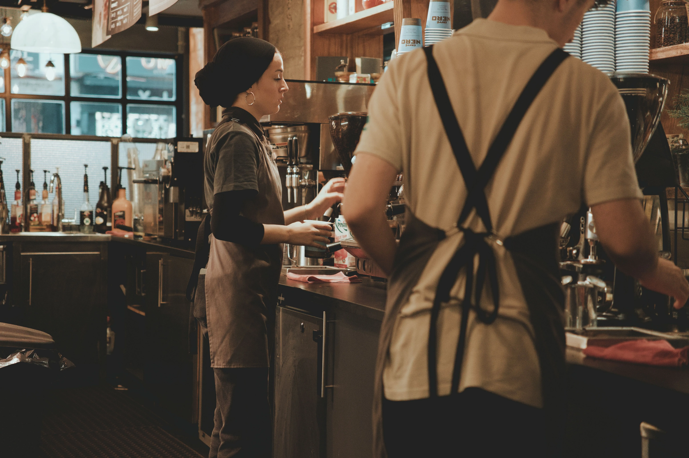

If you look at the menu board, adding Vanilla Sweet Cream Cold Foam to an iced coffee seems like a simple upgrade. But behind the bar, it is the single most destructive modifier to drive-thru window times in the entire modern coffee industry. 

When you introduce a modifier that requires leaving the espresso machine, walking over to the cold bar, grabbing a specific pitcher, pouring a precise measurement, running a blender cycle, and then waiting for that cycle to finish before you can cap the drink, you completely shatter the momentum of the hot bar barista. What actually happens is a massive bottleneck at the blender station, where three different baristas are waiting to foam their drinks while the drive-thru timer turns deep red.

This is the reality of managing the sweet cream cold foam workflow during a morning rush, and how to stop it from tanking your peak numbers.

## The Prep Nightmare

You cannot make sweet cream cold foam on the fly from scratch. It relies on a pre-batched Vanilla Sweet Cream mixture. 

The recipe is heavy cream, 2% milk, and vanilla syrup. If the proportions are off by even a few ounces, the foam will not aerate properly in the blender. It will either come out as heavy, dense sludge that sinks to the bottom of the cup, or thin, watery milk that dissipates immediately. 

**ProTip for Shifts**: Assign one dedicated person (usually Customer Support) to batch sweet cream in bulk before peak hits. Use the large brewing cubes instead of the 2-liter pitchers if your store volume demands it. I recommend having them wear [heavy duty non-slip work shoes](https://www.amazon.com/s?k=non+slip+work+shoes&tag=fastfoodguide-20) because pouring gallons of heavy cream invariably leads to slick, dangerous spills on the cold bar mats.

If you run out of sweet cream at 7:30 AM, your line is dead. The baristas will start trying to free-pour heavy cream and vanilla directly into the foaming blender to save time, and the consistency will be garbage. The customers will complain, drinks will be remade, and the line will stop moving. You need at least ten backup pitchers ready in the walk-in before the sun comes up.

## The Blender Bottleneck

The physical act of foaming is the real killer. 

You pour 100ml of sweet cream into the special foaming blender pitcher and hit button 3. That cycle takes several seconds. During those seconds, the barista is standing there, essentially paralyzed, waiting for the foam to finish so they can pour it over the iced beverage, lid it, and hand it off.

Now multiply that by four cars in a row ordering cold foam on different drinks. If you only have two foaming blenders, your cold bar barista and your hot bar barista are now fighting over real estate. 

The solution is aggressive sequencing. You cannot pull the espresso shots, build the iced drink, and *then* start the foam. Step by step, this is the workflow you must enforce: 
1. Read the ticket. 
2. Immediately pour the sweet cream into the blender and start the cycle. 
3. While the blender is running, queue your espresso shots and build the base of the iced beverage. 
4. By the time the base is built, the foam cycle is finishing. Pour, lid, and handoff.

If your team is waiting until the drink is 90% built before they touch the blender, they are bleeding seconds on every single transaction.

**ProTip for Baristas**: Always keep an extra foaming pitcher rinsed and staged next to the blender base. A good [commercial digital thermometer](https://www.amazon.com/s?k=commercial+digital+thermometer&tag=fastfoodguide-20) is great for checking the temp of the walk-in, because if the heavy cream drops below 38 degrees or gets too warm, it affects the aeration process in the pitcher. Keep it cold, keep it moving.

## Rinsing and Cross-Contamination

The final piece of the cold foam nightmare is the pitcher rinser. Heavy cream coats the inside of the plastic foaming pitcher with a thick film of butterfat. A quick spray on the pitcher rinser doesn't always cut through it, especially if the water pressure drops when the dishwasher is running in the back.

If you don't aggressively rinse the pitcher, the residual fat starts to sour, and the subsequent batches of foam taste off. Furthermore, Starbucks now offers flavored foams (chocolate cream, salted caramel, matcha). If you foam a chocolate cream and don't rinse it perfectly, the next customer's vanilla foam is going to have a brown tint and a mocha aftertaste.

You have to drill the rinse cycle into your team. Spray, dump, inspect, stage. 

The sweet cream cold foam trend is an operational tax on every single store. You survive it by hyper-managing your prep levels, mastering the sequencing of the blender button, and accepting that the cold bar is now the hardest station in the building. Control the blenders, or they will control your shift.
