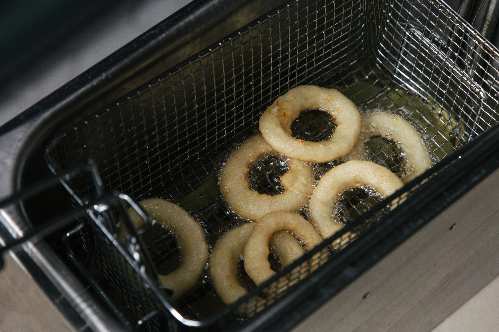

If you spend any time scrolling through TikTok or Instagram Reels, your feed is inevitably flooded with viral Starbucks hacks: neon-pink iced refreshers topped with matcha cold foam, 15-modifier Frappuccinos dripping with caramel drizzle and cookie crumbles, and intricate espresso builds claiming to taste exactly like Cinnamon Toast Crunch or a Twix candy bar.

In front of a ring light, these custom drinks generate millions of views. Behind the Starbucks counter, they represent a significant **logistical bottleneck**.

As someone who spent a decade managing high-volume quick-service restaurant (QSR) operations, I know that the internet's obsession with "Secret Menu Hacks" is an ongoing battle against kitchen throughput. While simple modifications are built into the Starbucks business model, viral hacks frequently ruin the drink, disrupt the barista's [Beverage Routine](/articles/starbucks-morning-rush), and destroy store-level Speed of Service (SOS) timers.
## 1. The Myth of the "Secret Menu" Button

The most common point of friction between customers and baristas begins at the order screen: **there is no official Starbucks Secret Menu.**

When a influencer posts a video commanding their followers to "Ask for the Barbie Drink at Starbucks," they are spreading a fundamental operational misconception.
*   **POS Limitations:** The Starbucks Point of Sale (POS) terminal and [Digital Production Manager (DPM)](/articles/starbucks-dpm-routing) contain zero preset buttons or recipe cards for viral internet names. 
*   **The Translation Burden:** Baristas undergo rigorous training to memorize over 100 standard beverage recipes, but they are not paid to keep up with trending TikTok hashtags. When a guest orders a "Butterbeer Latte" by name without providing the recipe (e.g., a Caramel Macchiato made with whole milk, toffee nut syrup, and caramel drizzle), the transaction halts while the barista tries to guess or look up the formula, stalling the queue.

## 2. The Cold Bar Cross-Travel Disaster (Hot Drinks with Cold Foam)

**ProTip:** The recent surge in cold foam popularity has forced some high-volume stores to test the "Starting Five" operational approach or completely separate the cold bar to prevent the blender bottleneck, which is infamous for halting drive-thru momentum.

One of the most widespread viral trends of the past two years is requesting **Sweet Cream Cold Foam** on piping hot beverages—such as hot white mochas, Americanos, or brewed coffees.

### Why It Fails Thermodynamically and Logistically
From an operational engineering perspective, putting cold foam on a hot drink is a double failure:
1.  **Melted Mess:** Sweet Cream Cold Foam is an emulsion of heavy cream, 2% milk, and vanilla syrup aerated in a specialized Vitamix high-speed blender disc at 34°F. When spooned over a 160°F hot espresso beverage, the intense heat immediately melts the foam. Within 30 seconds of leaving the handoff plane, the cold foam liquefies into a greasy, warm film floating on top of the coffee, completely defeating the intended textural contrast.
2.  **Station Cross-Travel:** Starbucks kitchens are ergonomically separated into two production zones: Hot Bar ([Mastrena espresso machines](/articles/starbucks-mastrena-espresso-calibration)) and Cold Bar (Frappuccino blenders, shakers, and ice bins). When a ticket prints on Hot Bar requiring cold foam, the Hot Bar barista must physically leave their station, walk across the kitchen aisle to Cold Bar, wait for a free Vitamix blender pitcher, blend the foam for 15 seconds, and carry it back to Hot Bar. This cross-station travel breaks the barista's standardized 2-drink sequencing cadence, dropping line output by up to 30%.

## 3. The 15-Modifier Frappuccino (The Viscosity Limit)

**ProTip:** Vitamix blender settings aren't just timers—they are calibrated specifically for the syrup base in the Frappuccino base. Adding massive amounts of liquid syrup breaks the emulsion, leading to separation within minutes.

Another viral staple is the hyper-customized Frappuccino—such as ordering a Venti Vanilla Bean Frappuccino with heavy cream, 5 pumps of brown sugar syrup, 3 pumps of hazelnut, strawberry puree in the bottom of the cup, extra caramel drizzle lining the walls, java chips blended in, and topped with mocha drizzle and cookie crumble.

### The Blender Calibration Problem
Commercial Vitamix blenders on the Starbucks Cold Bar are calibrated to emulsify a precise ratio of ice, liquid dairy, and proprietary **Frappuccino Syrup Base** (an emulsifying syrup base).
*   **Thick Sludge:** When a customer injects 8 extra pumps of dense liquid sugar and heavy cream into the blender pitcher, the liquid-to-ice ratio is completely skewed. 
*   **The Separation Effect:** Instead of blending into a smooth, milkshake-like consistency, the over-syruped mixture turns into a soupy, separated liquid that refuses to hold its structure. When the barista pours it into the cup, the heavy caramel drizzle on the walls slides to the bottom, the whipped cream sinks into the soup, and the drink overflows the lid during capping, creating a sticky, unsanitary mess on the handoff plane that requires an immediate station wipe-down.

  <strong>Manager's Insight: How Custom Hacks Inflate Prices</strong>
  Many viral videos pitch hacks as "cheap cheat codes"—for example, instructing users to order an Iced Espresso in a Venti cup with extra milk and syrup to get an "Iced Latte for half the price."
    
  Starbucks corporate revenue algorithms caught onto this loophole years ago and updated their POS rules. If a customer requests more than 4 ounces of dairy or plant-based milk added to an espresso or tea, the POS register automatically forces a **$0.70 to $0.80 dairy upcharge**. 
    
  On top of that, every custom syrup flavor, cold foam addition, and drizzle adds between $0.60 and $1.35 to the ticket. By the time a customer finishes ringing up a 10-modifier viral hack, their "cheap cheat code" cup of coffee costs **between $9.00 and $12.50**, yielding massive gross profit margins for the store while penalizing the guest's wallet.

## How to Customize Like a QSR Pro

Customizing your coffee is a core part of the Starbucks experience. To get a delicious drink without frustrating your barista or triggering a kitchen bottleneck, follow three simple rules:
1.  **Always Provide the Recipe:** Have the exact syrup pumps, milk choices, and topping additions ready on your phone to read off sequentially.
2.  **Respect Temperature Zones:** Keep cold toppings (like Sweet Cream Cold Foam) on iced drinks where they retain their structural integrity.
3.  **Order Complex Builds Inside:** If your drink requires more than four custom modifications, walk into the cafe or use Mobile Order & Pay. Never order a 10-modifier hack at the drive-thru speaker during the 8:00 AM morning rush.
