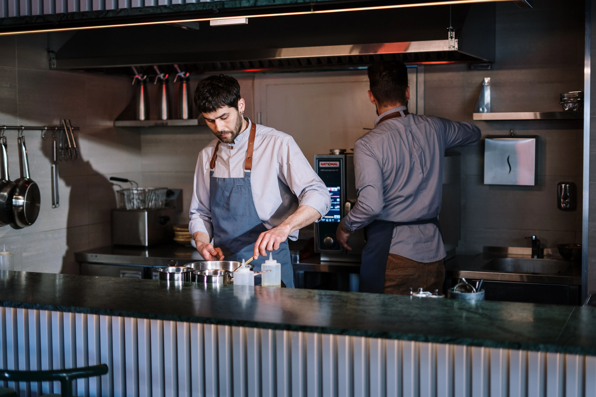

Look, corporate loves a good marketing campaign, and "freshly sliced meats" sounds amazing on a commercial. But down in the trenches, when you are staring down a lunch rush with a line out the door, adding a massive deli slicer to a store footprint that was never designed for one changes the entire geometry of the prep shift. The reality of the line is that the new Subway slicers completely blew up the old opening routines. 

I want to walk you through exactly what happens when you take a concept built on pre-sliced, vacuum-sealed bags of protein and suddenly force an automatic gravity feed slicer into the back room. This is the workflow impact, step by step.

## The Prep Schedule Destruction

Before the slicers, morning prep for the cold bain-marie was idiot-proof. You grabbed a bag of turkey, cut the corner, and shingled it into the cambro. You could prep backup turkey, ham, and roast beef in about fifteen minutes flat. 

Now? You have a 16-pound log of processed turkey breast that has to be mounted onto the carriage of an automatic slicer. 

The blade spins, the carriage moves, and the meat drops. But someone has to stand there and catch it, fold it, and shingle it properly so that the sandwich artists on the line can actually grab the standard 6-slice portion without tearing the meat to shreds. If you just let it fall into a pile, the lunch rush will be a nightmare of torn turkey and inaccurate portioning, completely destroying your food cost.

You have to dedicate at least one hour of a morning prep person's shift entirely to the slicer. That means your bread baking schedule gets compressed, your vegetable prep gets pushed back, and your opener is suddenly sweating before the store is even unlocked.

**ProTip for Managers**: If you want your openers to move faster, invest in better grip equipment. The standard issue gloves slip when handling wet meat logs. I used to buy my team heavy duty non-slip work shoes and proper grip gloves so they could lock in and crank through prep without worrying about slipping on the wet tile back near the sink.

## Food Cost Variance and Yield Loss

Corporate will tell you that slicing in-house reduces food cost because whole logs are cheaper to ship than pre-sliced packs. On paper, sure. On the actual P&L statement of a franchised store? It is a bloodbath of yield loss if your team isn't trained perfectly.

The first issue is the heel. When the log gets down to the last two inches, the slicer carriage can't grip it properly. You end up with a chunk of turkey or ham that just spins against the blade, creating a shredded mess. Managers who don't watch the trash cans will lose three to five percent of their total meat yield just in discarded heels. You have to train your staff to manually slice the end pieces or utilize them in chopped salads (if your franchise allows it).

The second issue is the dial setting. The thickness dial dictates everything. If a rookie prep cook bumps the dial from a 2 to a 3, your turkey slices are now 30% thicker. The sandwich artist on the line is still trained to grab 6 slices for a footlong. Suddenly, you are giving away 30% more meat on every single turkey sub. Your food cost variance at the end of the week will be thousands of dollars in the red, and you will have no idea why until you catch them slicing ham as thick as a steak.

## Blade Maintenance and Hardware Failure

Nobody talks about the physical toll this equipment takes when subjected to fast food volume. A deli slicer in a high-volume Subway is running nonstop for hours. Eventually, the carriage rod loses lubrication. Once that track dries out from repeated sanitizer wipe-downs, the gravity feed starts sticking. 

When the carriage sticks, the opener has to manually shove the meat block against the blade. That causes tearing, uneven slices, and heavy strain on the motor. I make my openers apply food-safe mineral oil to the slide rod every single Monday morning. If you skip this, you are replacing a burnt-out motor within six months.

Then there is the sharpening stone. A dull blade doesn't slice the turkey; it drags and shreds the protein. The training videos make sharpening look like a breeze. Just pop the stone on top and press the button, right? Wrong. If the blade has grease buildup on it because someone didn't clean it properly the night before, the sharpening stone just grinds that grease into the metal. Now you have a glazed, ruined sharpening stone and a blade that is somehow duller than before. You have to strip the blade completely bare with a degreaser before you even think about dropping that sharpening assembly onto it.

**ProTip for Maintenance**: Keep a dedicated toothbrush in your tool kit just for the sharpening stone. Scrub the stone with hot water and soap every two weeks. If the stone gets glazed with animal fat, it won't throw a spark or hone the edge. A glazed stone is completely useless.

## The Cleaning Nightmare

Let's talk about the breakdown. At night, the closer has to break down the slicer, sanitize the blade, and reassemble it. 

The slicers they rolled out are heavy, complex pieces of machinery. You have to remove the carriage tray, the blade guard, and the sharpener. It takes a solid twenty minutes to properly clean and sanitize the machine. If a closer is rushing to get out at 11 PM, they are going to cut corners. They will wipe down the visible parts but leave protein buildup behind the blade guard. 

**ProTip for Closers**: Do not use the green scratch pads on the slicer blade. You will dull the edge and the morning crew will hate you. Use a dedicated commercial digital thermometer to check your quaternary sanitizer bucket temp before you wipe it down—if it's too cold, it won't break through the animal fat residue.

What actually happens is the health inspector shows up, runs a flashlight behind the blade guard, finds three-day-old ham residue, and writes up a critical violation. The introduction of the slicer means you can no longer hire a 16-year-old kid and expect them to close the back room without heavy, continuous supervision. The liability of someone losing a fingertip while cleaning the blade is also a massive stressor for the general manager. Cut-resistant gloves are mandatory, but you still have to watch them like a hawk.

## Cross-Contamination Realities

In a perfect world, you slice all your turkey, clean the machine, slice all your ham, clean the machine, slice the salami, and so on.

The reality of the line is that the store gets unexpectedly busy, you run out of ham on the line, and someone runs to the back to quickly slice half a log of ham right after someone just finished slicing spicy pepperoni. The grease and spice from the pepperoni transfer directly onto the ham. The next customer who orders a plain ham sandwich gets a mouthful of pepperoni grease. 

You have to implement a strict hierarchy of slicing: light meats first (turkey, chicken), dark meats second (ham, roast beef), and spiced meats last (salami, pepperoni). If you break the order, you break down the machine. No exceptions. 

This is the workflow you have to accept. The fresh sliced initiative might look good on a billboard, but behind the counter, it requires a complete overhaul of labor deployment, intense food cost monitoring, and a level of mechanical training that the fast food industry isn't traditionally built for. Watch the dial, watch the heels, and check behind the blade guard.
