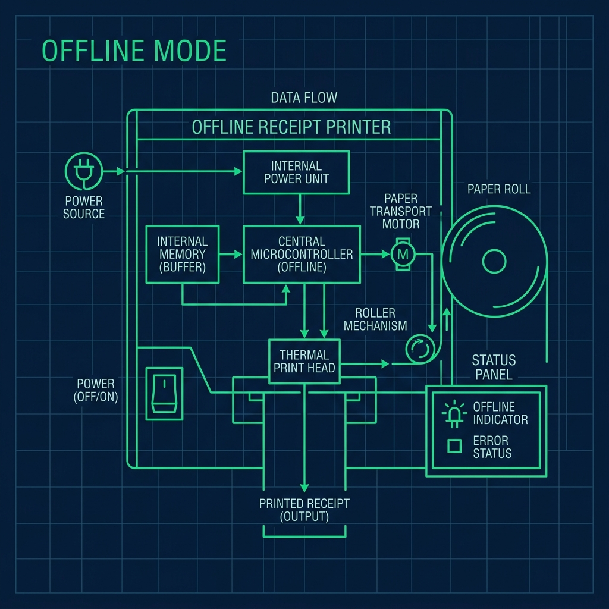
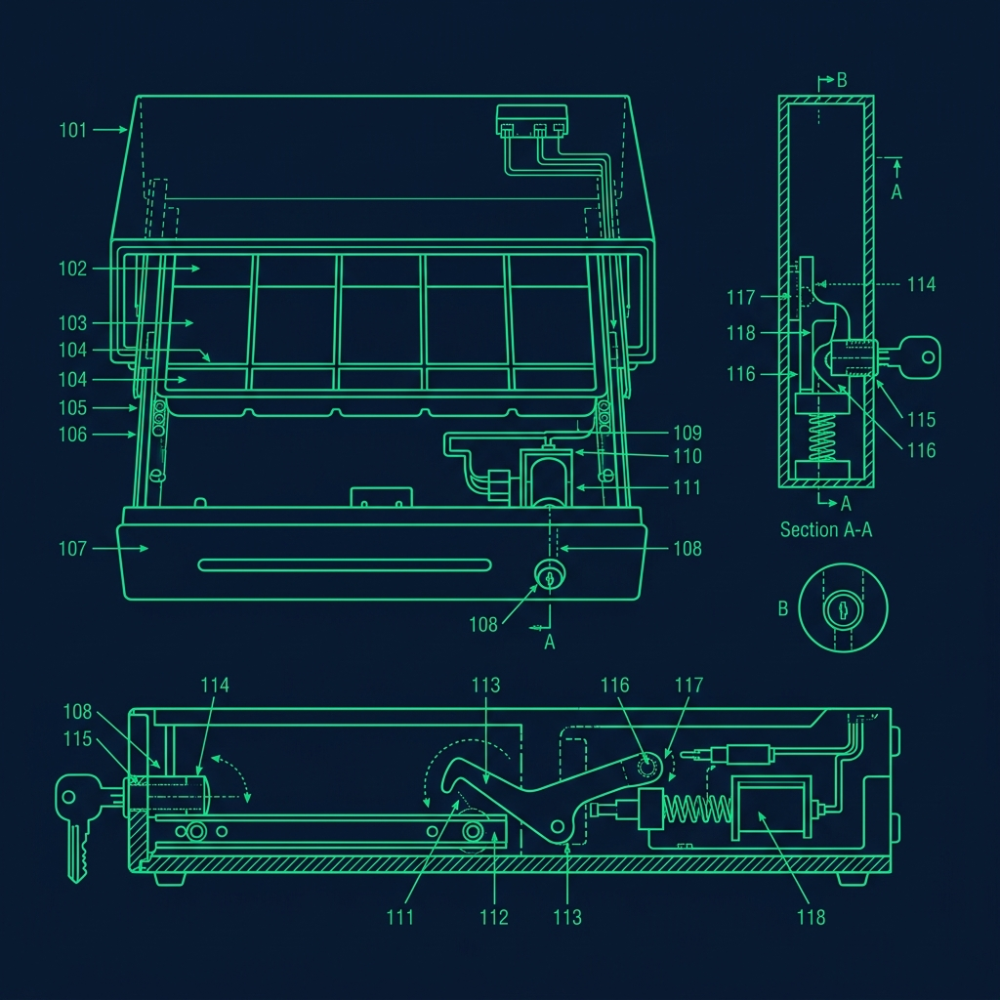

The most stressful part of working at Subway is not making the sandwich. It is ringing it up correctly at the end. 

At most fast food chains, the cashier takes the order first and then the kitchen builds it. At Subway, the customer stands in front of you, builds their sandwich in real time, and you have to somehow translate that stream-of-consciousness order into the Point of Sale system after the fact. The problem? Customers almost never tell you what they want in a logical order. They will say "Turkey on Wheat with extra cheese, bacon, and a drink" all in one breath, and your brain has to sort that chaos into the exact sequence the POS demands. On the line, it plays out like this: 

## The 3-Step Core Ring: The Foundation of Everything

The Subway POS interface is designed to mirror the physical sandwich line, which means it forces you to enter information in a specific order. Every single sub you ring up requires three mandatory modifiers hit in this exact sequence: 

1. **Size:** 6-Inch, Footlong, or Footlong Pro (Double Meat).
2. **Bread:** Italian, Hearty Multigrain, Italian Herbs & Cheese, Flatbread, or whatever options your location carries.
3. **Core Formula:** Turkey, Spicy Italian, Meatball Marinara, Cold Cut Combo, Steak & Cheese, and so on.

If you skip any one of these or enter them out of order, the system will not let you proceed to the payment screen. It will just sit there, blinking at you, while the customer stares and the line grows.

Understanding why this sequence exists helps it stick in your brain. The system calculates the base price from Size + Core Formula. Different sizes have different prices. Premium formulas like Steak & Cheese or [the Subway](/articles/subway-bain-fill-line-rule) Club cost more than a Veggie Delite. The bread selection does not change the price, but it has to be recorded for inventory tracking. Once the POS has these three anchors, it knows which sandwich it is dealing with and can correctly price any add-ons you tack on afterward.

## The "Out of Order" Customer and How to Handle Them

Here is a real scenario that happens fifty times a day. A customer walks up and says: "I want a Turkey on Wheat with extra cheese, bacon, and a drink."

If you hear "bacon" and immediately hit the Bacon button, the system throws an error. It does not know which sandwich the bacon belongs to yet because you have not established the Core Ring.

**The fix is mental filtering.** You train your brain to hear the customer's full sentence, strip out the add-ons and sides, and extract only the three Core Ring pieces. Ignore the bacon. Ignore the drink. Press: Footlong → Wheat → Turkey. Now go to the Add-Ons tab—Bacon, Extra Cheese. Finally, hit Drinks & Sides for the beverage.

I have seen new hires try to ring things as they hear them, and it creates a cascade of errors. The system locks up, you have to back out, and now you are flustered with six people watching. The first few days on register are rough. But by the end of your first week, the muscle memory kicks in. You will start hearing "Turkey on Wheat with bacon" and your fingers will instinctively go Size → Bread → Formula → Add-Ons without conscious thought.

## The "Make It a Meal" Trap

This one catches new cashiers constantly. When a customer buys a sandwich plus a bag of chips and a medium drink, they qualify for a discounted combo price—the Meal Deal.

Here is the trap: older Subway POS systems do not automatically bundle this. You have to physically press the "Make it a Meal" button and then select the chip and drink sizes. If you ring the chips and drink as separate individual side items, you overcharge the customer. They look at the receipt, the total is higher than expected, and now you have to void the entire transaction and re-ring everything from scratch while the line backs up and your shift lead glares at you.

Some newer POS software versions do auto-detect meal combos when all three qualifying items are on the order. But not every store runs the same software version, so you cannot rely on this. Make it a habit to always manually check for the Meal button on every order that includes a drink and chips. Five seconds of checking saves you five minutes of voiding and re-ringing.

## Handling Multiple Sandwiches on One Order

Things get genuinely chaotic when someone is ordering for their entire office. They rattle off four or five sandwiches in a row while you are trying to keep all of it straight.

The golden rule: **complete one sandwich entirely before starting the next one.** Hit Size, Bread, Formula, and all Add-Ons for sandwich number one. Then press "Add Another Item" and start sandwich number two fresh. If you try to bounce between sandwiches—adding bacon to number three while you are still building number one—you will assign add-ons to the wrong sub and the receipt will be a mess.

For large catering-style orders, some stores use a paper order form first and then transfer the whole thing to the POS methodically. This is slower but far less error-prone than trying to keep five different sandwich builds in your working memory simultaneously. I always encouraged my team to grab the notepad for anything over three sandwiches. No shame in writing it down.

## The Coupon and Promo Code Minefield

Subway runs constant promotions—BOGO deals, $5.99 footlong specials, app-exclusive discounts, rewards program offers. Each one has to be applied correctly in the POS, and they do not always stack with each other.

Critical rule: **apply coupons and promo codes before you hit the total button.** If a customer hands you a paper coupon, scan it or manually enter the code before finalizing. If you complete the transaction first and then try to apply the coupon, most systems will not let you go back without a manager override, which means another void-and-re-ring.

App-based promotions are applied when the customer scans their Subway Rewards QR code, but you should still verify on the screen that the discount actually went through before accepting payment. I have seen the QR scan register successfully but the discount fail to apply because the customer's app-side order did not match what was rung up on the POS. Always double-check the total before you hit that final button.

## Pro Tips for the Register

- **Repeat the order back before touching the POS.** Verbally confirm: "Footlong Turkey on Wheat with bacon and extra cheese, making it a meal with chips and a drink?" This takes five seconds and saves you from painful voids.
- **Learn the premium vs. standard formulas.** Knowing which sandwiches are premium helps you anticipate the price. When a customer sees a higher-than-expected total, you can explain why instead of freezing and calling for a manager.
- **Use the Notes field for complex requests.** If a customer wants "light mayo only on one half," type a quick note in the POS. It prints on the receipt and protects you if they complain later.

## Frequently Asked Questions

### What do I do if the POS freezes mid-transaction?

Do not panic. Most Subway POS systems save the current transaction state. If the screen freezes, wait about 30 seconds for it to recover. If it fully crashes and reboots, you will likely need to re-ring from scratch. Apologize to the customer and move quickly. If it keeps happening, report the issue to your manager so they can contact IT support—recurring crashes usually mean a software update is needed.

### How do I handle a customer who wants to pay with multiple payment methods?

The POS supports split payments. On the payment screen, select the first payment method and enter the partial amount, then select the second method for the remaining balance. This is common when someone uses a gift card for part of the order and a credit card for the rest. It is straightforward once you know the button exists—the tricky part is that many new cashiers do not even realize split payment is an option until someone asks for it.

### Why does the POS sometimes show a different price than the menu board?

Menu board prices and POS prices can fall out of sync, especially after a corporate price update. The POS price is the official price. If a customer points out a discrepancy, alert your manager so they can update the menu board. In some cases, the manager may honor the posted price as a courtesy, but that is their call to make—not yours.

---

*Dive deeper into Subway operations with our guides on the [Subway bread baking process](/articles/subway-bread-baking-process), the [bain fill line rule](/articles/subway-bain-fill-line-rule), and [how to fold a wrap without tearing it](/articles/subway-wrap-folding).*
