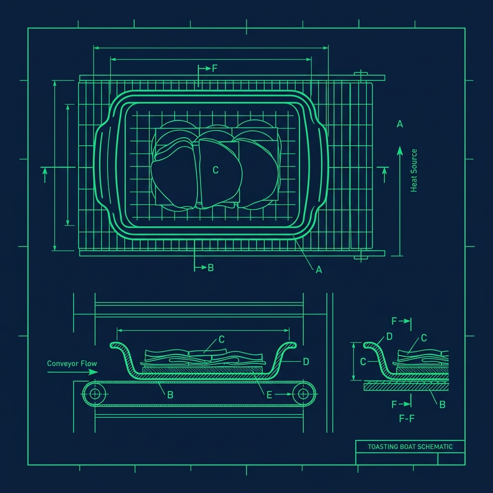
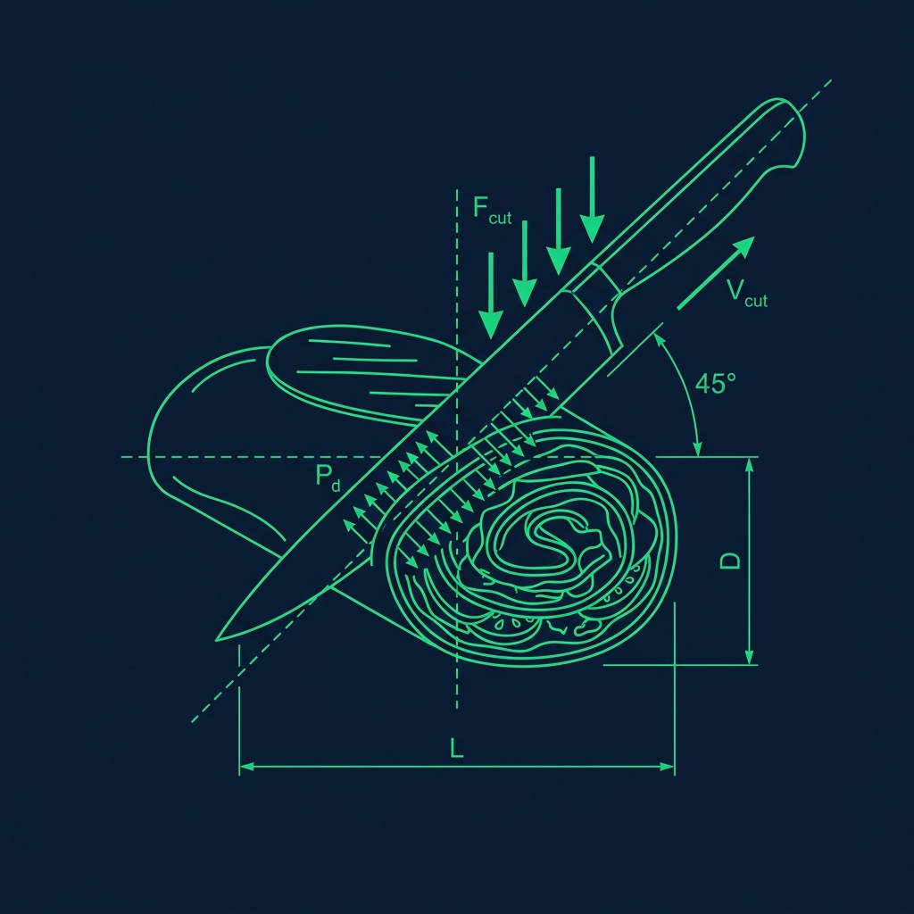

If there is one item that strikes genuine fear into the heart of a new Subway Sandwich Artist, it is the wrap. Not the bread. Not the register. The wrap. 

Unlike the sturdy sub rolls that can absorb abuse and still hold together, the tortillas used for wraps are notoriously fragile. They are thin, they are cold, and the moment a customer orders double meat with every vegetable and three lines of ranch, you are looking at a 90% chance of catastrophic tortilla failure right there on the cutting board. I have watched experienced employees absolutely nail wraps for months and then get destroyed by one overstuffed Steak & Cheese wrap on a busy Saturday. Here is the insider method for rolling a loaded Subway wrap perfectly—every single time. 

## Step 1: Warm the Tortilla (Never Skip This)

> **Russell's Note:** Forget the fancy gadgets. Give me a sharp 8-inch chef's knife and a 32oz deli container labeled with blue painter's tape, and I can run any station.

> **Russell's Note:** People always ask why this tastes different at home. Simple. We aren't afraid of butter, salt, and keeping the flat top screaming hot.

Cold tortillas snap. Warm tortillas stretch. This is the single most important principle in the entire wrap-building process, and the one that new hires skip most often when the line is backed up. 

If the customer is getting their meat toasted, toast the meat in the silicone boat as usual, and lay the empty tortilla flat on the deli paper. The residual heat from the toasted meat will soften the tortilla when you place it on top. If they want a cold wrap, ask if you can pop the empty tortilla into the toaster on the "Heat/1-Sub" setting for just 3 seconds. Just enough to make it pliable.

The difference is night and day. A cold tortilla straight from the cooler has almost zero elasticity—it will crack along the fold lines the instant you apply pressure. A warmed tortilla becomes almost rubbery in its flexibility, which is exactly what you need when you are about to stuff it with a pound of ingredients. I cannot stress this enough: never skip the warm-up, even when you are tempted to save three seconds during a rush. Those three seconds will cost you thirty seconds of cleanup when the tortilla rips open and you have to start over.

## Step 2: The "Middle Third" Rule

The biggest mistake rookies make is spreading ingredients edge-to-edge across the tortilla like they are topping a pizza. This leaves no tortilla border to fold over, and the wrap is doomed before the roll even begins.

Keep all ingredients tightly stacked in the exact center third of the tortilla. Leave a massive, generous border of empty tortilla on the left, right, top, and bottom. It should look like you are barely using any of the tortilla's surface area. That empty space is your folding margin, and you need every inch of it.

### The Stacking Order Matters

Put heavy and wet items on the bottom: meat, cheese, tomatoes, sauces. Put light and dry items on top: lettuce, spinach, cucumbers. This is not arbitrary. If you pile dripping tomatoes on top of a bed of spinach, the tomato juice runs down through the lettuce and pools against the tortilla, creating a wet spot that will rip the moment you start rolling. Keeping the sauces sandwiched between the dense meat and the fluffy lettuce creates a moisture barrier that protects the tortilla from soaking through.

Think of it like building a wall. Dense foundation on the bottom. Light insulation on top. Every time I trained someone new, I made them repeat this: "Heavy low, light high, sauces in the middle."

## Step 3: The Roll and Tuck Technique

Do not try to fold this like a traditional burrito. Use the Subway deli paper to your advantage—it is a structural tool, not just a wrapper.

1. **Fold the sides:** Bring the left and right edges of the tortilla straight in toward the center, covering the ends of the ingredient pile. Hold them in place with your pinky fingers.
2. **Bring the bottom up:** Lift the bottom flap of the tortilla up and completely over the pile of ingredients.
3. **The pinch:** This is the critical moment. Using your fingertips, pinch the ingredients backward while tucking the bottom flap underneath them. You are compressing the lettuce and meat into a tight cylinder. Do not be gentle—firm, deliberate pressure is what creates a wrap that holds together.
4. **The roll:** Keeping constant tension on the cylinder, roll it forward until the top flap of the tortilla ends up underneath the wrap.
5. **The paper wrap:** Immediately roll the finished wrap tightly into the deli paper. The paper holds the structural integrity together and prevents the tortilla from relaxing and loosening up.

## Step 4: The Diagonal Cut

The cut angle is not just for aesthetics—it serves a functional purpose. Cutting straight across a wrap compresses the filling at the cut point and can blow out the ends. A diagonal cut distributes the pressure across a longer line, keeping the filling intact inside both halves.

Use a sharp serrated knife and cut with a single, confident stroke. Sawing back and forth drags the filling out of the wrap and creates a mess that looks unprofessional. If your store's knives are dull—and they almost always are—ask the manager to sharpen or replace them. A dull knife is the number one enemy of a clean wrap cut.

## Dealing with "The Impossible Order"

Every Sandwich Artist eventually faces this customer: double meat, every vegetable, extra sauce, extra cheese. You know before you start that this wrap is going to be a nightmare.

Here is the survival strategy. When the ingredient pile gets dangerously high, subtly compress the filling with your gloved hands before you start rolling. Press down gently but firmly to flatten the mound and eliminate air pockets. This reduces the overall volume without removing a single ingredient. The customer gets everything they asked for. You get a wrap that actually closes.

If the wrap tears despite your best efforts—and it will happen—stay calm. Grab a second tortilla, lay it flat, place the torn wrap on top, and re-roll the whole thing as a double-wrapped item. The customer usually appreciates the extra effort, and it looks far more professional than handing over a leaking, torn catastrophe. Just do not make double-wrapping your default—it uses twice the product and will get flagged during food cost reviews.

## Sauce Control: The Real Secret

Here is the thing nobody tells you during training: sauces are the number one cause of wrap failure. Not overstuffing—sauces.

Instead of applying long, thick lines of mayo or ranch across the entire surface of the tortilla, apply the sauce only in the center, directly onto the meat. This keeps the moisture concentrated in the densest part of the wrap and away from the tortilla edges where tears always start. Wet tortilla edges tear. Dry tortilla edges fold. Control the sauces and you control the wrap.

## Frequently Asked Questions

### What do I do if the tortilla tears before I even start rolling?

If the tear is small—less than an inch—you can usually still roll successfully by positioning the tear on the inside of the roll so it gets sealed by the filling. If the tear is large, discard the tortilla and start fresh. Do not try to patch it. Patches always make it worse, and you end up with a bigger mess than if you had just grabbed a new tortilla from the start.

### Should I toast the wrap after rolling it?

Some customers request a toasted wrap, and if your store offers it, you can place the rolled wrap in the toaster for a few seconds to crisp up the outside. Be careful—over-toasting makes the tortilla brittle and prone to cracking when the customer bites into it. A light toast is all you need. Think "warm and slightly crispy," not "crunchy."

### Why do wraps take so much longer to make than regular subs?

The warming, careful stacking, and rolling process adds significant time compared to simply loading ingredients into an open bread loaf. Wraps require more precision and more steps. During a rush, experienced Sandwich Artists will sometimes gently suggest bread to speed things up, but you should always make whatever the customer orders without complaint. A well-executed wrap takes about 60 to 90 seconds longer than a standard sub, and that is just the reality of the item.

---

*For more Subway techniques, explore our guides on the [Subway bread baking process](/articles/subway-bread-baking-process), the [bain fill line rule](/articles/subway-bain-fill-line-rule), and [how Chipotle rolls massive burritos](/articles/chipotle-massive-burrito-rolling).*
