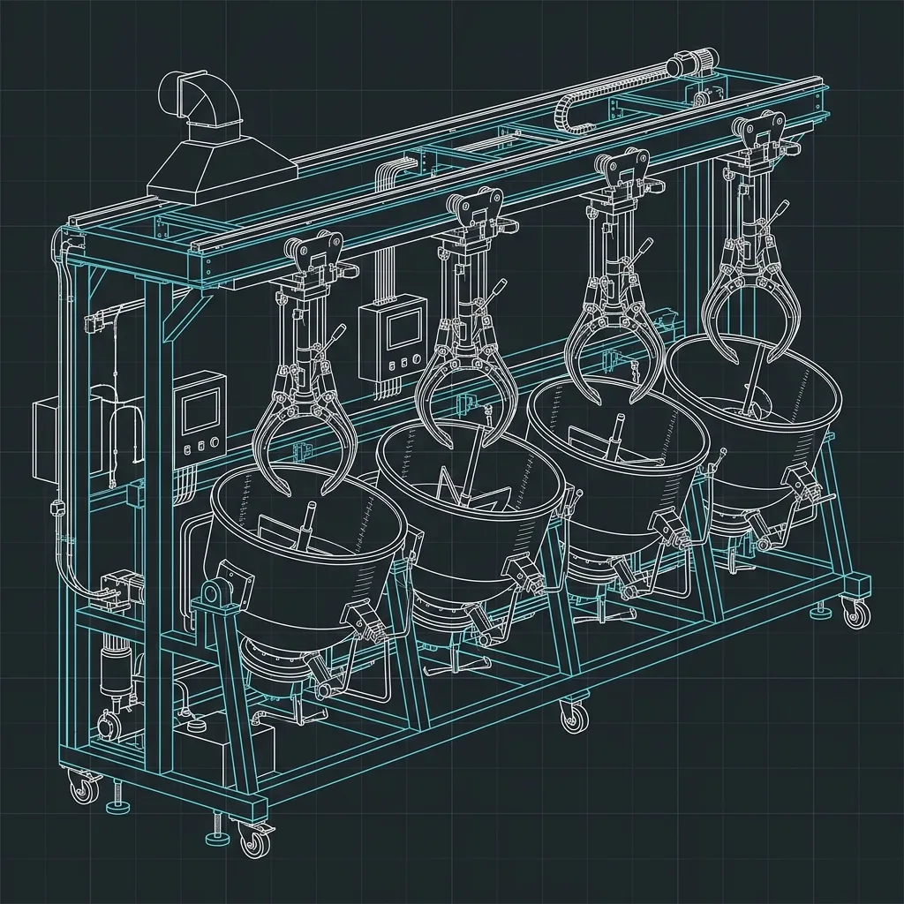

# The Sweetgreen Morning Prep Shift: How They Process 500 Lbs of Veggies

Listen, there’s something undeniably romantic about the idea of a farm-to-table salad concept. You walk into a Sweetgreen at 12:15 PM, the line is practically out the door, the music is bumping, and a small army of team members is rhythmically tossing vibrant greens and colorful roasted vegetables in massive steel bowls. It looks effortless. It looks fresh. It looks like a perfectly choreographed dance of health and wellness. 

But as a former multi-unit kitchen manager, let me tell you a little secret: that beautiful lunch rush is built on the sweat, adrenaline, and pure mechanical power of the morning prep shift. Long before the first customer contemplates adding double chicken to their Harvest Bowl, the kitchen is a battlefield. Specifically, it is a battlefield focused on processing upwards of 500 pounds of raw vegetables before 10:00 AM. 

If you want to understand what makes a high-volume scratch kitchen tick, you have to look at the opening hours. It is an intricate ballet of logistics, heavy machinery, and cold water. Let’s pull back the curtain and look at exactly how the Sweetgreen morning prep shift manages to turn a literal mountain of farm-fresh produce into the pristine, uniform ingredients you see on the service line.

## 6:00 AM: The Arrival and The Assessment

The shift begins before the sun is fully up. When the prep team unlocks the back door at 6:00 AM, the first order of business isn't making coffee—it's assessing the walk-in cooler. In a traditional fast-food environment, your inventory arrives frozen in standardized cardboard boxes. A fry is a fry. But at a place like Sweetgreen, your inventory is alive, perishable, and highly variable. 

> **Russell's Note:** Forget the fancy gadgets. Give me a sharp 8-inch chef's knife and a 32oz deli container labeled with blue painter's tape, and I can run any station.

> **Russell's Note:** When you're in the weeds on a Friday night, the last thing you want is a broken line. Turn and burn. That's the only way you survive until close.

The kitchen manager or lead prep cook has to immediately evaluate the state of the produce that was delivered either late the previous night or in the pre-dawn hours. We're talking massive, heavy waxed boxes of kale, giant bags of shredded cabbage, earthy crates of sweet potatoes, and delicate flats of cherry tomatoes. 

The very first constraint of the day is temperature. Everything in that walk-in must be temped and recorded. Health department regulations are one thing, but quality control is another entirely. If the arugula is sitting at 45°F instead of a crisp 38°F, it's going to wilt the second it hits the line. The prep team has to organize their attack plan based on what needs to be processed immediately, what needs to be roasted, and what needs to be chilled. 

By 6:15 AM, the stainless steel prep tables are sanitized, the cutting boards are secured, and the race against the clock officially begins. There are exactly three hours and forty-five minutes before the store opens, and an unbelievable amount of raw mass to move.

## The Produce Delivery: Local Farms, Local Problems

One of Sweetgreen’s biggest selling points is its commitment to local sourcing. It's a noble mission, and it results in a demonstrably better-tasting product. However, from a kitchen management perspective, "local produce" is just a polite way of saying "wildly inconsistent produce."

When you rely on a national distributor like Sysco or US Foods, a case of romaine lettuce is going to look exactly the same in New York as it does in California. The heads are uniform, the dirt level is minimal, and the yield is predictable. When you are sourcing from regional farms, as Sweetgreen does, you are at the mercy of the weather, the season, and the specific soil of that farm. 

This creates massive headaches for the prep team. Some mornings, the kale comes in pristine and dry. Other mornings, it looks like it was harvested during a monsoon and is covered in field mud. Sometimes the sweet potatoes are the size of softballs, perfect for dicing. Other times, they are massive, gnarled tubers that require serious knife work just to break them down into manageable chunks. 

The prep team has to constantly adjust their workflows. If the spinach is extra dirty, the wash cycle is going to take twice as long. If the carrots are thin and spindly, the yield will be lower, meaning they have to process more volume to hit their par levels for the day. It requires a level of culinary intuition and flexibility that you simply don’t find in a standard burger joint. If you've ever worked the [Cava Prep](/articles/cava-assembly-line/) shift, you know exactly what this kind of variability feels like, though [Cava](/articles/chain/cava) leans heavier into the Mediterranean dips and spreads rather than sheer leafy green volume.

## The Wash Station: Cold Water and Crisp Greens

Before anything gets chopped, it has to get washed. And when I say washed, I don't mean a quick rinse under the tap. I mean an industrial-scale sanitizing bath. 

Sweetgreen uses massive, multi-compartment sinks specifically designed for crisping and cleaning greens. The water temperature is critical here. It needs to be freezing cold—ideally below 40°F. This does two things: it removes dirt and debris, and it essentially shocks the greens, making them incredibly crisp. 

Have you ever wondered why the kale at Sweetgreen has such a satisfying crunch, while the kale you make at home feels limp? It's the ice bath. 

The prep cooks plunge massive colanders of chopped greens into the sinks, agitating them vigorously. The dirt sinks to the bottom, the pristine leaves float to the top. This process is repeated until the water runs completely clear. It is backbreaking, wet, freezing cold work. Your hands go numb within the first twenty minutes. 

Once the greens are washed, they have to be dried. Nobody wants a watery salad. Sweetgreen uses commercial salad spinners—essentially giant centrifuges that spin the water off the leaves. These things are massive, often holding up to 5 gallons of wet greens at a time. The physical exertion required to crank a commercial spinner, or even just to load and unload an electric one, over and over again, is a workout in itself.

## The Machine: The Robot Coupe Food Processor

Let’s dispel a myth right now: nobody is standing in the back of a Sweetgreen meticulously julienning carrots by hand with a chef's knife. While knife skills are essential for certain delicate items, the sheer volume of dense vegetables requires heavy artillery. 

Enter the Robot Coupe. 

For the uninitiated, a Robot Coupe (specifically the larger CL50 or CL52 continuous feed models) is the workhorse of the high-volume scratch kitchen. It is a commercial food processor that looks less like a kitchen appliance and more like a piece of industrial manufacturing equipment. It is loud, it is heavy, and it is incredibly dangerous if you don’t respect it.

This machine is how they process 500 pounds of vegetables. 

The Robot Coupe uses interchangeable cutting discs and dicing grids. Need to shred 50 pounds of cabbage for the spicy cashew dressing base? Swap in the 2mm slicing disc, and you can push entire heads of cabbage through the hopper as fast as you can load them. Need perfectly uniform 10mm cubes of sweet potato for roasting? Put in the dicing grid and the slicing disc, and watch the machine spit out perfect cubes at a rate of five pounds a minute. 

Operating the Robot Coupe is a specialized job. The prep cook stands at the machine, feeding raw product into the hopper with one hand and aggressively pushing the lever down with the other. The machine screams as it chews through dense root vegetables. A massive Lexan bin sits below the chute, filling up with perfectly cut produce in a matter of minutes. 

It is incredibly efficient, but it requires constant vigilance. The blades dull quickly under that kind of volume, and the dicing grids need to be frequently cleared of jams. Plus, the sheer repetition of slamming the hopper arm down takes a toll on your shoulders and back. 

## The Physical Demand: Chopping, Dicing, and Lifting

Even with the mechanical assistance of the Robot Coupe, the morning prep shift is an intensely physical job. You have to remember the scale at which this kitchen operates. A single busy location might go through 100 pounds of kale, 50 pounds of arugula, 80 pounds of sweet potatoes, and 40 pounds of cherry tomatoes in a single lunch rush. 

Every single one of those boxes has to be lifted, carried, unpacked, washed, processed, panned up, labeled, and stored. We are talking about moving thousands of pounds of weight over the course of a four-hour shift. 

And then there are the items that *do* require hand prep. You can’t put a cherry tomato through a Robot Coupe unless you want tomato puree. Those have to be halved by hand. Apples for seasonal salads need to be carefully diced to avoid bruising. Avocados—the most fickle ingredient in any kitchen—must be meticulously halved, pitted, and sliced right before service to prevent oxidation. It’s a similar pressure to what you see with [Chipotle Guacamole](/articles/chipotle-[guacamole](/articles/chipotle-guacamole/)/) prep, where managing the browning of the avocado is a constant battle against time and oxygen.

The kitchen manager acts as a conductor during this time, calling out times and temperatures. "I need the roasted sweet potatoes in the oven by 8:15!" "What's the temp on that washed arugula?" "We are behind on cabbage, let's move!"

It is a chaotic, loud, and incredibly focused environment. There is no time for chatting. Every minute is accounted for. If the prep team falls behind by even 15 minutes, the ripple effect will completely derail the lunch rush.

## The [Assembly Line](/articles/cava-assembly-line/) and The 10:00 AM Deadline

As the morning progresses, the raw ingredients are transformed. The ovens are filled with sheet pans of seasoned sweet potatoes, portobello mushrooms, and blackened chicken. The air smells like roasted garlic and caramelized onions. 

By 9:30 AM, the focus shifts from bulk processing to line assembly. This is where the fruits of the morning's labor are finally put on display. The front-of-house team arrives and begins stocking the massive refrigerated make-lines. 

This is a critical transition period. The prep cooks have to transfer the processed vegetables from their bulk storage bins into the specific sixth-pans and third-pans used on the service line. Every single pan must be labeled with the item name, the date, the time it was prepped, and the initials of the prep cook. Traceability is non-negotiable. 

The kitchen manager walks the line, checking the pars. Are there enough shredded carrots? Is the kale properly crisped? Are the roasted items holding at the correct hot temperatures above 140°F? They are looking for visual perfection. The line is the stage, and the ingredients are the stars. If the customer can see it, it has to look immaculate.

By 10:00 AM, the heavy prep is done. The massive sinks are drained, the Robot Coupe is disassembled and sent to the dish pit, and the prep tables are sanitized once again. The kitchen transitions from a raw processing plant into a high-speed assembly operation. The focus shifts to the [Mixing Station](/articles/sweetgreen-mixing-station/), where the real show happens during the lunch rush. 

## Conclusion: The Hidden Engine of Fast Casual

The next time you walk into a Sweetgreen, or any high-volume scratch kitchen, and marvel at the pristine array of fresh vegetables, take a moment to appreciate the sheer physical effort it took to get them there. The 6:00 AM prep shift is the hidden engine that powers the entire operation. 

It is not glamorous work. It is cold, wet, heavy, and relentlessly fast-paced. It requires dealing with the unpredictable nature of local agriculture and mastering heavy-duty commercial machinery. It demands a level of physical endurance and organizational precision that most people never see. 

But without that morning crew, hauling those heavy boxes of kale, wrestling with the Robot Coupe, and plunging their hands into freezing ice baths, the farm-to-table illusion would fall apart. They are the ones who turn the raw chaos of agriculture into the precise, uniform ingredients that make the lunch rush possible. They process the 500 pounds of veggies, so you can have your salad exactly the way you want it, exactly when you want it. It is a daily culinary miracle, executed before most of the city has even had their first cup of coffee.

## FAQ

## Do they really chop all the vegetables by hand every morning?
No, while some delicate items are hand-prepped, the bulk of the heavy dicing (like cabbage and carrots) is pushed through massive commercial Robot Coupe food processors with specialized dicing grids to ensure uniform cuts and save hundreds of labor hours.

## What time does the prep shift start?
The primary prep shift typically starts at 6:00 AM or 7:00 AM to ensure the entire line is fully stocked, temperature-checked, and ready to serve by the time the store opens for the 10:30 AM lunch rush.

## How do they handle local produce variations?
Sweetgreen's supply chain relies heavily on local farms, meaning prep teams often have to adjust to inconsistencies in produce size, water content, or dirt levels compared to standardized national purveyors, requiring much more rigorous washing and sorting.
