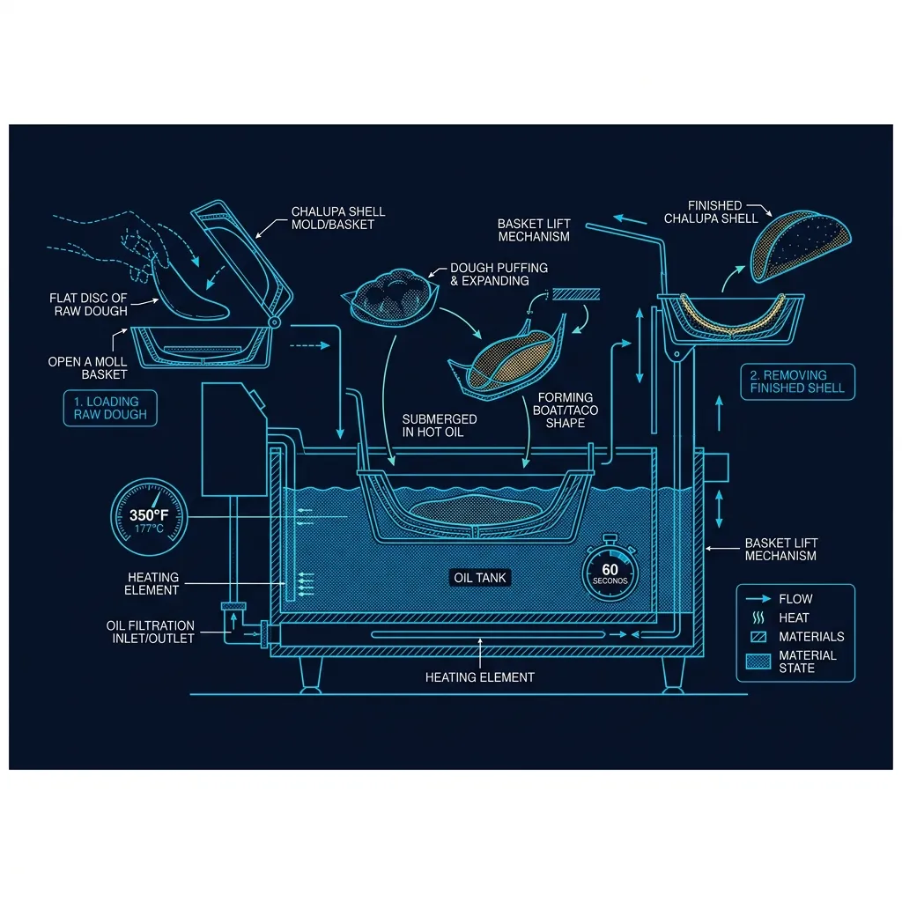
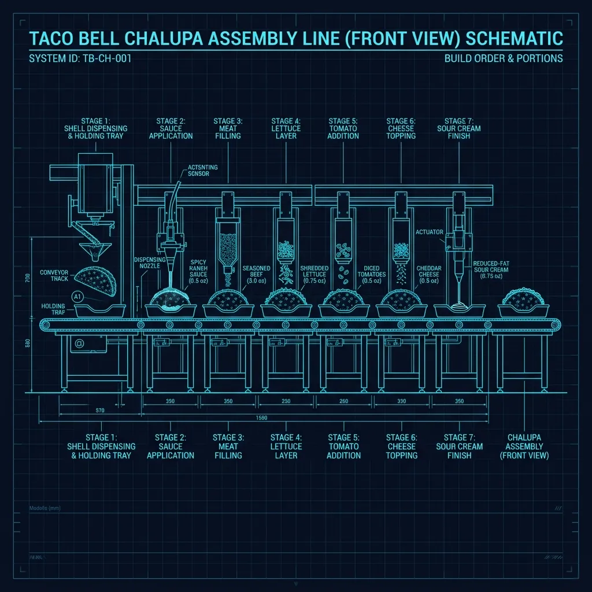

## It Starts as a Flat Disc of Dough

The Chalupa Supreme is one of Taco Bell's most popular premium items, and the shell is what makes it distinct from everything else on the menu. Unlike the hard corn taco shell (shipped pre-formed) or the soft flour tortilla (shipped flat and steamed), the Chalupa shell is **deep-fried in the restaurant from a pre-formed disc of raw flatbread dough**. *(Related guide: [How to Memorize the Taco Bell Menu Build Cards Fast](/articles/taco-bell-menu/))*

The dough arrives at the restaurant as **frozen, pre-portioned discs** — flat circles of yeast-leavened dough, roughly 6 inches in diameter and about a quarter-inch thick. They're stored in the walk-in freezer and pulled to thaw as needed throughout the day. *(Related guide: [What Is the Taco Bell \](/articles/taco-bell-linebacker-role/))*

This is not a tortilla. It's closer to a naan or pita dough — a yeast-based bread dough that puffs and develops air pockets when it hits hot oil. That puffing is exactly what creates the Chalupa's distinctive puffy, chewy texture that sits somewhere between a taco shell and a piece of fried bread. *(Related guide: [How Does Taco Bell Rehydrate Their Beans?](/articles/taco-bell-rehydrate-beans/))*

## The Fryer Mold: Engineering the Shape

Here's where the process gets interesting. A flat disc of dough can't fry itself into a taco shape — it would just puff up into a pillow. Taco Bell uses a **specialized frying mold** (sometimes called a chalupa press or chalupa basket) to force the dough into the right shape while it cooks.

### How the Mold Works

The mold is a two-piece metal basket:

1. **The bottom piece** is shaped like a taco boat — a concave metal form that the dough sits in
2. **The top piece** is a convex press that pushes down into the center of the dough, forcing it to conform to the boat shape
3. The assembled mold **submerges in the deep fryer** with the dough trapped between the two pieces

When the dough hits the **350°F oil**, it immediately begins to puff. But because it's trapped in the mold, it can only puff outward within the constraints of the boat shape. The result is a shell that has:

- A **flat bottom** for holding fillings
- **Curved walls** that rise up on the sides like a taco
- A **puffy, blistered exterior** with air pockets throughout
- A **chewy, bread-like interior** that's denser than a tortilla but lighter than a roll

### Timing Is Everything

The total fry time is approximately **55 to 65 seconds** — less than a minute in the oil. This is short enough that the dough cooks through and develops a golden-brown crust without becoming hard or cracker-like.

Timing accuracy matters here:

- **Under-fried** (less than 50 seconds): The dough is still raw in the center and too soft to hold fillings without collapsing
- **Properly fried** (55–65 seconds): Golden exterior, chewy interior, structurally sound
- **Over-fried** (more than 70 seconds): The shell becomes too crispy and starts cracking when you bite into it, losing the signature chewy texture

Most Taco Bell fryers have a **built-in timer** that beeps when the chalupa is done. Experienced crew members can also judge doneness by the color — the shell transitions from pale to golden to deep golden over the course of the fry.

## The Holding Problem

Fried Chalupa shells have a very short window of peak quality. Unlike a hard taco shell that can sit in a warming bin for an hour, a Chalupa shell starts degrading within **10–15 minutes** of leaving the fryer:

- The exterior absorbs ambient moisture and loses its crispness
- The oil on the surface cools and becomes greasy rather than crispy
- The chewy interior becomes doughy and heavy

This is why Taco Bell fries Chalupa shells **to order** rather than batch-frying them and holding them. When you order a Chalupa Supreme, the shell is typically fried fresh — which is also why Chalupas take slightly longer to prepare than items using pre-made shells.

During slow periods, a crew member might pre-fry a few shells and hold them in a warming area, but the quality difference between a fresh shell and a 15-minute-old shell is noticeable.

## The Assembly Line: Building the Chalupa Supreme

Once the shell comes out of the fryer and drains for a few seconds, it moves to the **make line** for assembly. The standard Chalupa Supreme build is:

1. **Spicy ranch sauce** (or sour cream, depending on the variant) — applied first to the inside of the shell while it's still warm
2. **Seasoned beef** — the standard Taco Bell beef mixture (rehydrated from a dehydrated beef product mixed with water and seasoning)
3. **Shredded lettuce** — standard iceberg lettuce
4. **Diced tomatoes** — fresh, diced in-store
5. **Three-cheese blend** — a mix of cheddar, pepper jack, and mozzarella
6. **Sour cream** — a measured portion on top

### The Steak and Chicken Variants

The Chalupa Supreme also comes in **steak** and **chicken** versions. The steak is a marinated, pre-cooked steak product that's grilled on the flat-top and sliced. The chicken is a marinated, pre-cooked chicken strip that's also grilled and diced. Both are held in steam wells on the make line.

The shell and assembly process are identical regardless of the protein — only the meat changes.

## Why the Chalupa Costs More

The Chalupa Supreme typically costs **$1.00–$2.00 more** than a standard taco, and there are real cost reasons for this:

### Ingredients

The flatbread dough costs more per unit than corn taco shells or flour tortillas. It's a yeast-leavened bread product with a more complex ingredient list, and it arrives frozen (requiring freezer space and thaw management).

### Oil Consumption

Every Chalupa shell absorbs oil during frying. Over a full day of Chalupa production, the fryer oil level drops noticeably, requiring more frequent oil top-offs and full oil changes. Fryer oil is one of the most expensive consumable supplies in a fast food kitchen.

### Labor

Frying to order takes more labor than pulling a pre-made shell from a warming bin. Someone has to load the mold, lower it into the fryer, time the cook, remove the mold, extract the shell, and get it to the make line — all for a single menu item. During a rush, this creates a bottleneck.

### Fryer Real Estate

The Chalupa mold takes up space in the fryer that could otherwise be used for Cinnamon Twists, chips, or other fried items. During peak hours, fryer capacity becomes a constraint, and the Chalupa competes with other fried items for fryer time.

## The Chalupa vs. The Gordita

Taco Bell customers frequently confuse the Chalupa and the Gordita, but they're fundamentally different:

| Feature | Chalupa | Gordita |
|---|---|---|
| **Shell material** | Yeast-leavened flatbread | Gordita flatbread (thicker, no yeast) |
| **Cooking method** | Deep-fried in a mold | Grilled/toasted on a flat-top |
| **Texture** | Puffy, crispy outside, chewy inside | Soft, pliable, slightly charred |
| **Shape** | Rigid boat/taco shape | Flat, folded like a soft taco |
| **Prep time** | ~60 seconds (frying) | ~30 seconds (grilling) |
| **Cost** | Higher (oil + dough + labor) | Lower (no frying required) |

The Chalupa's fried shell gives it a crunch-to-chew ratio that the Gordita doesn't have. The Gordita's grilled flatbread is softer and more pliable, closer to a thick pita pocket. They're designed for different textures and eating experiences, despite looking similar on the menu board.

## What Makes the Chalupa Work

The Chalupa shell is one of the few items in fast food that is genuinely **cooked from raw dough in the restaurant**. Most "fried" items at fast food chains — chicken tenders, fish fillets, onion rings — arrive pre-breaded and frozen, requiring only reheating in the fryer. The Chalupa starts as raw dough and is transformed into a finished bread product through the frying process.

That transformation — from a cold, flat disc of dough to a puffy, golden, structurally sound taco boat — happens in under a minute. It's one of the more impressive pieces of food engineering in the fast food world, and it's happening in every Taco Bell location, hundreds of times per day, by crew members who might not realize they're essentially baking bread in hot oil.
