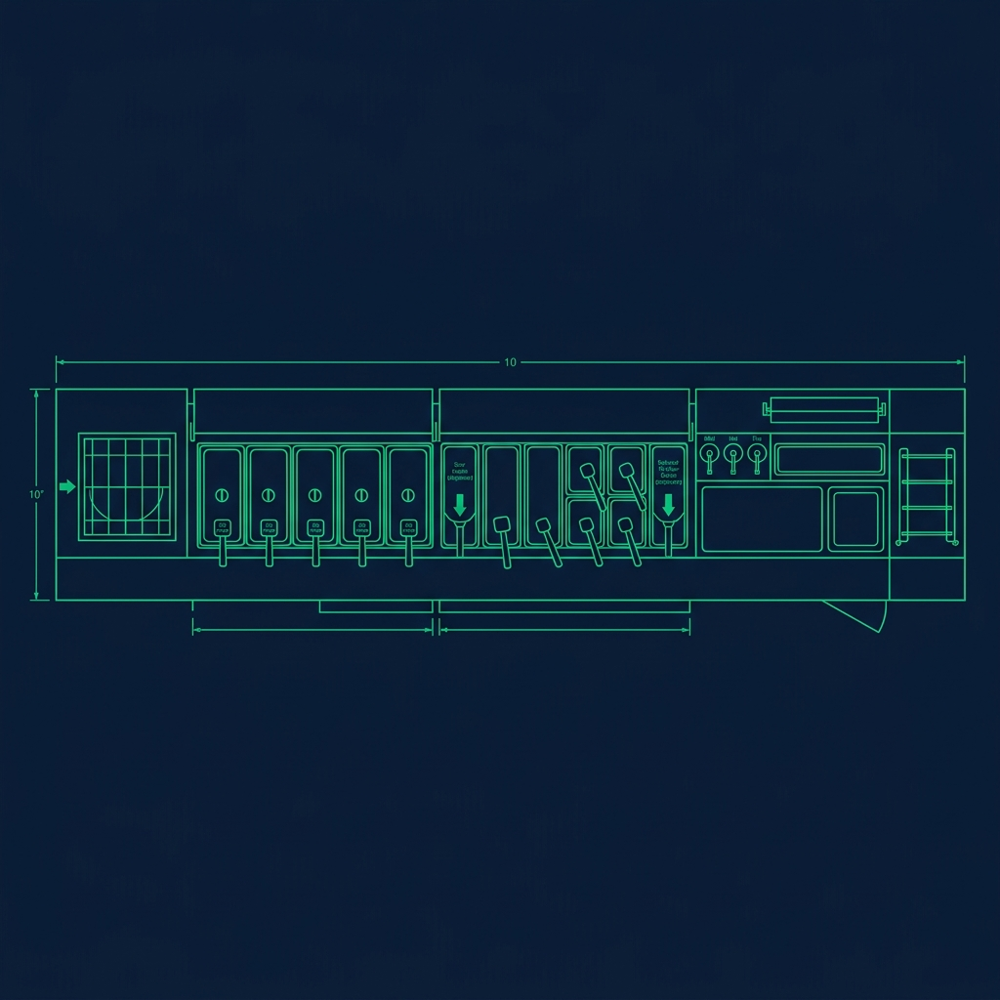
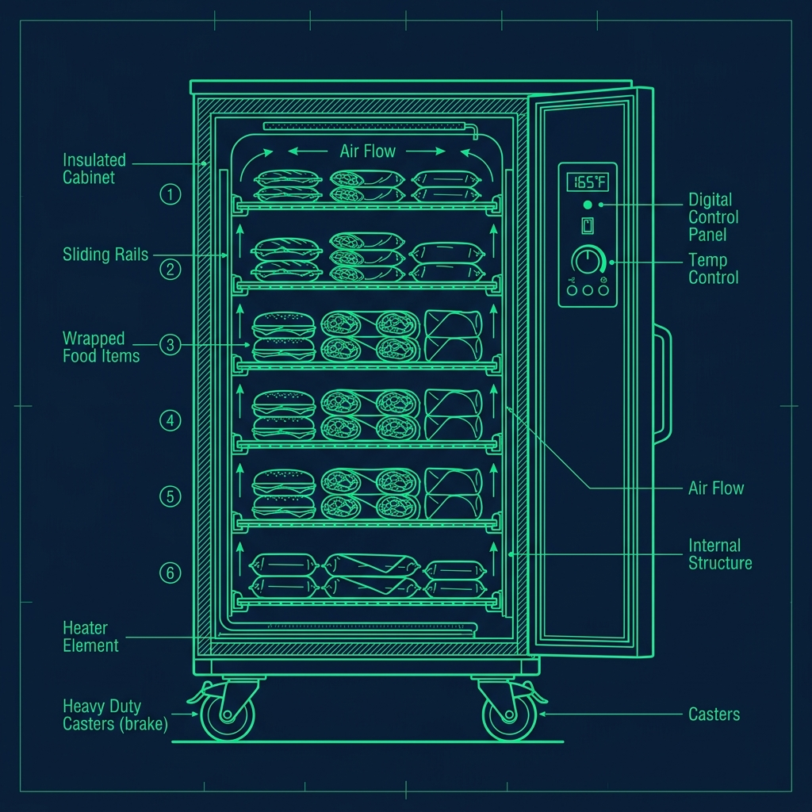

During a lunch rush at Taco Bell, the makeline is a blur of flying tortillas, sour cream guns, and nacho cheese pumps. Orders scroll down the screen faster than they can be cleared. The Starter is steaming shells and dropping beef. The Stuffer is wrapping and bagging. And somewhere behind all of them—moving constantly, scanning everything, carrying pans of ingredients back and forth like a short-order supply chain—is the Linebacker. 

If your shift lead assigns you to be the Linebacker, here is the reality: you do not actually make the food. Your entire job is to serve the people who are making the food. You are the invisible support system that keeps the line running at full speed. And when you do it right, nobody notices you at all. When you do it wrong, the entire kitchen grinds to a halt. 

## How the Makeline Is Divided

To understand the Linebacker, you need to understand how Taco Bell's makeline is structured. The line is divided into distinct zones with dedicated roles: 

- **The Starter** steams the tortillas and flat shells, adds the protein (beef, chicken, or steak), and pushes the partially built item down the line.
- **The Stuffer** adds the cold ingredients—lettuce, cheese, tomatoes, sour cream—wraps or folds the item, and places it in the packaging.
- **The Expeditor** (at high-volume stores) checks the order for accuracy, bags it, and sends it to the window.

When the Starter runs out of ground beef, they have to stop building, turn around, walk to the heating cabinet, grab a new pan, and swap it in. That process takes about 20 seconds. In Taco Bell drive-thru time, 20 seconds is an eternity—it can turn a green timer red and back up three orders. The Linebacker exists to make sure that 20-second stop never happens.

## The Linebacker's Core Duties

The Linebacker's job is deceptively simple to describe and incredibly demanding to execute:

- **Scanning and Call-Outs:** The Linebacker stands directly behind the line workers, constantly scanning every ingredient pan on the makeline. When the lettuce bin hits half-empty, they do not wait for it to run out. They are already heading to the walk-in cooler to grab a backup before the Stuffer even realizes they are getting low.
- **The Hot Swap:** When a pan empties, the Linebacker reaches over, pulls the empty pan out of the slot, and drops a fresh, full pan in its place. Done right, this swap takes less than 5 seconds and the line worker barely has to pause.
- **The Sweep:** The makeline gets incredibly messy during a rush. Shredded cheese and lettuce bits fall everywhere. Sour cream drips down the stainless steel surfaces. The Linebacker constantly wipes down the work area and sweeps the floor around the line. A clean workspace is not just about appearances—a pile of shredded cheese on the counter gets in the way of tortilla placement and slows down the builders.
- **Restocking peripherals:** Sauce packets, wrappers, bags, napkins, drink cups—all the non-food items that the window cashier and expeditor burn through. If the window person runs out of bags during a rush, that is on the Linebacker.

## The Mental Game: Situational Awareness Is Everything

Here is the thing nobody tells you about the Linebacker role: it is the most mentally exhausting position in the restaurant.

Unlike the Starter or Stuffer, who can focus on a single task—build the taco, wrap the burrito, move on—the Linebacker must track a dozen variables simultaneously. You are watching the beef pan, the chicken pan, the beans, the lettuce, the tomatoes, the cheese, the sour cream gun, the nacho cheese pump, the tortilla count, the wrapper supply, and the sauce packets. All at the same time. If you zone out for 30 seconds—just half a minute—the Stuffer runs out of lettuce, the Starter runs out of tortillas, and the entire line stops.

Great Linebackers develop a scanning pattern. They start at one end of the makeline and sweep their eyes to the other end in a continuous loop, like a security guard watching camera feeds. Each sweep takes about five seconds, and they repeat it non-stop throughout the shift. It becomes automatic after a few rushes, but the first time you do it, the cognitive load is overwhelming.

## Anticipation Over Reaction

The difference between a good Linebacker and a great one comes down to one word: anticipation.

A good Linebacker reacts when a pan empties. A great Linebacker has already placed a fresh pan on the counter behind the line worker before they even realize they are running low. This anticipation comes from experience. After a few shifts, you start to internalize the consumption rate of each ingredient. During a heavy lunch rush, a pan of ground beef lasts about 10 to 15 minutes. Lettuce goes faster—maybe 8 minutes during peak volume. Sour cream and nacho cheese last longer because they are dispensed in smaller amounts per item.

Once you know these rhythms, you can time your trips to the walk-in and the heating cabinet to stay one step ahead of demand. The goal is to never let a line worker turn around and look for something. If they have to look for it, you are already behind.

## Pre-Staging: The Rush Before the Rush

The best Linebackers do not wait for the rush to start. If lunch kicks off at 11:00 AM, they spend the 30 minutes before that pulling extra pans of beef, chicken, lettuce, tomatoes, and cheese out of storage and staging them on a cart or shelf within arm's reach of the makeline.

Having to walk to the cooler during the rush costs 30 to 45 seconds per trip. Having everything pre-staged means your swaps take 5 seconds. Multiply that time savings across 50 or 60 pan swaps during a two-hour rush, and you have saved the line close to 30 minutes of cumulative downtime. That is the difference between a [green drive-thru timer](/articles/taco-bell-drive-thru-timer) and a screen full of red.

## The Unsung Hero of Every Rush

The Linebacker never gets credit from customers. No one on the other side of the counter sees them. Customers see the person who handed them the burrito, not the person who made sure the beef was restocked 30 seconds before the pan ran dry. But every single person on the makeline knows that a bad Linebacker ruins the entire shift, and a great one makes even the worst lunch rush feel almost manageable.

If you are assigned the Linebacker role, take it as a compliment. It means your shift lead trusts you to hustle, pay attention, and keep the kitchen running without being told what to do every five seconds. It is the most physically demanding and mentally taxing role on the floor—and it is the one that separates the crew members who will be promoted from the ones who will not.

## Frequently Asked Questions

### How many people are typically on the makeline during a lunch rush?

A standard Taco Bell lunch deployment runs three to four people on the line: one Starter, one or two Stuffers, and one Linebacker. Very high-volume stores may add a second Linebacker or a dedicated expeditor who checks order accuracy before the bag goes to the customer.

### Do I need special training to be a Linebacker?

There is no formal certification, but you generally need to have worked the Starter and Stuffer positions first so you understand what each person on the line needs. Most shift leads will not put you on Linebacker until you have at least two to three weeks of makeline experience. You need to know the [menu build cards](/articles/taco-bell-menu) inside and out before you can anticipate what ingredients are about to run low.

### Is the Linebacker role unique to Taco Bell?

The name "Linebacker" is specific to Taco Bell's operational playbook, but the concept exists at virtually every high-volume fast food chain. [McDonald's](/articles/chain/mcdonalds) calls a similar role the "Initiator" or "Runner." [Chick-fil-A](/articles/chain/chick-fil-a) has a designated restocking position. [Starbucks](/articles/chain/starbucks) calls it the [Customer Support cycle](/articles/starbucks-customer-support-cycle). The principle is universal: keep the food builders building and have a dedicated person handle everything else.

---

*Explore more Taco Bell operations with our guides on the [drive-thru timer system](/articles/taco-bell-drive-thru-timer), [memorizing the menu build cards](/articles/taco-bell-menu), and [how Taco Bell rehydrates their beans](/articles/taco-bell-rehydrate-beans).*
