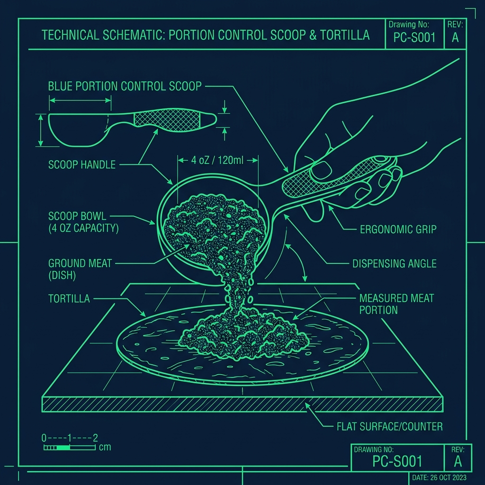
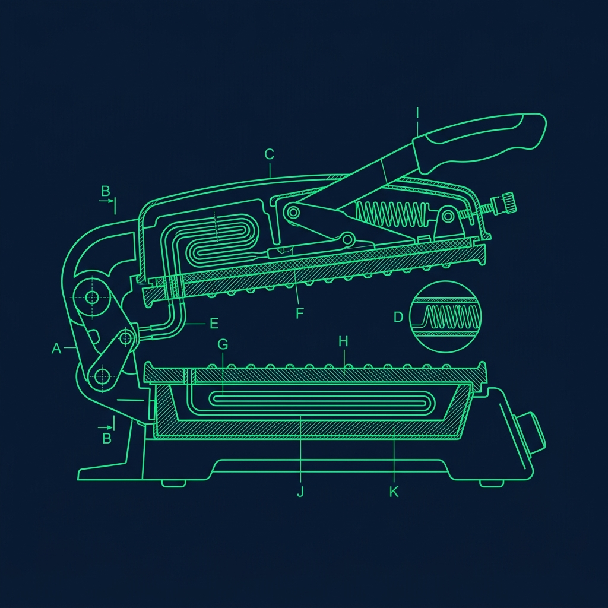

Getting hired at Taco Bell is the easy part. Surviving your first week on the makeline—the food assembly line where every burrito, taco, and crunchwrap in the store is built—is where people either figure it out or fall apart. 

Taco Bell's menu looks massive. There are dozens of burritos, tacos, chalupas, crunchwraps, quesadillas, and bowls, plus a rotating cast of limited-time offers that change every few weeks. New hires stare at the build cards posted above the line and feel their brains short-circuit. But here is the secret that every veteran Food Champion knows, and that I wish someone had told me on day one: Taco Bell does not actually have 50 different items. They have about 8 core ingredients folded, wrapped, and pressed into 50 different shapes. Once you see the pattern, the entire menu collapses into something manageable. 

## Stop Memorizing Items—Start Memorizing "Bases"

The biggest mistake new hires make is trying to memorize every single item as if it is a completely unique recipe. It is not. Almost everything on the Taco Bell menu is a variation of a handful of base builds. Learn the bases, and learning a new item becomes a matter of spotting which base it uses and what small modifications are made. 

> **Russell's Note:** You don't know true panic until a 15-item catering order drops right in the middle of a Sunday brunch shift. It instantly backs you up to the window.

> **Russell's Note:** You don't know true panic until a 15-item catering order drops right in the middle of a Sunday brunch shift. I still have nightmares about it.

- **The Supreme Base:** Whenever an item says "Supreme"—Taco Supreme, Chalupa Supreme—it almost always means you take the standard build and add sour cream and diced tomatoes. That is it. Two extra ingredients.
- **The Burrito Base:** Most standard burritos start with a flour tortilla, a scoop of beans, a scoop of beef, or both. The differentiator is the sauce and one or two unique toppings.
- **The Doritos Locos Base:** A standard DLT is just beef, lettuce, and cheese inside a flavored shell. Same build as a regular crunchy taco—different shell.

Take the Cheesy Gordita Crunch. It sounds complicated. But it is just the standard taco base wrapped in a flatbread with a layer of melted three-cheese blend and spicy ranch between the shell and the flatbread. Once you know the taco build, you are only learning three extra steps. That mental shift—from "50 unique items" to "8 bases with modifications"—is the single biggest shortcut on the makeline.

## The Portion Control System: Scoops Over Ounces

Taco Bell relies heavily on strict portion control, and the system is designed to be intuitive once you understand the tools:

- **The Blue Scoop:** Used for ground beef. One level blue scoop per taco, one for most burritos.
- **The Yellow/Green Scoop:** Used for beans. Same principle—one level scoop.
- **The Two-Finger Pinch:** Used for shredded cheese and shredded lettuce. Not a measured scoop—a specific hand motion that delivers a consistent amount once you develop the feel.

Do not memorize "1.5 ounces of beef." Memorize "one level blue scoop." The build cards above the line tell you the exact order of ingredients—read them left to right, top to bottom, and follow the sequence.

The root cause: If you add an extra half-scoop of beef to 200 burritos in a day, the store has lost several pounds of ground beef that was not accounted for in the food cost budget. Franchise owners track food cost percentages obsessively—sometimes down to the tenth of a percent—and if the numbers are off, the shift lead will start standing behind the line watching every scoop you take. Getting the portions right from day one saves you from that kind of supervision.

## The Crunchwrap Supreme Cheat Code

The Crunchwrap is the item that intimidates new hires the most, not because the ingredients are complicated but because of the fold. Here is the exact build order:

1. 12-inch flour tortilla laid flat
2. One scoop of beef in the center
3. One pump of nacho cheese
4. Tostada shell placed flat on top (this is the crunch layer)
5. One click of sour cream, spread across the tostada
6. Lettuce
7. Diced tomatoes
8. **The Fold:** Fold the edges of the tortilla inward toward the center in a hexagon pattern. Place it fold-side down on the grill press.

The grill press seals the fold shut with heat, so the fold does not need to be geometrically perfect—it just needs to be tight enough that ingredients do not spill out before it hits the press. New hires waste time trying to create a perfectly symmetrical hexagon. Speed matters more than aesthetics here. As long as all the edges are tucked toward the center and the fold side goes down on the grill, the Crunchwrap will come out looking professional.

## Handling Limited-Time Items Without Panicking

Taco Bell introduces new LTO (Limited-Time Offer) items roughly every four to six weeks. These items cause disproportionate stress because they are not on the permanent build cards and the training window is often just a single shift before they go live.

Here is the good news that calms every new hire I have ever trained: almost every LTO is a variation of an existing base. A limited-time loaded burrito is still a burrito base with one or two special ingredients—a new sauce, a different cheese blend, a crunchy topping. When the LTO training card goes up, scan it for the base it most closely resembles and then note only the differences. This turns a seemingly brand-new item into a minor tweak you can learn in five minutes instead of memorizing from scratch.

## Get Line Time During Slow Hours

You cannot memorize the menu by staring at the build cards in the break room. You have to build muscle memory, and that only happens by actually making the food with your hands.

During the slow hours—usually between 2:00 PM and 4:00 PM—ask your shift lead if you can work the drive-thru orders while an experienced builder watches you. Do not panic when the screen fills up. Read one ticket at a time. Within two weeks, your hands will know where the sour cream gun and the lettuce bin are without you even having to look.

The best way to accelerate your learning is to verbalize the build as you do it. Say the ingredients out loud: "Tortilla, beef, nacho cheese, tostada, sour cream, lettuce, tomatoes, fold." Speaking the sequence engages a different part of your brain than silently reading the card, and it locks the order into long-term memory dramatically faster. I made every new hire on my shifts do this, and the ones who actually did it consistently were building at full speed within 10 days instead of the usual three weeks.

## Pro Tips for Faster Menu Mastery

- **Take a photo of the build cards.** Most shift leads will let you snap a picture on your phone. Study them during your break or before your shift. Five minutes of reviewing before you clock in is far more effective than trying to memorize on the fly during a rush.
- **Learn the sauces first.** Sauces are the biggest differentiator between similar items. A Beefy 5-Layer uses nacho cheese and sour cream. A Bean Burrito uses red sauce and onions. Once you know which sauce goes with which item, the rest of the build usually falls into place naturally.
- **Watch the veterans.** Stand behind an experienced Food Champion during a rush and watch their hands. They always grab ingredients in the same order, never hesitate between steps, and their portions are instinctively accurate. Mimicking their flow teaches you more in one shift than a week of reading build cards. The [Linebacker role](/articles/taco-bell-linebacker-role) is actually a great position for this—you are standing right behind the line with a perfect view of how experienced builders work.

## Frequently Asked Questions

### How long does it take a new hire to memorize the full Taco Bell menu?

Most new hires can handle the core menu items confidently within two to three weeks of consistent line time. Mastering the full menu—including LTOs and less common items like the Mexican Pizza—usually takes about six to eight weeks. The key variable is how much actual line time you get. If you are stuck on register or drive-thru window for most of your shifts, it will take longer because you are not physically building the items.

### What happens if I build an item wrong?

If you catch the mistake before it reaches the customer, discard it and rebuild correctly. If the customer receives it and complains, the store remakes it for free. Repeated build errors will get you pulled off the line for retraining, but occasional mistakes are expected during your first few weeks. Everyone messes up Crunchwrap folds. Everyone puts nacho cheese where the sour cream goes at least once.

### Do I need to memorize the prices too?

No. The POS system and the cashier handle pricing. Your job on the makeline is to build correctly and portion accurately. However, knowing the approximate price of common items helps if you are ever pulled to the front counter to answer customer questions. The [drive-thru timer](/articles/taco-bell-drive-thru-timer) is what matters on the operations side—not the price tags.

---

*Keep learning Taco Bell operations with our guides on the [Linebacker role](/articles/taco-bell-linebacker-role), the [drive-thru timer system](/articles/taco-bell-drive-thru-timer), and [how Taco Bell rehydrates their beans](/articles/taco-bell-rehydrate-beans).*
