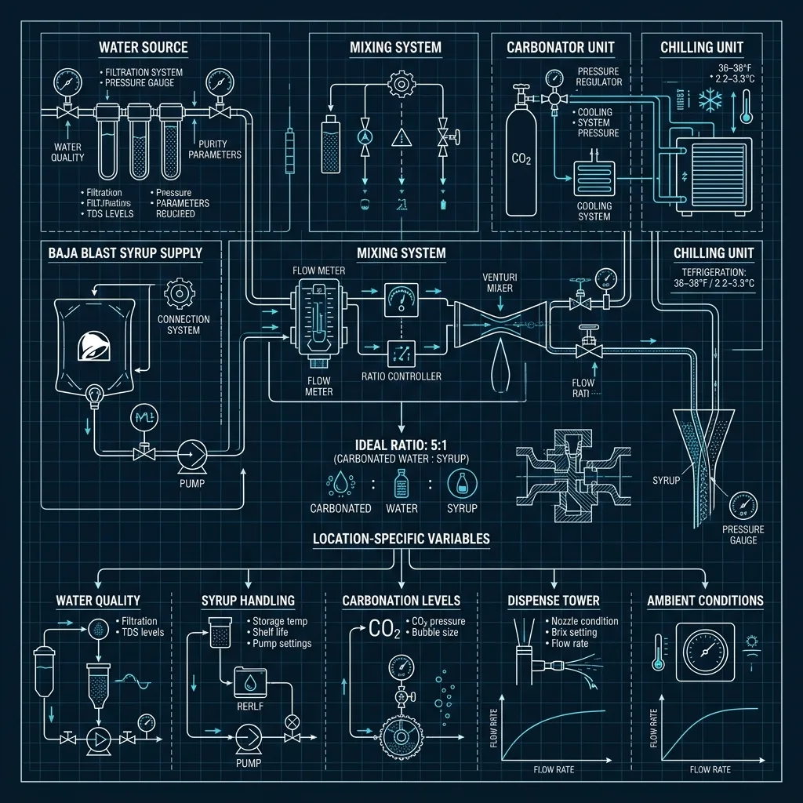

When it comes to raw operational speed, Taco Bell is the undisputed king of the Quick Service Restaurant (QSR) industry. While [McDonald's](/articles/chain/mcdonalds) relies on heavy robotics (like the platen grills) to maintain pace, Taco Bell relies on a completely different strategy: extreme ingredient simplification and a ruthless assembly line.

If you look at the [Taco Bell menu](/articles/taco-bell-menu), you will see hundreds of different items. But if you look behind the counter, you realize that every single one of those items is constructed from the exact same 15 base ingredients. It is an operational masterclass in permutations. 

This guide strips away the marketing and looks at the gritty reality of running a Taco Bell shift. We will break down the make-line, the hydration systems, the fryers, and the specific roles that allow a crew to push cars through a drive-thru in under 60 seconds.

## The Rehydration Kitchen

The first thing you have to understand about Taco Bell is that they do not "cook" in the traditional sense. There are no spatulas, no raw beef patties, and no open-flame grills. Taco Bell operates a "rehydration and re-thermalization" kitchen. 

The core proteins (the seasoned beef and the shredded chicken) arrive at the store pre-cooked in heavy plastic bags. The morning prep team drops these bags into a massive re-thermalizer—essentially a giant, temperature-controlled water bath (sous-vide on an industrial scale). Once the meat reaches 165 degrees Fahrenheit, the bags are pulled, cut open, and dumped into the hot-holding pans on the make-line.

The refried beans follow a similar logic but start entirely dehydrated. We break down the exact ratios and the specific whisking technique required to bring the pellets back to life in our guide on how [Taco Bell rehydrates beans](/articles/taco-bell-rehydrate-beans). 

<strong>Operational Reality:</strong> This rehydration model is why Taco Bell can operate with such a small physical footprint and such low labor costs. They do not need a grill cook monitoring temperatures. They just need assemblers who can scoop and fold rapidly.

## The Make-Line Architecture

The heart of the store is the make-line. It is a long, dual-sided stainless steel table with heated water baths (bains-marie) running down the center, and refrigerated cold rails running along the top edges. 

The hot ingredients (beef, chicken, beans, nacho cheese) sit in the heated center. The cold ingredients (lettuce, tomatoes, sour cream, shredded cheese) sit in the cold rails. 

The assembly process is heavily standardized using specific portion-control tools. The beef scoop, for example, is calibrated to hold exactly 1.5 ounces of meat. You do not shake it; you drag it against the side of the pan to level it off, dump it into the taco shell, and slide it down the line. 

### The [Linebacker Role](/articles/taco-bell-linebacker-role/)

During a Friday night dinner rush, the assemblers on the make-line are moving so fast that they will drain a pan of beef in three minutes. If the assembler has to stop making tacos, turn around, walk to the re-thermalizer, cut open a new bag of beef, and refill the pan, the drive-[thru timer](/articles/taco-bell-drive-thru-timer/) turns red.

To solve this, Taco Bell invented one of the most famous roles in the QSR industry: The Linebacker. 

The Linebacker stands behind the assemblers. They do not make food. They wear a headset to listen to incoming orders, and they constantly scan the hot and cold pans. When a pan gets low, the Linebacker pulls a fresh one from the cabinet and swaps it out *before* the assembler runs out. The assemblers never have to break their rhythm. We wrote a deep dive on the intensity of the [Taco Bell linebacker role](/articles/taco-bell-linebacker-role) and why it makes or breaks a shift.

## The Fryer and Specialty Shells

While the make-line handles 80% of the menu, the fryer station handles the high-margin specialty items. Taco Bell doesn't just fry potatoes; they fry their own shells.

The Chalupa is one of the most profitable items on the menu, and its unique texture requires a specific frying process. The flatbreads arrive raw. A crew member loads them into a heavy metal cage (a fryer mold) that bends the flatbread into a U-shape, drops the cage into the 350-degree oil, and sets a timer. 

If the oil is too hot, or if the timer is ignored for even ten seconds, the shell turns into a rock-hard brick. If the oil is too cold, it absorbs the grease and becomes soggy. We detail the exact mechanics and oil requirements in our breakdown of the [Taco Bell chalupa shell](/articles/taco-bell-chalupa-shell). 

## The Drive-Thru and the Induction Loop

Taco Bell lives and dies by the drive-thru. They process more cars per hour than almost any other competitor. This isn't just because of the food; it's because of the technology tracking the cars.

Buried in the asphalt of the drive-thru lane are magnetic induction loops. When a massive hunk of metal (a car) rolls over the loop, it disrupts the magnetic field. This sends a digital signal directly to the store's timing computer.

There are usually three loops:
1. **The Speaker Loop:** Starts the clock when the customer pulls up to order.
2. **The Window Loop:** Tracks how long the customer sits at the window waiting for their food.
3. **The Exit Loop:** Stops the clock when the customer finally drives away.

Corporate mandates strict limits on these timers. The standard target is under 50 seconds at the window. If you want to know how store managers game these sensors (and how corporate catches them), check out our exposé on the [Taco Bell drive-thru timer](/articles/taco-bell-drive-thru-timer).

## The PepsiCo Partnership and [Baja Blast](/articles/taco-bell-baja-blast/)

You cannot talk about Taco Bell without talking about their beverage strategy. Decades ago, Taco Bell was owned by PepsiCo (before they spun off into Yum! Brands). That foundational relationship allowed them to secure one of the most valuable exclusive products in fast food history: Mountain Dew [Baja Blast](/articles/taco-bell-baja-blast/).

Baja Blast was chemically engineered specifically to complement the flavor profile of Taco Bell's food. It is a massive traffic driver, particularly during the late-night "Fourth Meal" rush. We break down the syrup-to-carbonation ratios and the history of this legendary drink in our [Taco Bell Baja Blast](/articles/taco-bell-baja-blast) guide.

## The Reality of the Line

Working at Taco Bell is fundamentally different than working at a burger chain. You aren't managing raw proteins or worrying about cross-contamination between a grill and a bun station. You are managing a high-speed folding and scooping operation. 

The heat comes from the steam of the water baths, and the pressure comes from the relentless beep of the drive-thru headset. It is an incredible display of operational efficiency. When a fully staffed line is in sync, with a solid Linebacker feeding them ingredients, they can clear a 15-car drive-thru stack in under ten minutes. That is the gritty reality of the fastest kitchen in the world.
