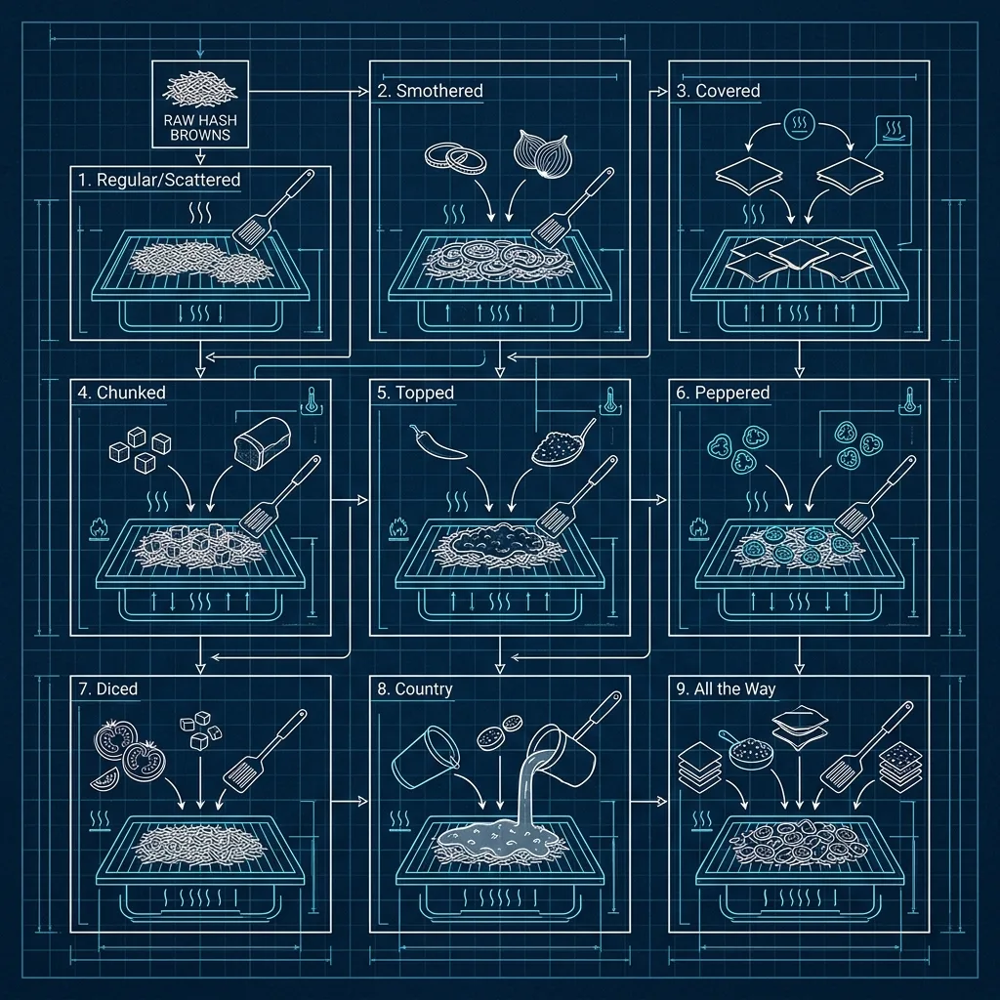
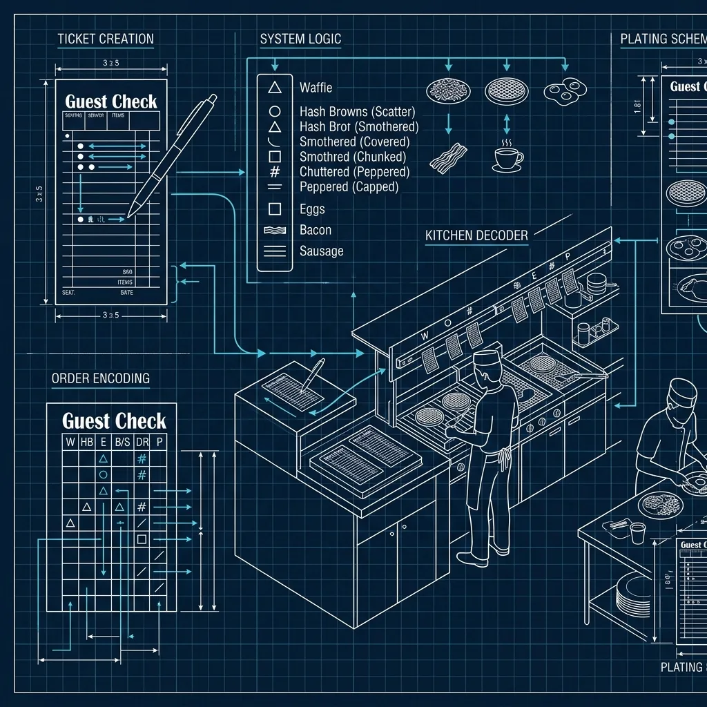

7.  How Does the Waffle House Hash Brown Ordering System Work?

If you’ve ever sat at the counter of a Waffle House at 2 AM and watched the grill operator work, you’ve probably noticed something strange. There’s a language happening between the server, the ticket, and the cook that doesn’t involve much talking at all. Condiment packets and jelly containers get placed on plates in specific positions. Tickets get marked with cryptic shorthand. And somehow, out of what looks like total chaos, your hash browns come out exactly the way you ordered them — smothered, covered, chunked, and peppered. 

I spent time working alongside Waffle House crew members during a cross-training stint early in my QSR career, and their hash brown system is genuinely one of the most elegant ordering systems in the entire fast food industry. It’s not just a menu gimmick. It’s a fully integrated communication protocol between front of house and back of house that has been refined over decades. 

## The Nine Modifications, Explained

> **Russell's Note:** People always ask why this tastes different at home. Simple. We aren't afraid of butter, salt, and keeping the clamshell grill screaming hot.

> **Russell's Note:** People always ask why this tastes different at home. Simple. We aren't afraid of butter, salt, and keeping the flat top screaming hot.

Every order of Waffle House hash browns starts with a base: a portion of dehydrated potato that gets rehydrated and then cooked on the flat-top. From there, customers can add up to nine modifications. Here’s what each one actually means in the kitchen: 

**Scattered** — This is the default cooking method. The hash browns are spread out across the flat-top grill rather than cooked in a ring mold. Almost every order is scattered, so if a customer just orders “hash browns,” they come scattered automatically.

**Smothered** — Sautéed onions mixed in with the hash browns. The grill operator pulls from a hotel pan of pre-diced onions and folds them into the potatoes while they cook.

**Covered** — A slice of American cheese melted on top. This gets laid on during the last minute or so of cooking so it melts down into the potatoes without burning.

**Chunked** — Diced pieces of hickory-smoked ham folded into the hash browns. The ham comes pre-diced in bags and sits in a cold well near the grill.

**Diced** — Fresh diced tomatoes added on top. These are raw and get placed on after cooking, right before the plate goes up.

**Peppered** — Jalapeño peppers mixed in. These come from a jar of pickled jalapeños, sliced into rings or diced depending on the location.

**Capped** — A serving of button mushrooms cooked into the hash browns. The mushrooms come from a can, drained, and they get a little time on the flat-top before being mixed in.

**Topped** — Bert’s Chili ladled over the top. This is the same chili used for the chili cheese plate, kept warm in a steam well.

**Country** — White country gravy poured over everything. The gravy is made from a mix and kept in a warmer, and it turns the hash browns into something closer to biscuits and gravy territory.

You can order any combination of these. All nine at once if you want. And yes, people do.

## The Marking System: How Tickets Actually Work

This is the part that fascinates most people, and it’s the part that’s hardest to explain without seeing it in person. Waffle House uses a physical marking system on the plates and tickets to communicate orders from the server to the grill operator without verbal callouts.

Here’s how it works: when a server writes up a ticket, they use specific abbreviations. “SM” for smothered, “COV” for covered, “CH” for chunked, and so on. But the real magic is the plate marking system.

Before the grill operator starts cooking, the server “marks” the plate using condiment items placed in specific positions:

*   **Scattered**: No marker needed — it’s the default.
*   **Smothered**: A pat of butter or piece of toast placed at a certain position.
*   **Covered**: A slice of cheese on the plate.
*   **Chunked**: A portion of ham placed to the side.
*   **Diced**: A container of apple jelly or a specific condiment packet.
*   **Peppered**: A packet of hot sauce or a pepper ring.
*   **Capped**: A container of grape jelly.
*   **Topped**: A container of strawberry jelly or preserves.
*   **Country**: A container of apple butter.

The exact markers can vary slightly by location because some stores have evolved their own shorthand over the years, but the core system is standardized in Waffle House training. New grill operators learn this system during their initial training period, and it’s drilled into them until it becomes second nature.

The beauty of this system is speed. During a busy late-night rush, the grill operator doesn’t have time to read every ticket word by word. They glance at the markers, read the visual shorthand, and immediately know what goes on the grill. It cuts seconds off every order, and when you’re pushing out 40 or 50 plates an hour, those seconds add up fast.

## How Grill Operators Handle 8+ Modifications at Once

Here’s where it gets real. A single customer ordering hash browns “all the way” — meaning all nine modifications — is one thing. But a grill operator during a Saturday night rush might have six or seven different hash brown orders working simultaneously, each with a different combination of modifications, all sharing the same flat-top with eggs, bacon, and waffle batter dripping down from the iron station.

The flat-top at Waffle House is typically a 6-foot commercial griddle running at about 350°F to 375°F. The grill operator mentally divides this surface into zones. Hash browns get their own section, usually the right side or the lower third of the grill, depending on the operator’s preference and which hand they favor.

Each hash brown order gets its own little territory on the flat-top. The operator lays down the rehydrated potatoes, spreads them thin, and then starts adding modifications in sequence. Smothered onions go on first because they need cook time. Chunked ham goes on next. Capped mushrooms. Peppered jalapeños. Each ingredient gets folded in with a spatula at the right moment.

The covered cheese goes on late — too early and it burns to the grill. Diced tomatoes go on at plating because they’re raw. Topped chili and country gravy go on at the very end, right before the plate hits the window.

What makes a good Waffle House grill operator is spatial memory. They have to remember which pile of hash browns belongs to which ticket, which modifications have been added, and which still need to go on. There’s no screen, no timer, no beep telling them when to flip. It’s all feel and experience.

I’ve watched operators run eight separate hash brown orders simultaneously while also managing a full egg line and keeping track of waffle timers. It’s legitimate short-order cooking at its purest — no automation, no safety nets, just a person with a spatula and a mental map of their grill.

## The Flat-Top Technique for Crispy Hash Browns

If you’ve ever wondered why Waffle House hash browns are crispier than what you make at home, here’s the truth: it comes down to three things — hydration, oil, and patience.

The hash browns start as dehydrated potatoes. They get rehydrated with water before cooking, but the key is not making them too wet. Too much water and they steam on the grill instead of crisping. An experienced operator knows the exact ratio by feel — the potatoes should be moist but not soggy.

Once they hit the flat-top, the operator spreads them thin. This is critical. A thick pile of hash browns steams in the center and never gets that golden crust. Scattered hash browns are spread out to maximize surface contact with the grill. The flat-top is oiled, and the potatoes essentially shallow-fry in a thin layer of cooking oil.

Then comes the patience. Good hash browns need about 4 to 6 minutes per side. The operator presses them down with a spatula to increase grill contact, lets them sit, and resists the urge to move them around too much. Moving them breaks the crust. You want that Maillard reaction to build up a solid golden layer before you flip.

The flip itself is a skill move. A full order of scattered hash browns is a loose, fragile thing on the grill. You have to get under it with a wide spatula, commit to the flip, and lay it back down without scattering potato everywhere. New operators lose hash brown portions to bad flips all the time. It’s a rite of passage.

After the flip, the same process repeats on the other side. Modifications get folded in during this second cook. Cheese goes on top during the last 30 to 60 seconds. And when the operator decides they’re done — again, by look and feel, not by timer — they slide the whole thing onto the plate.

## Volume During Late-Night Shifts

Waffle House is a 24-hour operation, and anyone who’s worked in or near one knows that the real test comes between 11 PM and 4 AM. After bars close, after concerts let out, after football games end — that’s when the rush hits.

During a late-night slam, a single grill operator might be handling a continuous stream of orders that doesn’t let up for three or four hours straight. The hash brown orders pile up because that’s what people crave at 2 AM — something hot, greasy, salty, and customizable.

I’ve seen ticket rails so full that servers are holding tickets in their hands waiting for a clip to open up. The grill operator is working the entire flat-top surface, every square inch, with hash browns in various stages of completion overlapping with eggs over-easy, patty melts, and scattered, smothered everything.

The noise level is something else too. A packed Waffle House at 1 AM on a Saturday is louder than most sports bars. Jukeboxes playing, customers yelling across the counter, servers calling out orders over the din. And through all of it, the grill operator is quietly reading markers, tracking modifications, and putting out plate after plate.

What keeps the system from falling apart is the marking system. When the operator is in the weeds — and they will be in the weeds — they don’t have to remember verbal orders. The markers are right there on the plate or ticket. It’s a physical checklist that persists even when the operator’s brain is running at full capacity.

## Why This System Has Survived for Decades

Waffle House opened in 1955, and the core of the hash brown system has been in place since the early years. It’s been refined, but the bones are the same: a simple base product with modular additions, communicated through a visual marking system that doesn’t require technology.

There’s been no move to digitize this process. No touch screens at the grill. No automated ticket systems replacing the plate markers. And I think the reason is simple — it works. It’s fast, it’s reliable, and it scales. Whether there are two customers at the counter or thirty people waiting for tables, the system handles the volume.

Other chains have spent millions on kitchen display systems, automated fryers, and digital order management. Waffle House invested in training humans to be really, really good at a simple system. And honestly, watching a great grill operator work during a rush is one of the most impressive things you’ll see in the restaurant industry.

## The Bottom Line

The Waffle House hash brown system isn’t just a fun menu quirk — it’s a masterclass in low-tech kitchen communication. Nine modifications, a visual marking system, and a skilled grill operator working a flat-top at 2 AM with nothing but spatial memory and a metal spatula.

If you’ve never ordered hash browns “all the way” at a Waffle House, I’d encourage you to do it at least once. Sit at the counter so you can watch the grill. Pay attention to the markers on the plates. Watch how the operator tracks six orders at once without breaking stride.

And if you’ve got your own Waffle House hash brown order — the specific combination you always get — drop it in the comments. I’m partial to scattered, smothered, covered, and peppered myself, but I respect the all-the-way crowd.

RR

Russell Roseberry

10-Year QSR Veteran & Former Kitchen Manager

Russell Roseberry spent over a decade managing kitchens at major fast food chains across the Southeast. From [Chick-fil-A](/articles/chain/chick-fil-a) to [Wendy's](/articles/chain/wendys) to [Taco Bell](/articles/chain/taco-bell), he's worked every station, trained hundreds of new hires, and learned the operational secrets that most customers never see. He created Fast Food Guides to share real insider knowledge with the people who actually want to know how the food gets made.
