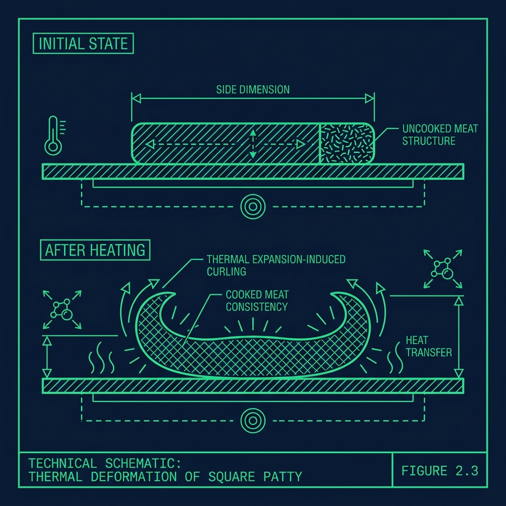

Wendy's has built its entire brand identity on two things: fresh, never-frozen beef and those distinctive square hamburger patties that hang over the edge of the bun. But The operational reality: 

It's called the 4-Corner Press. And if you skip it, you'll turn a beautiful square patty into a shrunken, lopsided meatball that your manager will make you throw away. 

## Why Fresh Beef Fights Back

When you throw a frozen hamburger patty onto a grill, it basically acts like a hockey puck. The ice crystals that formed during freezing have broken down the cell walls, creating a rigid structure that holds its shape under heat. The patty sits there, takes the heat, and cooks predictably. 

Fresh beef is a completely different animal—literally. When you drop a loosely packed, fresh ground beef patty onto a 400°F griddle, the muscle proteins immediately begin contracting. The heat causes the meat fibers to tighten and pull inward, and if you just let it sit there, that flat square patty will curl up into a thick, round ball within about 30 seconds. The edges pull toward the center, the corners lift off the grill surface, and you end up with something that's raw in the thickened center and burnt on the thin edges.

I watched new hires stare at this process in complete bewilderment. They drop a perfect square, walk away for 15 seconds, and come back to find something that looks like a golf ball. That's exactly why the 4-Corner Press exists.

## The 4-Corner Press Technique

The technique itself is deceptively simple, but the timing window is critical. Here's the exact sequence:

1. **The Drop:** Lay the raw square patties onto the grill in neat, organized rows. Don't throw them—place them flat so they make full contact with the grill surface.

2. **The Season:** Immediately hit the patties with salt and pepper. Seasoning before pressing ensures the salt gets locked into the sear crust, creating a more flavorful exterior. If you season after pressing, the salt just sits on the surface without bonding to the meat as effectively.

3. **The Sear:** Let the meat sit for three to five seconds. You need just enough time for the bottom to start forming a thin crust—this prevents the meat from sticking to your spatula during the press.

4. **The Press:** Using a heavy, flat metal spatula, press down firmly on each of the four corners of the square patty. Corner, corner, corner, corner. About one second per corner. You're pressing the edges outward against the grill, essentially staking them down so the contracting proteins can't pull them inward.

Think of it like staking down the corners of a tent. If you only anchor the center, the edges curl up. But pin all four corners to the ground, and the fabric stays flat and taut. Same principle—you're creating four anchor points that resist the natural inward pull of the contracting muscle fibers.

The entire press sequence takes about five seconds per patty. On a full grill with eight or more patties cooking simultaneously, you need to move through the entire set in under 30 seconds. That's a rhythm you develop through repetition: drop, season, sear, corner-corner-corner-corner, next patty. Get it into your muscle memory so you don't have to think during a rush.

## The Timing Window You Cannot Miss

Here's the thing nobody tells you during training orientation: the window for the 4-Corner Press is only about 15 to 20 seconds after the patty hits the grill. That's it.

If you press too early—before the bottom has started to crust—the raw meat sticks to your spatula and tears apart. You'll peel up half the patty and create a mangled mess. Wait for the sear first.

If you press too late—after the proteins have already fully contracted—pressing will only squeeze out moisture and juices. You'll end up with a dry, flat patty that's lost all its flavor in a puddle of grease on the grill. The meat has already locked into its shrunken shape, and no amount of pressure will reshape it.

The golden rule: press while the meat is still mostly raw. The corners should feel soft and pliable under your spatula, and the press should spread the meat outward with minimal resistance. If you feel significant pushback, you've waited too long.

## The [Clamshell Grill](/articles/wendys-clamshell-grill/) Complication

If your Wendy's uses a [double-sided clamshell grill](/articles/wendys-clamshell-grill), the 4-Corner Press becomes even more time-critical. The clamshell's top platen comes down within seconds of pressing the green button, so you need to drop the patties, hit all four corners immediately, and then close the grill before the window expires.

Once the clamshell is closed, the top platen locks the press in place and the patties cook from both sides simultaneously. But if you forget to press the corners before closing, the top platen will flatten the center while the edges curl up and bunch inward. You'll pull out a patty that's thin in the middle and thick around the edges—the exact opposite of what you want.

I've watched Grill Cooks who were perfectly competent on a flat-top completely fall apart when they switched to clamshell. The urgency is different. On a flat-top, you have maybe 20 seconds. On a clamshell, you have about 10 before that green button needs to be pressed. Practice the rhythm before you're doing it under fire during a Friday lunch rush with 15 cars in the drive-thru.

## Common Mistakes and How to Avoid Them

- **Pressing too hard in the center:** This is the classic rookie error. Pressing the center squeezes out juice and fat, making the patty dry and tough. The 4-Corner Press uses firm but controlled pressure at the edges only. The center takes care of itself.
- **Pressing too late:** If the patty has been cooking for a minute or more, the proteins have fully contracted. Pressing at this point only squeezes out moisture. The window is 15 to 20 seconds—after that, you've missed it.
- **Dirty spatula:** After pressing a few patties, your spatula accumulates grease and bits of stuck meat that make the next press less effective. Quick scrape on the grill edge between patties keeps the spatula flat and clean.
- **Over-pressing Jr. patties:** The smaller Jr. patties are thinner and require a lighter touch. One quick press per corner—don't linger. Over-pressing a Jr. patty flattens it into a paper-thin disc that dries out completely.

## Frequently Asked Questions

### Do all Wendy's locations use the 4-Corner Press?

Yes. The 4-Corner Press is a standard, company-wide training component for every Grill Cook at Wendy's, regardless of whether the store uses a flat-top grill or a clamshell grill. The technique is identical—only the speed changes based on equipment type.

### What happens if a patty shrinks because I forgot to press it?

If the patty has shrunk significantly, it'll be too small for the bun and likely unevenly cooked—raw and thick in the center, overdone at the edges. Depending on severity, you may need to cook it longer to ensure food safety, and your manager may have you discard it entirely. Those shrunken patties often end up as [chili meat](/articles/wendys-chili-leftover-hamburgers) rather than going on a sandwich.

### Why doesn't Wendy's just use a patty mold to keep the shape?

Wendy's fresh beef is loosely formed into squares intentionally. A rigid mold would require compressing the meat tightly, which changes the texture and produces a denser, tougher patty. The loose pack combined with the 4-Corner Press creates a tender, juicy patty with a natural, hand-formed texture—which is a core part of Wendy's brand. That loose formation is what makes their burgers taste different from the compressed, frozen discs at other chains.

---

**Related Guides:** See how the [Wendy's clamshell grill](/articles/wendys-clamshell-grill) cuts cook times in half, or learn the truth about how [Wendy's chili uses leftover hamburgers](/articles/wendys-chili-leftover-hamburgers).
