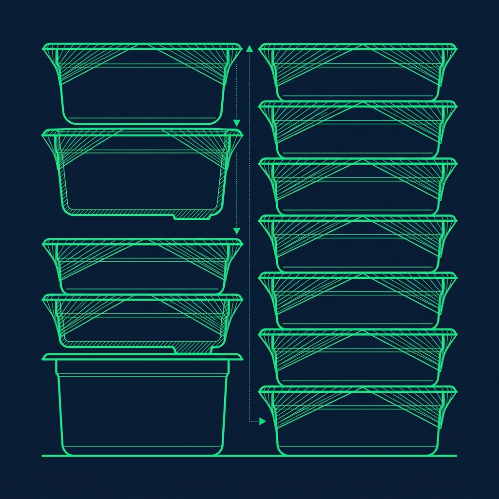
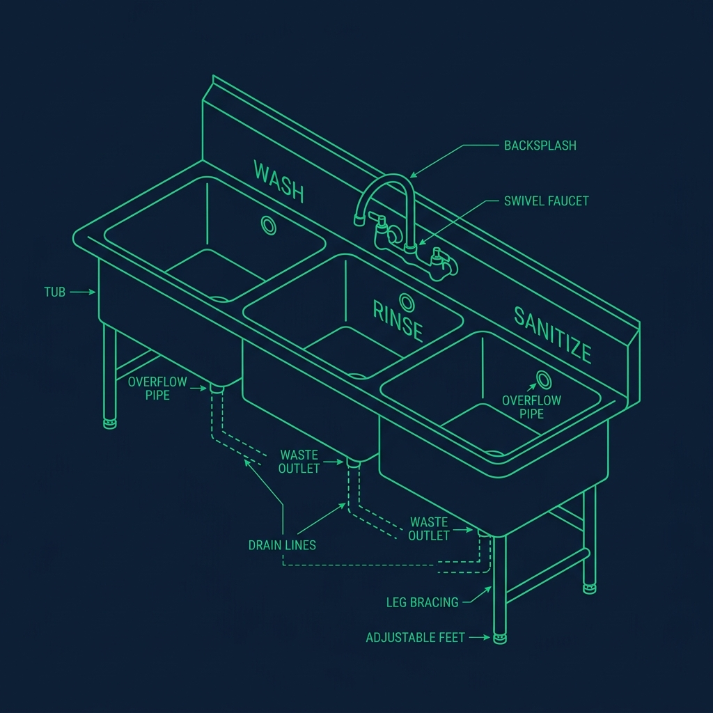

Closing a fast food restaurant is a grueling, exhausting process that separates the new hires from the veterans. The lobby is locked, the drive-thru is wrapping up the final late-night stragglers, and the entire crew is in a race against the clock to break down the kitchen so everyone can go home. If you've been assigned as the closing Sandwich Maker at Wendy's, you have a very specific set of responsibilities. You aren't scrubbing the floors. You aren't filtering the fryers. You aren't doing the [The Wendy's Frosty Machine \](/articles/wendys-frosty-machine-boil-out/))*

Here's the exact checklist, from the moment the pre-close starts until the manager unlocks the back door and lets you leave. 

## Phase 1: The Pre-Close (Starting Around 10:00 PM)

The secret to getting out early is pre-closing. If you wait until the store officially closes to start cleaning, you are going to be there until midnight or later, watching your manager get progressively more irritated. The best closers start chipping away at tasks during slow moments in the final hour. 

> **Russell's Note:** The Sysco truck being late will ruin a prep shift faster than anything else. You learn to pivot immediately or the lunch rush will crush you.

> **Russell's Note:** You don't know true panic until a 15-item catering order drops right in the middle of a Sunday brunch shift. I still have nightmares about it.

- **Condense the Pans:** If you have two half-empty pans of tomatoes, combine them into one clean pan. This frees up the dirty pan for the dishwasher to wash early, getting it off your plate entirely.
- **Wipe Down the Backsplash:** Take a sanitizer towel and thoroughly clean the stainless steel backsplash behind your station. This is one of those tasks that takes 60 seconds during pre-close but somehow takes five minutes when you're rushing at the end.
- **Restock Dry Goods:** Refill bun trays, sandwich wrappers, nugget boxes, and sauce packets. The morning crew needs everything fully stocked when they arrive at 6:00 AM. If they walk in to empty stations, your name will be remembered—and not fondly.

Pre-closing is genuinely an art form. The best closers I've ever managed were the ones who were constantly scanning for small tasks during quiet moments. If the drive-thru has been dead for 10 minutes, wipe down the outside of the reach-in coolers. Reorganize the condiment caddy. Restock the glove box. Every single task you complete before that final drive-thru car leaves is a task you don't have to do when the clock is ticking and everyone wants to go home.

## Phase 2: Breaking Down the Boards

Once the manager announces the drive-thru is officially closed, the real work begins and the pressure turns up.

- **Wrap and Date the Food:** All remaining cold ingredients—lettuce, tomatoes, cheese, onions, pickles—must be covered tightly in plastic wrap. You must write a new "Use By" date and time on every single pan and place them in the walk-in cooler. This is non-negotiable. Make sure the plastic wrap creates a complete, airtight seal. A loose wrap allows air circulation that dries out the food overnight. By the time the morning crew unwraps those tomatoes, they'll be shriveled and unusable if the seal wasn't tight. I always double-wrapped items that dry out quickly—shredded lettuce and diced onions especially.

- **Remove the Inserts:** Pull the metal inserts and cutting boards off the sandwich station and take them to the three-compartment sink for washing.

- **Clean the Coolers:** With the food removed, wipe out the inside of the reach-in coolers under the sandwich board. Sweep out dropped lettuce, stray shredded cheese, and any accumulated moisture. Sanitize the interior surfaces. The morning crew should open those coolers to a clean, dry interior—not a wilted lettuce graveyard.

## Phase 3: The Three-Compartment Sink

The metal inserts and cutting boards go through the standard three-sink wash process:

1. **Sink 1 (Wash):** Hot, soapy water. Scrub every surface with a brush to remove all food residue. Don't just dunk and pull—actually scrub.
2. **Sink 2 (Rinse):** Clean, hot water. Rinse off all soap completely. Soap residue on food-contact surfaces is both a health code issue and a flavor problem.
3. **Sink 3 (Sanitize):** A properly measured sanitizer solution—usually quaternary ammonia mixed to the correct concentration. Submerge each item for the required contact time, typically at least 30 seconds.

After sanitizing, let everything air dry on a clean drying rack. Do not towel-dry them. Towels can reintroduce bacteria onto freshly sanitized surfaces. Once dry, stack the inserts cleanly so the morning crew can drop them right back into the sandwich station without re-washing.

## Phase 4: The Frosty Machine (If It's Your Night)

Depending on your store's specific labor allocation, the Sandwich Maker or the Front Counter closer handles the Frosty machine. If it's your night, budget at least 20 to 25 minutes for the full teardown: draining the remaining mix into clean buckets for the walk-in, pulling the heavy metal parts, washing everything, running the sanitizer cycle, and reassembling with properly lubricated O-rings. The [full Frosty machine boil-out process](/articles/wendys-frosty-machine-boil-out) is the single longest task of the closing routine, and rushing through it by skipping the lubrication step is a guaranteed way to create a leaking disaster for the morning crew.

If the manager gives the green light, start draining the Frosty machine 15 to 20 minutes before the store officially closes. The drive-thru can sell from the second machine or inform customers that Frosties are unavailable. This head start can shave 15 minutes off your total close time—and that's 15 minutes of your life you'll never get back if you don't take the opportunity.

## Phase 5: The Final Walkthrough

Before the manager signs off on your station and lets you leave, they'll do a visual inspection. They're checking for:

- All food properly wrapped, dated, and stored in the walk-in
- Coolers wiped clean with zero food debris
- Sandwich station surface fully sanitized
- Backsplash clean and free of sauce splatter
- Bun trays, wrappers, and all dry goods restocked for the morning

If anything fails the walkthrough, you'll be asked to redo it. Don't argue. Don't cut corners. Fix it quickly and correctly so everyone can leave. The fastest path home is through the checklist, not around it.

## The Golden Rule of Closing

Never stand around. If your sandwich station is completely clean, wrapped up, and signed off, but the Grill Cook is still scraping 400 degrees of burnt grease off the [clamshell grill](/articles/wendys-clamshell-grill), go grab a mop. Offer to take the trash to the dumpster. Help stock the walk-in. The manager cannot release anyone until the entire store is signed off—every station, every checklist item. Helping your teammates is literally the only way to get home faster. The closers who stand around watching other people work are the closers who don't get scheduled for the shifts they want.

## Frequently Asked Questions

### How long does it typically take to close the sandwich station?

If you pre-close effectively, the final breakdown after the drive-thru closes takes about 30 to 45 minutes. Without pre-closing, expect 60 to 75 minutes of concentrated work. If the Frosty machine falls on you, add another 20 to 25 minutes on top. The fastest closers I've managed could have their station walkthrough-ready in 25 minutes after the last order—but they were pre-closing aggressively from the moment the dinner rush ended.

### What if a customer orders a sandwich after I've already started breaking down?

You make the sandwich. As long as the drive-thru is open, you are serving customers. Period. This is exactly why pre-closing is done selectively—you condense and clean around the items you still need, but you never fully break down the station until the manager officially calls it. I've seen closers break down everything at 10:15 only to have a car pull up at 10:20, and they had to re-open pans from the walk-in. Don't be that person.

### Can I leave before other stations are done?

No. In nearly every Wendy's, the manager does a full walkthrough of the entire restaurant before releasing anyone. All stations—grill, fry, sandwich, front counter—must be signed off. If your station is done early, you help others finish. The team leaves together. That's how it works.

---

**Related Guides:** Learn the dreaded [Frosty machine boil-out process](/articles/wendys-frosty-machine-boil-out) in full detail, or see how the [Wendy's clamshell grill](/articles/wendys-clamshell-grill) cleanup factors into the nightly routine.
