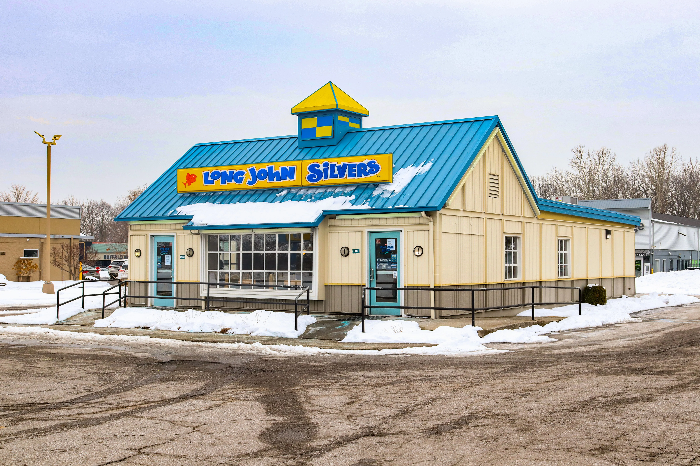

The ticket printer hasn't stopped for 45 minutes, the grill cook is frantically dropping fresh batches of spicy chicken, and three cars just pulled up to the speaker box at the exact same time. You hand the customer their drink and hit them with the line: 

*"We're just waiting on fresh fries for you. Can you go ahead and pull forward to those yellow lines, and we’ll bring it right out?"*

To a customer, this seems like a minor inconvenience. But behind the window, asking a car to "pull forward" or "park" is a highly calculated survival maneuver driven by an unforgiving piece of technology: the Drive-Thru Timer. 

According to [QSR Magazine's annual drive-thru study](https://www.qsrmagazine.com/), speed of service remains the top operational priority across the industry. This timer dictates everything that happens in a Wendy’s kitchen, and pulling forward is the only way the system survives a lunch rush.

## The SOS (Speed of Service) Metric

At Wendy's, the ultimate metric of a shift manager’s success is **SOS**, or Speed of Service. 

Corporate sets a strict SOS goal. Depending on the franchise, the target is usually between **90 and 120 seconds** per car. That timer starts the exact millisecond your front tire triggers the magnetic loop embedded in the asphalt at the speaker box, and it stops the moment your rear tire clears the sensor at the pickup window.

Inside the kitchen, there is a large digital scoreboard mounted on the wall where every employee can see it. It displays real-time data:
- How many cars are currently in the drive-thru lane.
- The exact time each car has been in line.
- The store's rolling average SOS for the hour.

When a car’s timer turns from Green (under goal) to Red (over goal), the stress level in the kitchen spikes. General Managers and District Managers receive automated reports of SOS times. If a store consistently runs a 180-second average, the manager’s job is on the line.

## Why Do They Ask You to Pull Forward?

Because Wendy's uses [fresh, never frozen beef](/articles/chain/wendys/wendys-fresh-never-frozen) and cooks fries in precise batches, food isn't just sitting around in endless quantities. 

**ProTip:** The ZOOM Nitro system is the most common drive-thru timer used in modern Wendy's locations. It uses color-coded dashboards that flash red when an order crosses the 120-second threshold, which instantly raises the stress level on the floor.

Imagine you pull up to the window and order three Spicy Chicken sandwiches. The sandwich maker realizes they only have one Spicy Chicken patty left in the holding cabinet, and the grill cook just dropped a fresh basket into the fryer. 

That basket takes exactly 4.5 minutes to cook. 

If the manager leaves your car sitting at the window for 4.5 minutes, your specific drive-thru timer will hit over 300 seconds (a massive red flag). But more importantly, the four cars behind you—who only ordered drinks and pre-made salads—are now trapped. Their timers are also skyrocketing because of *your* spicy chicken. 

By asking you to pull forward, the manager accomplishes two things:
1. They stop your car's timer (as you cross the window sensor).
2. They unblock the bottleneck, allowing the DTR (Drive-Thru Register) cashier to immediately hand out the easy orders to the cars behind you.

**ProTip:** Designated runners are often used during peak lunch hours. The runner wears a headset so they know exactly which parked car is waiting for the spicy chicken sandwich before they even walk out the door.

<strong>Operational Reality:</strong> Parking a car is officially allowed by corporate policy, but it is heavily monitored. If a store parks too many cars, the District Manager will flag them for "cheating the timer." The goal is to cook food accurately enough that parking is rarely necessary, but during unexpected spikes in volume, it is the only release valve a kitchen has.

## The "Window Time" vs. "Total Time"

The drive-thru timer actually tracks multiple segments of your journey:
- **Menu Board Time:** How long you spend ordering.
- **Line Time:** How long you wait between the speaker and the window.
- **Window Time:** How long you actually sit at the window handing over your credit card and receiving your food.

This is why the drive-thru cashier will sometimes hand you a drink, process your card, and instantly ask you to pull forward. They are optimizing that specific 30-second window metric.

## Audio Headset Surveillance and Acoustic Noise Cancellation Systems

Modern Wendy's drive-thrus do not rely solely on visual cameras and magnetic loops; they utilize advanced multi-channel wireless headset networks with acoustic noise-cancellation hardware. When a vehicle enters the menu board lane, an ultrasonic sensor triggers an audible beep across all employee headsets, instantly opening a live audio channel before the customer even utters a word.
- **"Hearing Ahead" & Kitchen Staging:** Every sandwich maker, grill cook, and fry station coordinator wears a headset. This allows the kitchen line to hear the customer order in real time—often 15 to 20 seconds before the order cashier finishes punching the items into the POS register. If a customer asks for "three Dave's Triples with no pickles," the sandwich station is already laying down nine fresh beef patties and slapping cheese onto toasted buns before the cashier hits the total button.
- **AI-Driven Order Accuracy & Acoustic Filters:** To prevent acoustic bottlenecks caused by loud diesel engines, pouring rain, or screaming children in the backseat, Wendy's has begun deploying AI-assisted acoustic filtering at the menu board speaker. The system strips out background ambient frequencies, delivering crisp vocal frequencies directly to the headset network. This reduces order clarification loops ("Sorry, did you say large or medium?"), which saves an average of 4.2 seconds per transaction during peak lunch hours.

## Drive-Thru Bottlenecks: Mobile Order Check-Ins and Cash vs. Contactless Transactions

While magnetic loop timers track vehicle movement, the human element of payment processing and mobile app redemption remains the most unpredictable variable in drive-thru speed management:
- **The "At-the-Window App Pull-Up" Penalty:** The single greatest destroyer of green SOS scoreboards is the customer who waits until they reach the cashier window to unlock their smartphone, open the Wendy's app, and search for a digital reward barcode. This 20- to 30-second delay doubles the target window transaction time. To counteract this, DTO speakers are trained to ask: *"Are you using a mobile app reward today?"* immediately at the speaker box, forcing the customer to prepare their screen while waiting in line.
- **Cash Handling vs. NFC Contactless Payment:** From an operational standpoint, cash transactions are a massive liability for drive-thru timers. Accepting cash requires receiving bills, verifying denominations, popping the register drawer, counting change, and handing coins back through an open window—a sequence that averages 22 to 28 seconds. By contrast, an NFC contactless tap-to-pay transaction (Apple Pay or contactless credit cards) clears the merchant gateway in under 4 seconds. Kitchen managers track cash-to-card ratios closely, as a heavy cash shift invariably adds 15 to 20 seconds to the hourly SOS rolling average.

## How the Kitchen Prepares for the Timer

To prevent cars from having to pull forward, a Wendy’s kitchen operates on anticipation. 

The grill cook isn't waiting for your order to pop up on the screen. They are actively forecasting. If a tour bus pulls into the parking lot, or the drive-thru camera shows a line of ten cars wrapping around the building, the grill cook instantly drops maximum batches of [square patties on the clamshell grill](/articles/chain/wendys/wendys-clamshell-grill). 

When a kitchen gets "in the weeds" (restaurant slang for falling hopelessly behind), it is usually because the grill cook failed to anticipate the rush, resulting in an empty meat cabinet. When the meat cabinet is empty, every single car has to be parked, the drive-thru timer scoreboard turns solid red, and the shift descends into chaos. 

So the next time you’re asked to pull forward for a fresh batch of fries, don't take it personally. The crew isn't ignoring you—they are just trying to keep the digital scoreboard green.
