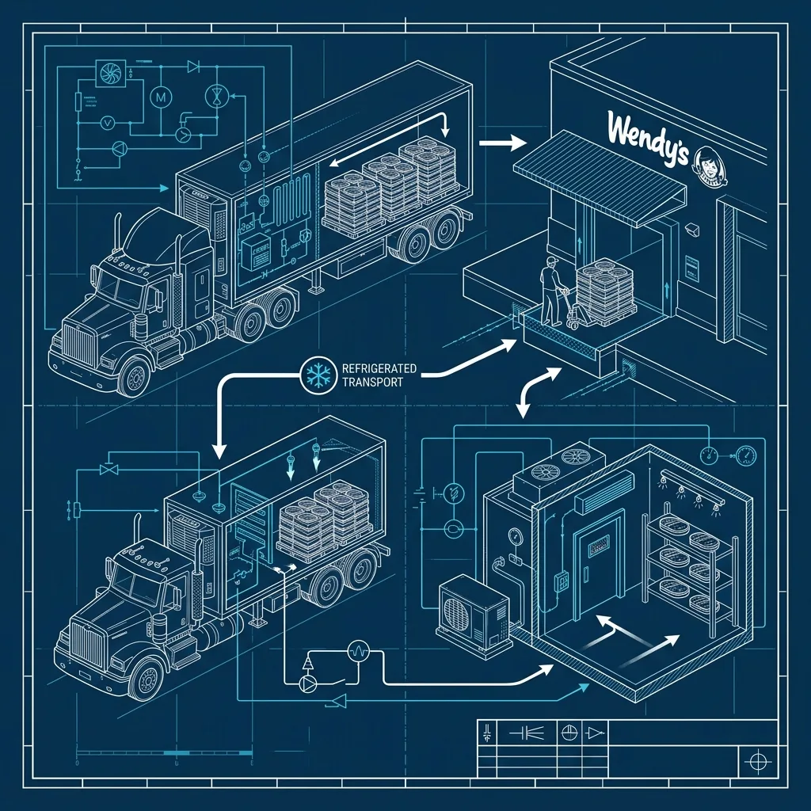
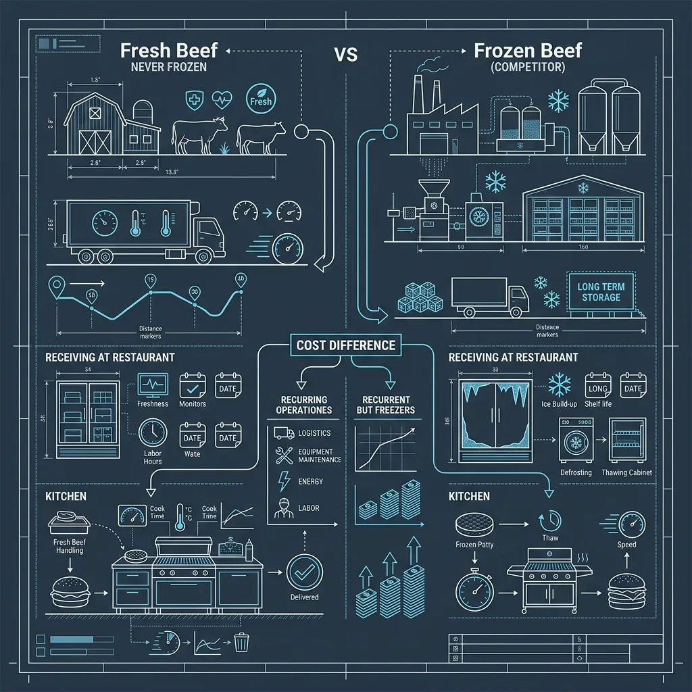

2.  \>
4.  \>
6.  \>
7.  Does Wendy's Really Use 'Fresh, Never Frozen' Beef?

Yes. Wendy’s really does use fresh, never frozen beef for their hamburger patties. This is not a marketing gimmick. It’s not a technicality. It’s not “fresh” in some legally redefined way that actually means “mostly frozen.” The beef that goes into your Wendy’s burger was never, at any point in its journey from the packing plant to the flat-top grill, frozen solid. *(Related guide: [What Are the Exact Closing Duties for a Wendy's Sandwich Maker?](/articles/wendys-closing-duties/))*

I know people are skeptical. Fast food has earned that skepticism a hundred times over. But this is one of those cases where the claim holds up under scrutiny, and it has massive implications for how Wendy’s operates compared to every major competitor. It costs them more money, creates more logistical headaches, and forces a completely different approach to cooking and inventory management. The fact that they do it anyway tells you how central this single commitment is to the brand. *(Related guide: [What is the Wendy's \](/articles/wendys-4-corner-press/))*

Let me break down exactly how it works, where it doesn’t apply, and why it matters.

## The Beef Arrives Refrigerated, Not Frozen

A Wendy’s location receives beef deliveries multiple times per week — typically three to four times, depending on the volume of the store. The beef arrives in refrigerated trucks, packed in sealed cases, held at a temperature between 32°F and 40°F. That’s the standard refrigeration range. Cold enough to keep the beef safe and fresh, nowhere near the 0°F threshold required for frozen storage. *(Related guide: [What is the Wendy's Double-Sided \](/articles/wendys-clamshell-grill/))*

When the delivery shows up, the crew unloads the cases directly into the walk-in cooler. Not the walk-in freezer — every Wendy’s has both, but the fresh beef never goes anywhere near the freezer. The cooler maintains the same 32-40°F range, and the beef stays there until it’s ready to be portioned and cooked.

The shelf life of fresh beef stored at proper refrigeration temps is roughly 5 to 7 days. That’s a tight window compared to frozen patties, which can sit in a freezer for months without degrading. This short shelf life is the entire reason Wendy’s needs so many deliveries per week. A McDonald’s or Burger King can take one big frozen delivery and be set for a while. Wendy’s is constantly receiving new product, and if a delivery gets delayed or shorted, the store can run out of beef within a day or two. I’ve heard of stores in rural areas or during bad weather hitting genuine beef shortages, and there’s no backup plan. You can’t defrost your way out of it because there’s nothing in the freezer to defrost.

## What This Costs — And Why Most Chains Don’t Bother

Running a fresh beef program is significantly more expensive than using frozen patties. The cost difference breaks down into several categories:

**Transportation.** Refrigerated trucking is more expensive than frozen trucking per mile. The equipment costs more, the fuel costs are higher because you’re running the refrigeration unit constantly, and fresh beef is heavier per unit because it retains more moisture. Multiply that by three to four deliveries per week across thousands of locations, and the logistics bill is substantially larger than what a frozen-patty chain pays.

**Spoilage.** Fresh beef goes bad. Frozen beef does not, at least not on any practical timeline. A Wendy’s store that over-orders or has a slow week will throw away beef. A McDonald’s store in the same situation just keeps it in the freezer for next week. Wendy’s managers have to be much more precise with their order quantities, and even the best forecasters lose product to spoilage regularly. This is a cost that frozen-patty competitors simply don’t have.

**Storage.** Walk-in cooler space is at a premium in any restaurant, but especially in QSR where the kitchens are small. Wendy’s has to dedicate meaningful cooler square footage to beef storage that other chains use for other products. This doesn’t show up as a line item on a P&L statement, but it constrains what else a store can carry and how much flexibility they have with their cooler layout.

**Labor.** Fresh beef requires more handling. The patties have to be managed on a first-in-first-out rotation, date-labeled, and monitored for temperature. If a cooler goes down, the beef can spoil within hours during warm months. At a frozen-patty chain, a freezer failure gives you a longer runway to get it fixed before you lose product.

Wendy’s absorbs all of these costs because the fresh beef commitment is the foundation of their brand identity. Dave Thomas built the company on it, and the corporate team has reinforced it relentlessly for decades. When Wendy’s launched their “Where’s the beef?” campaign in the 1980s, the underlying message wasn’t just about patty size — it was about quality. Fresh beef tastes different than frozen beef. The texture is different. The sear is different. And Wendy’s bets everything on the idea that customers can tell the difference, even subconsciously.

## How Fresh Beef Changes the Cooking Process

If you’ve ever cooked a frozen burger at home versus a fresh one, you know the difference. A frozen patty releases a lot of water as it cooks because ice crystals that formed during freezing rupture the cell walls of the meat, and all that moisture comes flooding out on the grill. That’s why frozen patties tend to shrink more and can end up drier if overcooked.

Fresh beef holds onto its moisture better. The cell structure is intact, so when the patty hits the [Wendy’s clamshell grill](/articles/wendys-clamshell-grill) — which cooks from both sides simultaneously — it sears quickly on the outside while staying juicier on the inside. The cooking time is shorter than it would be for a frozen patty, because there’s no thawing phase. A fresh Wendy’s patty cooks in roughly 60 to 90 seconds on the clamshell, depending on the size (Single, Double, or Triple).

The clamshell grill is the perfect partner for fresh beef. Because it applies heat from both top and bottom simultaneously, the patty gets an even sear across both surfaces without needing to be flipped. Flipping is where you lose moisture — every time you flip a burger, juices escape. The clamshell eliminates that entirely. Combined with the moisture-retaining properties of never-frozen beef, the result is a patty that is noticeably juicier than what you get at most competitors.

The [4-corner press technique](/articles/wendys-4-corner-press) that Wendy’s uses for their square patties also benefits from fresh beef. The press pushes the patty into its signature square shape right on the grill, and fresh beef responds to the press more predictably than frozen would. It holds the shape better and doesn’t crack or crumble the way a partially-thawed patty might.

## The Exceptions: What IS Frozen at Wendy’s

Here’s where the nuance lives, and where Wendy’s marketing is technically precise but not always transparent.

The “fresh, never frozen” claim applies specifically to **North American beef hamburger patties**. That’s it. It does not apply to everything on the menu. Several major items arrive at the store frozen:

**Chicken.** The Spicy Chicken Sandwich, Classic Chicken Sandwich, chicken nuggets, and any other chicken product come in frozen. They’re stored in the walk-in freezer and either thawed before cooking or cooked from frozen, depending on the product. The chicken breasts for the sandwiches are typically thawed in the cooler overnight before being cooked on the grill.

**Fish.** During Lent or whenever the fish sandwich is on the menu, the fish fillets arrive frozen.

**Frosty mix.** The base for Wendy’s Frosty arrives as a liquid mix that gets poured into the Frosty machine, but the mix itself is stored refrigerated, not frozen. The machine freezes it during the serving process.

**French fries.** Like virtually every fast-food chain in existence, Wendy’s fries arrive frozen and go from the freezer directly into the fryer. Nobody in the industry is cutting fresh potatoes for fries at the store level — the economics just don’t work. The one exception is [Five Guys, which uses fresh-cut fries from whole potatoes](/articles/five-guys-no-freezers).

So when someone says, “Wendy’s says fresh never frozen but their chicken is frozen!” — yes, that’s true. But Wendy’s has never claimed otherwise. The slogan specifically references beef. Read the fine print on any Wendy’s ad or menu board and you’ll see some variation of “fresh beef available in the contiguous U.S., Alaska, and Canada.” The asterisk is always there, even if people don’t notice it.

## Dave Thomas and the Founding Principle

R. David Thomas opened the first Wendy’s in Columbus, Ohio, in 1969, and fresh beef was the concept from day one. Dave had worked in the restaurant industry for years — including a stint helping turn around several struggling KFC franchises — and he believed that the fast-food industry had settled for mediocrity on beef quality.

His pitch was simple: make hamburgers with fresh beef, cook them to order, and serve them hot. Everything else — the square patties, the pick-your-own toppings bar, the Frosty — grew out of that core idea. But fresh beef was the non-negotiable. When Wendy’s grew from one location to dozens to hundreds to thousands, the supply chain got more complicated, but the commitment never wavered. Dave Thomas reportedly visited stores regularly until later in his life and would check the coolers himself to make sure beef was being handled properly.

This is one of those founding-era brand commitments that a lot of chains eventually abandon as they scale. The original Subway baked bread in every store; the process eventually got simplified and semi-automated. The original Domino’s guaranteed 30-minute delivery; they dropped it over liability concerns. Wendy’s is one of the rare cases where the founding principle survived the founder and survived the scaling process intact.

## How Wendy’s Competes Against Frozen Patties

The competitive landscape is clear. McDonald’s uses frozen beef patties for almost everything — the one exception was the Quarter Pounder, which McDonald’s switched to fresh beef in 2018 for the U.S. market, directly in response to Wendy’s relentless advertising about it. Burger King uses frozen patties across the board. Most regional chains use frozen patties. Even some higher-end fast-casual burger joints use frozen patties because the logistics are so much simpler.

Wendy’s advertising has been aggressive about this distinction for years. The “fresh, never frozen” tagline appears in virtually every Wendy’s commercial and on every menu board. Their social media team — which became famous for roasting competitors on Twitter — has repeatedly called out McDonald’s and Burger King for using frozen beef. The famous exchange where Wendy’s Twitter account asked a user “You don’t have to bring them to a burn center” after roasting a frozen beef competitor became one of the most viral fast-food social media moments of the 2010s.

From a taste perspective, the difference is real but subtle. In blind taste tests, most people can tell the difference between a fresh beef burger and a frozen one, but the margin is narrower than Wendy’s marketing implies. The bigger difference is in texture — fresh beef produces a patty with a slightly looser, less compressed grain that feels more like a restaurant burger than a mass-produced puck. The sear on a fresh patty also tends to be more even and more caramelized, because the surface isn’t fighting against surface moisture from thawing.

Whether this difference is worth the premium Wendy’s pays for it depends on who you ask. From a strict financial analysis, frozen patties make more sense. From a brand-building perspective, the fresh beef commitment has given Wendy’s a differentiated position in a market where most competitors are functionally interchangeable. You might not taste the difference in every single bite, but you believe there’s a difference, and that belief is worth billions in brand equity.

## The Supply Chain Under Stress

The fresh beef commitment was tested severely during the COVID-19 pandemic when meat processing plants across the country experienced shutdowns and slowdowns. Wendy’s was one of the first major chains to run out of beef at multiple locations because their supply chain had no buffer. A frozen-patty chain can ride out a two-week supply disruption on existing freezer inventory. Wendy’s could not.

During the worst weeks of the 2020 meat shortage, an estimated 18 percent of Wendy’s locations were out of beef entirely. Drive-thru menu boards showed hamburger items as unavailable. It was a stark illustration of the trade-off: the same supply chain characteristics that make fresh beef taste better also make the system more fragile. There’s no strategic reserve. There’s no “just pull from the freezer” backup plan.

Wendy’s weathered the crisis, beef supplies normalized, and the fresh never frozen commitment continued. But the episode highlighted a vulnerability that frozen-patty chains don’t have. It’s the price of the premium, and Wendy’s has decided, over and over again, that it’s a price worth paying.

## Frequently Asked Questions

### Does Wendy’s beef ever get frozen by accident?

It shouldn’t. If a walk-in cooler malfunctions and drops below freezing, or if beef is left in a delivery truck too long in winter, there’s a chance the product could partially freeze. In those cases, standard food safety protocols would require the beef to be evaluated and potentially discarded rather than served as “fresh.” Managers are trained to monitor cooler temperatures constantly.

### Is Wendy’s beef higher quality than McDonald’s or Burger King’s?

Not necessarily in terms of grade. All three chains use standard commercial-grade beef. The difference is in handling and preparation, not in the inherent quality of the cattle. Fresh versus frozen is a processing choice, not a grading distinction. However, the cooking process and moisture retention of fresh beef do result in a different final product.

### Why doesn’t Wendy’s just freeze the beef as a backup?

Because it would undermine their entire brand promise. The moment Wendy’s serves a frozen patty, even as a backup, they can no longer make the “fresh, never frozen” claim with integrity. Competitors and regulators would jump on it immediately. The commitment is all-or-nothing, which is what makes it both powerful and risky.

* * *

RR

Russell Roseberry

10-Year QSR Veteran & Former Kitchen Manager

Russell Roseberry spent over a decade managing kitchens at major fast food chains across the Southeast. From Chick-fil-A to Wendy's to Taco Bell, he's worked every station, trained hundreds of new hires, and learned the operational secrets that most customers never see. He created Fast Food Guides to share real insider knowledge with the people who actually want to know how the food gets made.

## More Insider Guides

[

### What Is the Taco Bell "Linebacker" Role?

Inside the most physically demanding role at Taco Bell: the Linebacker who restocks the makeline mid...

](/articles/taco-bell-linebacker-role/)[

### What Does the Krispy Kreme Hot Light Actually Mean?

When the Krispy Kreme Hot Light turns on, doughnuts are rolling off a 25-foot automated production l...

](/articles/krispy-kreme-hot-light/)[

### The Bizarre Way Jack in the Box Tacos Are Made

Ever wonder why Jack in the Box tacos look fried shut? Learn the weird frozen-to-fryer process, the ...

](/articles/jack-in-the-box-tacos-made/)[

### Do Domino's Delivery Drivers Pay For Their Own Gas?

Domino's mileage reimbursement varies wildly by franchise. Here's the per-mile vs per-delivery break...

](/articles/dominos-gas/)

[← Browse All Guides](/articles/)
