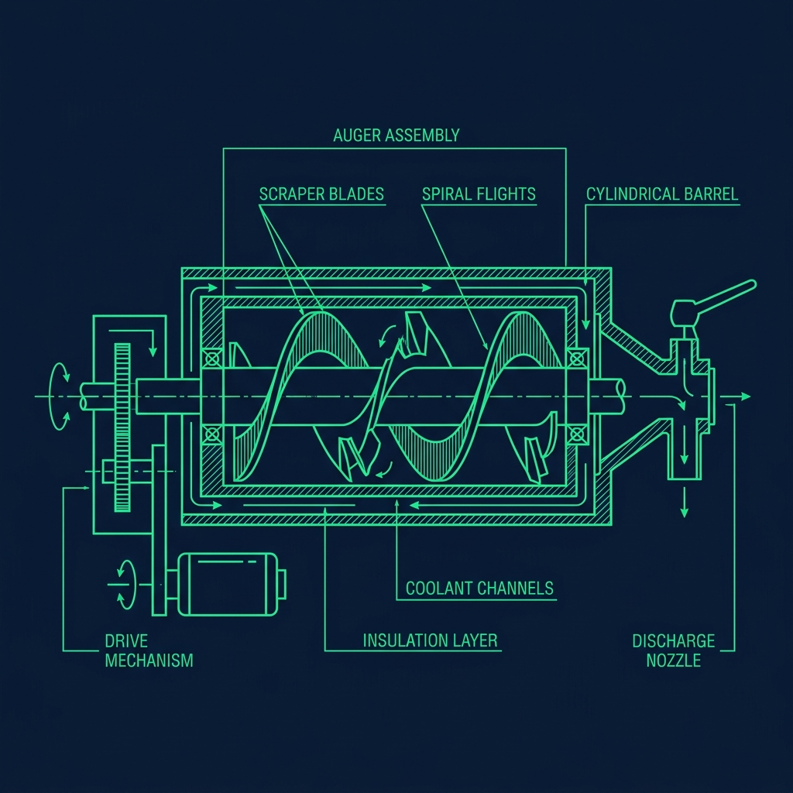
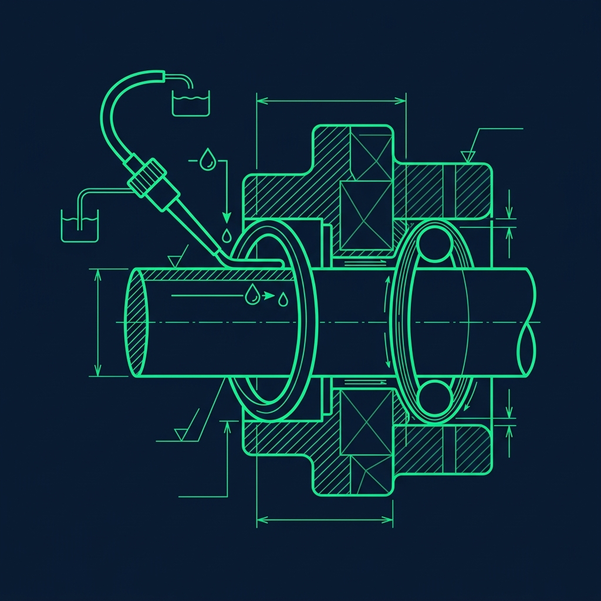

The Wendy's Frosty is a fast food icon—one of those products that has been on the menu since Dave Thomas opened the first location. Customers see a creamy, frozen treat that comes out of a shiny machine in about four seconds. What they don't see is the nightly maintenance nightmare that keeps that machine running safely. If you've been assigned [What Are the Exact Closing Duties for a Wendy's Sandwich Maker?](/articles/wendys-closing-duties/))*

It's called the Boil-Out. And by the time you're done, you'll understand why.

## Why the Boil-Out Is Non-Negotiable

The Frosty machine dispenses a dairy-based product that is continuously churned and frozen inside sealed metal cylinders. Dairy residue is one of the most aggressive bacterial breeding grounds in food service. Even trace amounts of old Frosty mix left in contact with the internal components overnight will sour, creating both a health hazard and a foul taste that contaminates every single Frosty served the next day. 

I've worked in stores where a new closer did a rushed, half-hearted cleaning on a Friday night. Saturday morning, the first customer's Frosty tasted like sour milk. We had to dump the entire hopper, re-clean the machine from scratch, and lose an hour of Frosty sales during the lunch rush. That one sloppy close cost the store hundreds of dollars and earned the closer a conversation with the GM they didn't enjoy. 

The boil-out strips the machine of all dairy residue, sanitizes every surface that contacts the product, and ensures the morning crew is pouring fresh Frosty mix into an immaculately clean system.

## Step 1: The Drain and Flush

Before you can touch the machine's internals, you need to empty it completely.

Pull the massive levers and drain all remaining liquid Frosty mix into clean, sanitized buckets. These buckets go into the walk-in cooler—the mix is still usable for tomorrow morning as long as it's stored at proper temperature and hasn't exceeded its shelf life.

Once the machine is empty, pour buckets of warm water into the top hoppers and pull the levers again, flushing the freezing cylinders until the water runs completely clear. This usually takes two to three full cycles. The first flush comes out thick and milky—that's residual mix clinging to the cylinder walls and the auger. The second flush will be thinner with a slight cloudy tint. By the third, the water should be crystal clear. If it's still cloudy after three cycles, keep flushing. Do not move to the teardown until the water is clean. Cutting this corner means you'll be scrubbing dairy film off the internals for twice as long.

## Step 2: The Mechanical Teardown

This is the part that intimidates every new hire, and honestly, it should. The Frosty machine is not a simple countertop appliance—it's a precision freezing system with heavy metal components.

Here's what comes apart:

- **The faceplate:** Unbolt the heavy plastic faceplate from the front of the machine. Some models use thumbscrews, others require a specific tool. Know your machine.
- **The auger:** Reach inside the freezing cylinder and pull out the auger—a massive metal corkscrew wrapped with sharp plastic scraper blades. This thing is heavy, often several pounds, and the scraper blades are genuinely sharp enough to slice your hand open if you're careless. Always grip the auger by the center shaft and keep your fingers away from the blade edges.
- **The O-rings:** Small rubber gaskets that sit in grooves along the drive shaft and the faceplate. There are typically four to eight of them, depending on the machine model. They create the watertight seals that prevent liquid from leaking during operation.

Lay every part out on a clean towel in the exact order you removed them. This makes reassembly straightforward—you simply work backward through the line. Randomly piling everything in the sink is a recipe for confusion and lost O-rings, and a single missing O-ring means the machine cannot run the next morning.

## Step 3: The Scrub and Sanitizer Soak

Take every removable component to the back sink. Scrub each piece with a brush and warm, soapy water to remove all visible dairy residue. Pay special attention to the auger's scraper blade edges—milk film hides in the crevices where the blades attach to the shaft.

After scrubbing, submerge all parts in a sanitizer solution for the required contact time. Most stores use a quaternary ammonia-based sanitizer mixed to the manufacturer's specified concentration. While the parts are soaking, go back to the machine and wipe down the inside of the freezing cylinder with a clean, sanitizer-soaked cloth. Reach as far back as you can and scrub the walls. The cylinder doesn't come out of the machine, so this interior wipe-down is your only opportunity to clean it.

Each O-ring must be individually removed from its groove, inspected under good lighting, and scrubbed clean. Hold each ring up and flex it gently. You're looking for hairline cracks, surface nicks, flattened areas where the rubber has become stiff, or any deformation that would compromise the seal. A cracked O-ring that looks "fine" at 11:00 PM becomes a puddle of Frosty mix on the floor at 10:00 AM. A 50-cent replacement O-ring is infinitely cheaper than five gallons of wasted mix and a ruined morning rush.

## Step 4: Reassembly and the Lube

This is where new employees always, always mess up. When putting the machine back together, you cannot just slide the metal auger back in and bolt the faceplate on. Every single rubber O-ring and the drive shaft must be coated with food-grade lubricant—typically Petrol-Gel or an equivalent NSF-certified product.

Squeeze a generous bead of lubricant onto your gloved finger and coat the entire circumference of each O-ring before sliding it back into its groove. Then coat the drive shaft where the auger connects. A well-lubricated machine reassembles smoothly—the O-rings slide into position without resistance, and the faceplate bolts on cleanly.

A dry O-ring will catch on the groove, twist out of position, and potentially tear. And here's the real problem: your store may or may not have replacement O-rings in stock. If a ring tears at 11:30 PM and there's no spare, the Frosty machine is offline until a replacement arrives—which might mean no Frosties for Saturday morning. I witnessed this happen more times than I want to admit, and it's always because someone thought they could skip the lube step "just this once."

## Step 5: The Test Run

After reassembly, run a test cycle. Pour clean water into the hopper and run the machine for 60 seconds. Watch every joint, every seal, every point where the faceplate meets the machine body. If water drips or seeps from anywhere, you need to disassemble that section, check the O-ring, re-lubricate, and try again.

It is vastly better to catch a leak during a two-minute water test at 11:00 PM than to have the morning crew pour in five gallons of expensive Frosty mix and watch it form a river across the floor. The test run is the last line of defense, and skipping it is gambling with someone else's morning.

## Time Management Is Everything

The full boil-out process—drain, flush, disassemble, scrub, sanitize, reassemble, test—takes 25 to 35 minutes when done properly by someone who knows the machine. If you're new, budget 40 to 45 minutes. Start the process the moment the manager gives you the green light—ideally 15 to 20 minutes before the store officially closes. If you start too late, you'll either rush through it (leading to poor sanitization, missed O-rings, or skipped lubrication) or hold up the entire closing crew while everyone waits for you to finish.

## Frequently Asked Questions

### Does every Wendy's do a full boil-out every single night?

Yes. The full teardown and sanitization is a daily closing requirement with zero exceptions. Some stores also perform an additional deep-clean boil-out on a weekly basis that involves running a specialized chemical solution through the machine's internal lines at near-boiling temperatures. But the nightly process is non-negotiable—skip it once and you risk a health code violation and a batch of Frosties that taste like cottage cheese.

### What happens if an O-ring breaks and the store doesn't have a replacement?

The machine stays offline until a replacement is sourced. The store will either borrow one from a nearby Wendy's, contact their equipment supplier for emergency delivery, or simply operate without Frosties until the part arrives. Selling product from a leaking machine is not an option—it's both a food safety issue and a slip-and-fall liability with mix on the floor.

### Why is it called a "boil-out" if nothing is actually boiling?

The term is inherited from the weekly deep-clean process, which does involve running a hot chemical solution through the machine's internal lines at near-boiling temperatures to dissolve stubborn dairy buildup. The nightly teardown inherited the name even though it's technically a drain, flush, and sanitize. In practice, every Wendy's employee uses "boil-out" to mean any Frosty machine cleaning—nobody says "I'm going to do the nightly drain-flush-teardown-sanitize-reassemble." Boil-out is just easier.

---

**Related Guides:** See the full [Wendy's closing duties checklist](/articles/wendys-closing-duties) for how the boil-out fits into the overall close, or compare frozen dessert maintenance with the [Dairy Queen Blizzard flip](/articles/dairy-queen-blizzard-flip) tradition.
