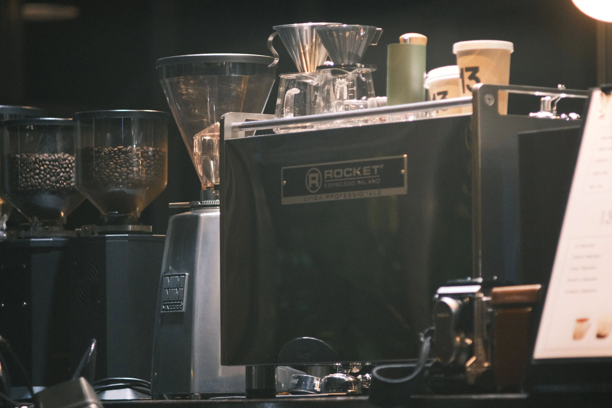

The reality of the line at any In-N-Out Burger is that the grill is not the bottleneck. The grill cooks at a predictable, mathematical rhythm. The true choke point—the station that makes or breaks a Friday night dinner rush—is the Fry Board. And nothing destroys the rhythm of the fry portioner faster than a string of tickets calling for "Animal Style Fries."

To understand why this seemingly simple secret menu item is an operational nightmare, you have to understand the logistics of fresh-cut fries. In-N-Out does not use frozen, pre-blanched potatoes. They peel, dice, and fry fresh Kennebec potatoes directly in 100% sunflower oil. Fresh potatoes have a massive moisture content. When they come out of the fryer, they have a critically short window of structural integrity before the ambient humidity and residual internal steam cause them to lose their crunch.

When you order regular fries, the portioner scoops them into a paper sleeve, allowing the steam to vent upward, preserving the crispy exterior. But when you order Animal Style Fries, that entire carefully engineered thermal dynamic is thrown out the window. Step by step, this is the workflow that occurs on the board.

## The Steam Dome and Cheese Melting Physics

When the ticket prints for Animal Fries, the fry portioner grabs an open-faced corrugated cardboard boat instead of the standard paper sleeve. They lay down a heavy bed of hot fries. Then, they lay two overlapping slices of standard American cheese directly over the top of the fry matrix. 

Here is where the operational bottleneck occurs. The residual heat of the fries alone is not enough to rapidly melt two slices of processed cheese in the few seconds the portioner has before the next basket comes up from the oil. The employee must manually force the phase change of the cheese. 

To do this, they place the entire cardboard boat onto a designated heated surface or under a metal clamshell steam dome. They shoot a tiny amount of water onto the surface next to the boat and drop the dome. The entire container sits in this dedicated steamer for exactly 24 to 48 seconds. The flash steam envelops the fries, rapidly raising the ambient temperature and forcing the American cheese to liquefy and drape over the potato matrix.

**ProTip from the Fry Board:** The steam dome technique is highly effective for melting cheese, but it is a double-edged sword. If the portioner leaves the dome down for even three seconds too long, the steam permeates the corrugated cardboard boat, compromising its structural rigidity and turning the bottom layer of fries into absolute mush.

During this steaming process, the fry portioner is effectively paralyzed. They cannot pull the next basket. They cannot salt the next batch. They have to monitor the steam dome, pull the boat at the exact right second, and pass it to the board assembler. 

## The Thermal Collapse of the Fry Matrix

Once the cheese is melted, the fries are passed down the board to receive the final garnishes: a heavy ladle of grilled chopped onions, and a massive squeeze of the signature Spread. 

From an engineering perspective, you have just created a localized moisture trap. The melted American cheese forms an impermeable lipid seal over the fries. The heavy Spread and the moisture-laden grilled onions sit directly on top of that seal. The heat radiating from the fresh fries cannot vent upward; it is trapped beneath the cheese blanket.

The result is rapid, aggressive thermal collapse. Within exactly four minutes of assembly, the steam softens the exterior crust of the Kennebec potatoes. The starch matrix breaks down, and the fries lose their rigidity entirely. If you attempt to eat Animal Style Fries through the drive-thru and wait until you drive home, you will not be eating french fries. You will be eating a dense, heavy potato casserole that requires a fork to consume.

## The Corrugated Boat Structural Failure

The packaging itself is also pushed beyond its design limits. The corrugated cardboard boats used by In-N-Out are engineered to hold dry, lightly salted items. They have a thin wax-like coating, but they are not designed to withstand heavy, hot, oil-based sauces and trapped steam for extended periods. 

As the Animal Fries sit, the lipids from the melted cheese and the Spread begin to degrade the coating on the cardboard. The boat becomes translucent, greasy, and structurally compromised. By the time it is placed into a brown takeout bag along with your Double-Double, it is actively transferring grease to the bottom of the bag, threatening a catastrophic bag blowout if you hold it by the top edge. 

**ProTip for the Line:** Experienced board operators will quickly double-boat a heavy order of Animal Fries if they notice the bottom boat getting soggy during the assembly process. It costs the store an extra fraction of a cent in packaging, but it prevents the customer from dropping their meal in the parking lot.

## The Verdict on the Line

Animal Style Fries are undeniably delicious, which is why they are ordered by thousands of customers every single day. But they represent the ultimate friction point in a high-speed QSR kitchen. They transform a fast, scoop-and-serve side item into a multi-step culinary assembly process requiring heat application, garnishing, and delicate packaging handling. 

### How to Order (To Preserve Crunch)

If you actually want to enjoy the crispness of the fresh-cut fries while still getting the Animal Style experience, there is a very specific way to manipulate the POS system. 

When you get to the speaker box, order your fries "Light Well" or "Fry Well" (which leaves them in the fryer for an extra 60 to 90 seconds, giving them a much harder, crunchier exterior). Then, ask for a side of Spread and a side of grilled onions in separate ramekins. Do not ask them to melt the cheese on the fries. Instead, ask for a slice of cheese on the side. 

By deconstructing the item, you prevent the fry portioner from having to use the steam dome, you keep the line moving, and you prevent the thermal collapse of the potato matrix. You can assemble it yourself at your table, ensuring maximum structural integrity for every single bite. And as a final insider pro-tip: always ask for your napkins separately, as the wet clamshell often leaks grease and moisture, completely ruining any napkins tucked into the bag!
