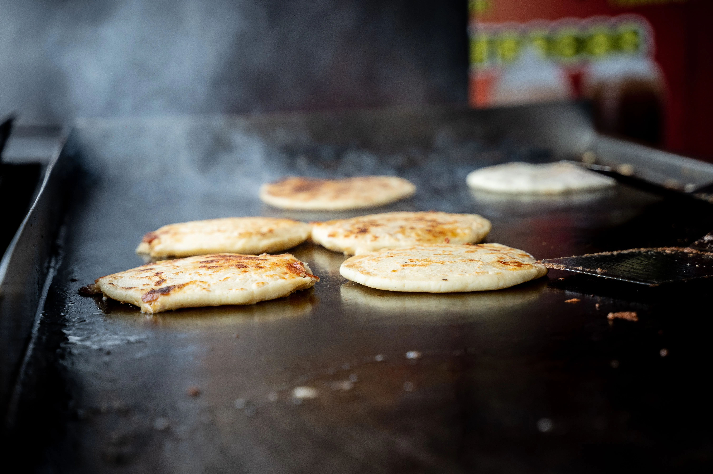

In the lore of fast-food secret menus, few items hold as much mythical status as **The McBrunch Burger**—widely known on social media as the **"10:35 AM Burger."** 

The concept is an indulgent dream for lovers of crossover food: you take a standard 100% beef Double Cheeseburger from the lunch menu and stack a fresh cracked breakfast Round Egg and a golden, crispy Hash Brown directly between the beef patties and the bun. 

While influencers celebrate this hybrid creation as the ultimate menu hack, to any McDonald's general manager or shift leader, **this order is an absolute operational nightmare.** 

With an official **Operational Annoyance Score of 10/10**, demanding a McBrunch Burger during the daily breakfast-to-lunch changeover violates nearly every kitchen sequencing and food-safety protocol in the building. Here is the behind-the-scenes engineering reality of why McDonald's kitchens dread the 10:35 AM hack.

## 1. The 10:30 AM Changeover: The Most Stressful 15 Minutes

To understand why the McBrunch Burger causes kitchen paralysis, you must examine what actually happens inside a McDonald's kitchen at exactly 10:30 AM every morning. 

A McDonald's kitchen is not designed to serve breakfast and lunch simultaneously; the equipment physical footprint requires a complete operational reset known as **The Changeover**. During this intense 15-minute window, the entire kitchen team executes a synchronized mechanical shift:
*   **Griddle Temp Recalibration:** Breakfast sausage patties and folded eggs are cooked on the [platen clamshell griddles](/articles/mcdonalds-platen-grill) at lower temperature settings (around 350°F). To cook [10:1 and 4:1 lunch beef patties](/articles/mcdonalds-fresh-beef-grill-process), the griddle temperatures must be spiked upward to 425°F. Cooks are frantically scraping off breakfast grease, laying down Teflon sheets, and waiting for burners to hit beef searing temperatures.
*   **Fryer Station Purge:** At the [fry station](/articles/mcdonalds-fry-station), the vats designated for hash browns must be cleared, skimmed for potato flakes, and calibrated to flash-fry standard salted french fries.
*   **UHC Cabinet Swap:** The **[Universal Holding Cabinet (UHC)](/articles/mcdonalds-uhc-cabinet-timers)**—the heated electronic holding trays that keep cooked proteins hot—undergoes a total purge. Breakfast plastic trays containing biscuits, sausage, and eggs are pulled out, discarded or logged into waste sheets, and replaced with clean trays awaiting the first drop of lunch chicken McNuggets and beef patties.

**ProTip:** You must time your arrival precisely at 10:25 AM. If you show up earlier, the lunch beef is not cooked yet; if you arrive after 10:35 AM, the egg ring station is completely broken down and sanitized.

## 2. Why Crossover Orders Crash the Line (Annoyance Score: 10/10)

When a customer pulls up to the drive-thru speaker at 10:32 AM and demands a Double Cheeseburger stuffed with a Round Egg and a Hash Brown, they are throwing a wrench directly into the middle of this carefully timed mechanical ballet.

### 1. Equipment Deadlock
To make a McBrunch Burger, the kitchen must cook raw lunch beef while simultaneously retaining cooked breakfast eggs and hash browns. 
*   If the grill cook has already spiked the griddle temperature to 425°F for lunch beef, they cannot drop a fresh egg ring without burning the egg white and ruining the Teflon surface.
*   If the UHC breakfast trays have already been dumped for the changeover, the assembly worker has no hot round eggs available, forcing the kitchen to either reject the order or illegally hold breakfast waste past its expiration timer.

### 2. POS Ring-Up Friction
Because the McBrunch Burger does not exist in corporate POS databases, cashiers cannot simply hit a button. 
*   To ring it up legitimately without messing up inventory counts, the cashier must ring up a Double Cheeseburger, navigate to the breakfast modifier screen (if the system has not already locked out breakfast sales at 10:30 AM sharp), and hit **"Add Round Egg ($1.29)"** and **"Add Hash Brown ($2.19)."**
*   In many franchise POS systems, once the clock strikes 10:30:00 AM, the POS software automatically hard-locks all breakfast modifier keys, making it computer-impossible to ring up a hash brown on a lunch receipt.

  <strong>Manager's Insight: The "DIY Assembly" Workaround</strong>
  If you are craving the flavor combination of a McBrunch Burger without earning the hatred of your local kitchen crew, there is a simple, manager-approved workaround: **The DIY Assembly Method.**
    
  Arrive at the restaurant at exactly 10:25 AM (five minutes before changeover). Order a standard **Egg McMuffin** and a **Hash Brown** as separate breakfast items. Sit in the dining room or your car for 10 minutes until 10:35 AM when lunch menu service officially opens. 
    
  Return to the counter and order a plain **Double Cheeseburger**. When you receive your burger, open the bun yourself, lift the Round Egg out of your McMuffin, insert your Hash Brown, and stack them inside the double cheeseburger. 
    
  You get the exact same legendary taste sensation while allowing the kitchen team to execute their breakfast-to-lunch changeover without a single bottleneck or POS lock-out!

**ProTip:** Ask them to ring up a standard double cheeseburger and add a round egg a la carte. It is significantly cheaper than trying to ring up a breakfast sandwich and adding beef patties.

## 3. The Thermodynamic Reality of the Build

Even if you manage to convince a stressed crew to assemble a McBrunch Burger on the line, the physical physics of the sandwich make it structurally volatile.

*   **Grease Emulsion:** A standard Double Cheeseburger releases significant beef fat juices and melted American cheese. When you compress a deep-fried, oil-rich potato Hash Brown directly into this hot beef matrix, the combined lipid moisture exceeds the absorption capacity of the standard regular bun.
*   **Bun Collapse:** Within 60 seconds of wrapping, the bottom heel of the bun absorbs the combined hash brown grease and beef drippings, dissolving its starch crumb structure. If not eaten immediately upon serving, the sandwich collapses into a greasy, structurally compromised mess—proving that some viral hacks are better left as social media myths than actual daily orders.
